## 1 大模型基础
### 1.1大模型到底是什么玩意
大模型全称**大语言模型（Large Language Model，LLM）**，是基于深度学习的巨型神经网络，以海量文本、图片、音视频数据做训练，学习人类语言、知识、逻辑、创作模式。
- **本质**：它是一个拥有海量参数的深度学习概率模型 。
- **工作机制**：它的核心任务非常直观——**根据你输入的上文，预测下一个最可能出现的 Token（字或词）** 。
- **如何变成“通才”**：尽管底层只是在做“文字接龙”，但当模型吞噬了全网数以万计的图书、网页、代码和论文后，它在做接龙的过程中被迫学会了语法、逻辑、编程、甚至人类的常识与推理能力。
### 1.2 大模型存在的意义
在大模型出现之前，传统的 AI 主要是**专才模式**（如分类模型、语音识别模型），一个模型只能做一件特定的事情。而大模型带来了以下革命性的改变：
- **从“专用”到“通用”（AGI 的曙光）**：大模型拥有极强的**泛化能力**，同一个模型既能写代码、做翻译，又能写诗、分析财务报表，无需针对每个场景重头开发模型。
- **涌现能力（Emergent Abilities）**：当模型规模突破一定临界点（通常在百亿参数以上）时，会突然展现出小模型根本不具备的能力，比如复杂的逻辑推理、上下文学习（In-Context Learning）和思维链（Chain of Thought）能力。
- **改变人机交互范式**：以前人要学习机器能听懂的指令/编程语言，现在机器可以直接理解人类的**自然语言**，极大地降低了技术门槛。
**AGI（Artificial General Intelligence，通用人工智能）** 就是 AI 发展追求的“终极目标”之一，俗称**像人一样聪明、甚至超越人类的全面型 AI**。
ANI（Artificial Narrow Intelligence，狭义/专用人工智能），**特点**：只能在**特定领域**打败人类，换个场景就完全失效。
**AGI（通用人工智能）**： **特点**：具备**跨领域的自主学习、逻辑推理、感知和执行能力**。
### 1.3 大模型参数
#### 1.3.1 参数
参数就是神经网络里面**大量的权重数值**，是模型学习完知识之后保存下来的 “记忆载体”。训练就是不断调整这一堆数字；推理就是用这些数字计算输出结果
- **参数的物理含义**：参数（Parameters）在数学上就是神经元之间连接的**权重（Weights）和偏置（Biases）**。你可以把大模型想象成一个包含数千亿个调节旋钮的巨大超级方程，每个“旋钮”对应一个浮点数值。
- **训练的本质就是调参**：在预训练阶段，AI 吐出错误预测时，系统会通过反向传播算法自动微调这几百亿/千亿个“旋钮”，直到它接龙的准确率达到最高。
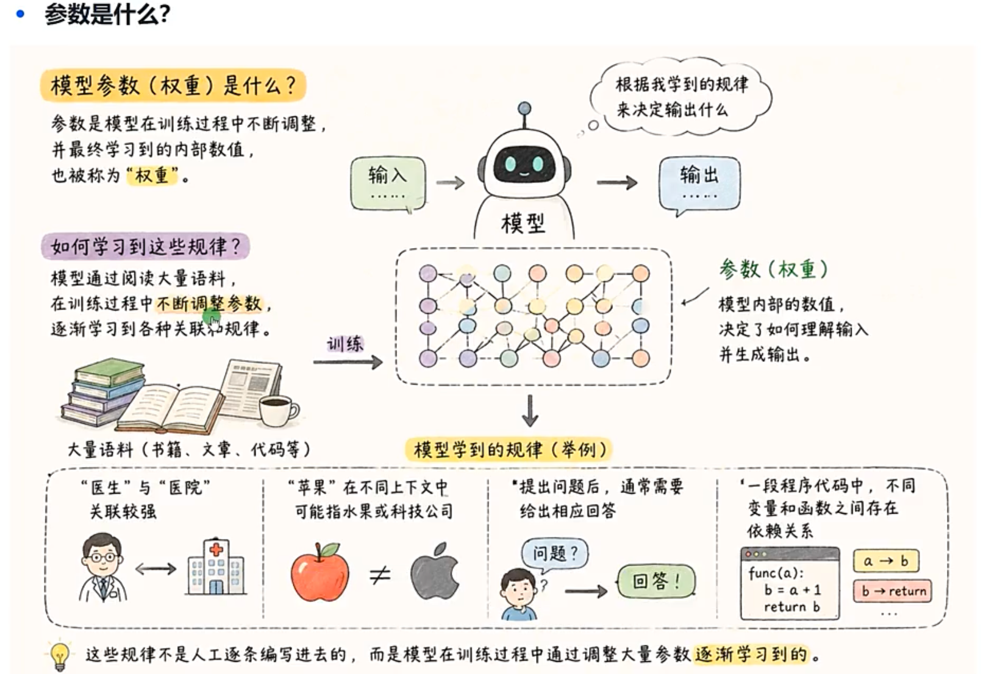
单位：**B（Billion，十亿）**7B = 70 亿参数，13B=130 亿，70B=700 亿，千亿就是 1000B。
- **常见规模（如 7B/13B/70B）**：
    - **B（Billion）**：代表“十亿”。
    - **7B**：70 亿参数（通常需要约 14GB~16GB 显存来加载权重）。
    - **70B**：700 亿参数（需要多张高性能 GPU 才能加载并运行）。
#### 1.3.2 稠密和混合模型
稠密模型（Dense Model）**与**混合专家模型（MoE, Mixture of Experts）是大模型架构的两大主流设计路线。它们的核心区别在于：**每次处理数据时，是动用模型的“全员”参数，还是只激活其中的“一部分”专家。**
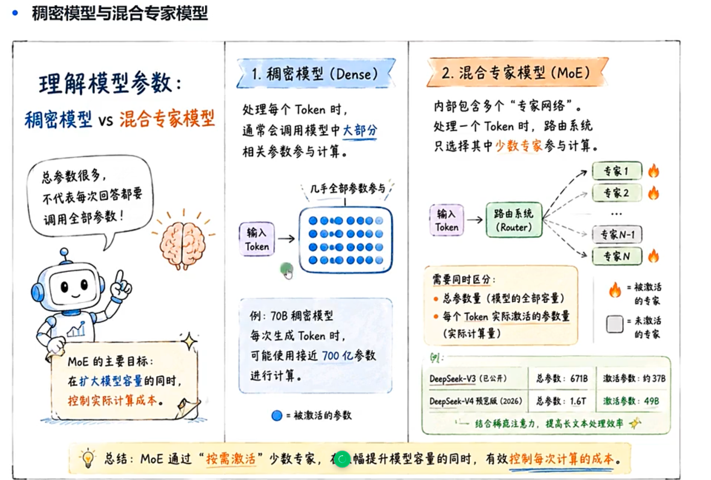
1. 稠密模型（Dense Model）
运行机制：全员上阵。输入每一个 Token（字/词）时，模型中的所有参数都会参与计算。
代表模型：LLaMA 系列、GPT-3、Early GPT-4（早期版本）、DeepSeek-V1 稠密版等。
优缺点分析：
优点：结构简单标准，易于训练、部署和分布式调度；在参数量较小（如 7B、8B）时效率极高。
缺点：当模型规模扩展到千亿级（如 175B+）时，每次推理都要计算全部参数，算力成本（FLOPs）和延迟会呈爆炸式增长。
1. 混合专家模型（MoE Model）
运行机制：按需分工。将传统 Transformer 中的 前馈网络层（FFN）拆分成多个独立的“子网络”（即专家，Experts），并增加一个路由网络（Router/Gate）。
路由机制：当输入一个 Token 时，路由会分析这个 Token 属于什么类型（比如代码、数学还是普通对话），然后决定只把这个 Token 转发给最擅长的 1~2 个专家处理。
代表模型：Mixtral 8x7B、GPT-4（据传为 MoE）、DeepSeek-V2/V3 等。
核心优势：总参数量大，但计算量（FLOPs）极小。
例如：一个“总参数 47B”的 MoE 模型，如果每次只激活 2 个专家（激活参数仅 13B），那么它推理时的计算速度和算力消耗就等同于一个 13B 的稠密模型，但能力却接近 47B 的稠密模型。
#### 1.3.3 <span style="color:#1f1f1f">参数和 token</span>
**参数（Parameters）** 和 **Token** 是理解大模型计算与运维的两个最核心单位。简单来说：**参数决定了模型的“大脑容量”，而 Token 是模型用来“阅读和表达”的文本基本单位。**
. 深入对比：参数 vs Token
| **维度** | **参数 (Parameters)** | **Token** |
| --- | --- | --- |
| **通俗比喻** | 模型大脑里的**神经元/知识记忆体** | 模型的**词汇片段/文字计量单位** |
| **本质属性** | **静态的**（模型训练好后固定不变） | **动态的**（随着用户的输入和输出实时变化） |
| **计量单位** | B（Billion，十亿），如 7B = 70 亿参数 | 个数（Tokens），如 1 个 Token ≈ 0.75 个英文单词或 0.5~0.8 个汉字 |
| **显存影响** | 决定了模型**静态加载**所需的显存基础（如 7B 需要 ~14GB） | 决定了推理/训练时的**动态显存**（KV Cache）与计算时长 |
| **商业计费** | 决定了购买或部署 GPU 显卡的硬件成本 | 云厂商 API 调用的**计费标准**（如 ￥0.002 / 1k Tokens） |
Token 究竟是什么？
大模型并不像人类一样直接阅读“字”或“词”，而是通过 Tokenizer（分词器） 将输入的文本切分成一串数字向量（Token ID）。
切分规则：
英文中，learning 可能会被切分为 learn + ing（2 个 Token）。
中文中，常见的词如 人工智能 可能是 1~2 个 Token；罕见字或标点符号可能会占用更多 Token。
计算映射：通常 1 个英文 Token ≈ 4 个英文字符（约 0.75 个单词）；在中文大模型优化后，1 个中文 Token 通常对应 0.5 ~ 1 个汉字。
1000 token 中文大约等于 500‑700 个汉字。
在真实的部署和运维监控中，**参数**与 **Token** 共同决定了系统的性能与资源开销：
1. **计算吞吐（TPS, Tokens Per Second）**：
运维监控的核心指标之一就是每秒生成的 Token 数量。参数量越大的模型，每生成 1 个 Token 所需的浮点运算量（FLOPs）越高，推理延迟也越大。
1. **上下文窗口（Context Window）**：
大模型一次能处理的最大 Token 数量（如 8k、32k、128k Tokens）。输入的 Token 越多，模型在推理时保存的 **KV Cache 显存** 就会呈二次方（或线性，取决于注意力机制）暴涨。
#### 1.3.4 主流模型参数情况
目前的开源与闭源主流大模型按照**参数量级**、**架构设计（稠密 Dense vs 混合专家 MoE）和适用场景**，
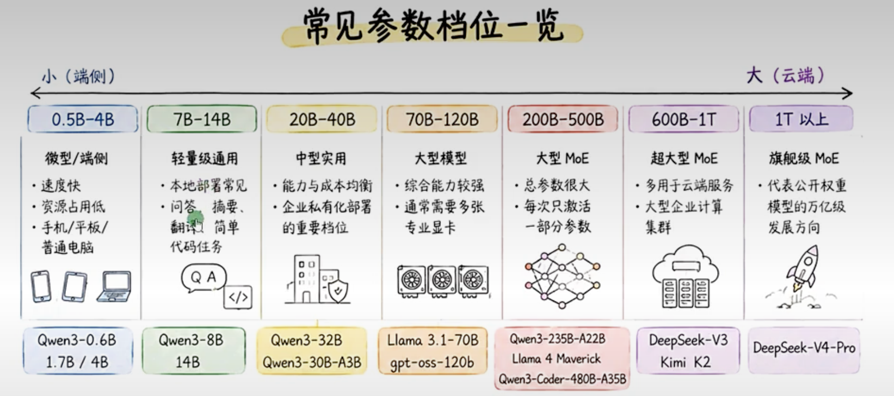
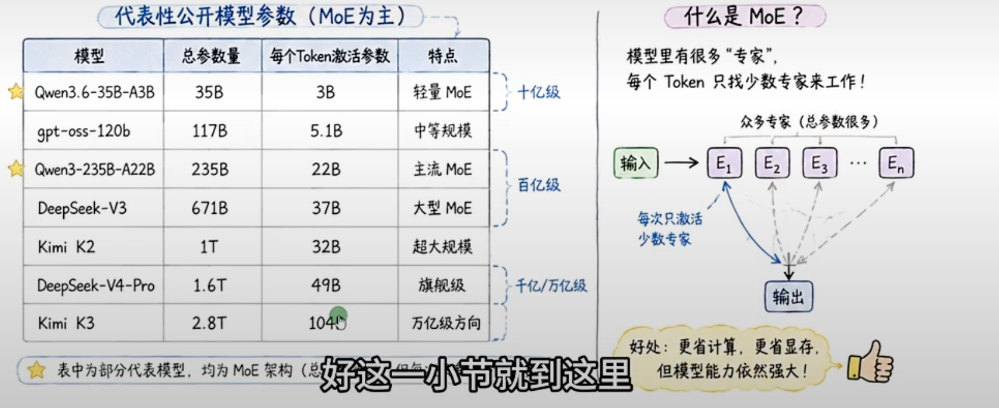
作为运维/架构人员，可以通过以下法则快速评估硬件需求：
- **静态显存公式**：模型参数量 (Billion) × 2 Byte ≈ 基础显存需求
- **加上动态开销**：生产环境需预留 20%~30% 的显存作为上下文 **KV Cache** 和并发缓存空间。
| **模型参数规模** | **精度** | **模型权重显存占用** | **建议部署显卡配置** |
| --- | --- | --- | --- |
| **7B** | FP16 / INT4 | ~14 GB / ~5 GB | 单卡 RTX 4090 (24G) / 单卡 A10 (24G) |
| **32B** | FP16 / INT4 | ~64 GB / ~20 GB | 单卡 A800 (80G) 或双卡 RTX 4090 |
| **70B** | FP16 / INT4 | ~140 GB / ~40 GB | 2 张 A800 (80G) 或 4 张 RTX 4090 |
| **671B (DeepSeek)** | FP8 / FP16 | ~350 GB / ~1.3 TB | 8 卡 H800 / A800 集群 |
### 1.4 Transformer原理
#### 1.4.1 Transformer核心架构
Transformer 架构及其核心的自注意力机制（Self-Attention）是大模型（LLM）实现理解与推理的**底层心脏**。
几乎所有现代大模型（稠密、MoE）底层骨架都是 **Transformer**，而**自注意力 (Self‑Attention)** 是 Transformer 最核心的灵魂。没有自注意力，就没有现在的大模型。
传统 RNN：文字必须一个接一个顺序算，前面算完才能算后面，长文本慢，长距离信息容易丢失。Transformer：**所有 token 可以并行计算**，依靠自注意力捕捉句子内部的关联关系。
#### 1.4.2 整体架构范式
标准的 Transformer 包含编码器（Encoder）**和**解码器（Decoder）两部分：
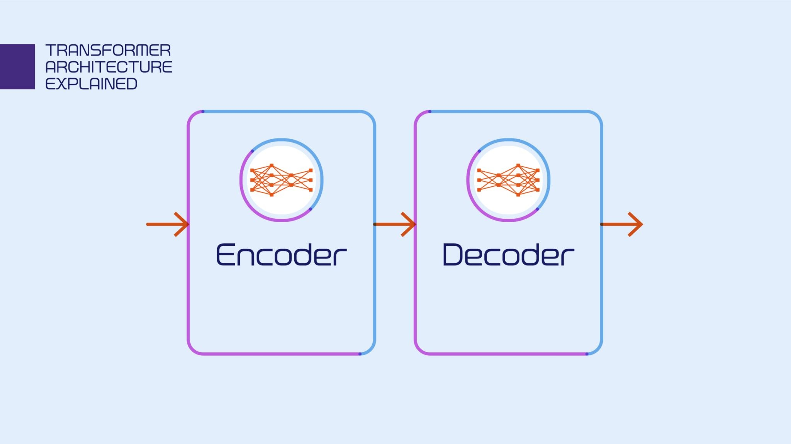
- **Encoder-Decoder 架构**（如 T5）：Encoder 负责特征提取，Decoder 负责生成，常用于翻译任务。
- **Decoder-Only 架构**（如 GPT、Llama、DeepSeek）：大模型普遍采用的路线。带掩码的 Masked Self-Attention 确保计算时当前 Token 只能看到“左侧上文”，严格按照“自回归模式”预测下一个词。
1. **Encoder 编码器**：理解输入（翻译、BERT 用）
1. **Decoder 解码器**：逐字生成输出文本（GPT、LLaMA、Qwen 这类大语言模型**只用 Decoder**）
1. 我们日常用的生成式大模型，都是**纯 Decoder 架构**，一层一层堆叠，几十层、上百层。
每一层 Decoder 层内部包含两大组件：
1. 掩码自注意力（Masked Self‑Attention）
1. 前馈网络 FFN（Feed‑Forward Network）
> MoE 模型就是把 FFN 替换成混合专家层。
#### 1.4.3 核心心脏：自注意力机制（Self-Attention）
自注意力机制的核心原理是：**计算序列中每个 Token 与其他所有 Token 之间的相关性权重，并结合上下文重新编码每个词的含义。**
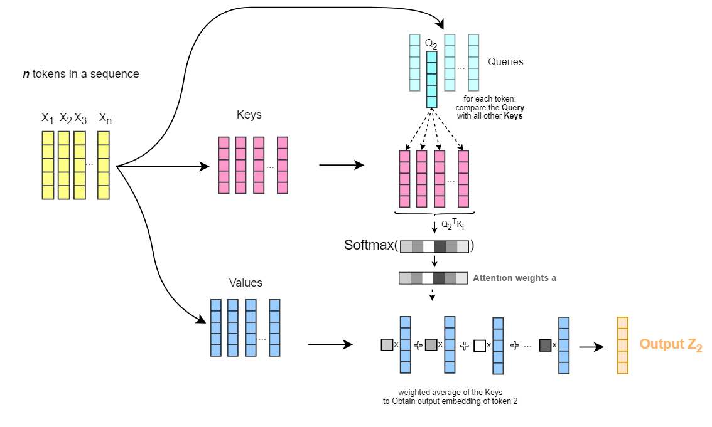
#### 1.4.4 Q、K、V 三矩阵概念
输入文本映射为 Embedding 后，通过乘以三个可学习的权重矩阵，为每个词生成三个向量：
- **Query ($Q$)**：查询向量（“我想寻找什么上下文？”）
- **Key ($K$)**：键向量（“我包含什么特征供别人匹配？”）
- **Value ($V$)**：值向量（“我实际代表的语义内容是什么？”）
计算流程四步：
1. 每个 token 分别生成 Q、K、V
1. **Q 和所有 K 做点积** → 算出相似度分数：代表当前词和其它词相关性多高
1. 分数做缩放 + Softmax 归一化 → 变成 0‑1 之间的**注意力权重**，权重越高代表越重要
1. 用权重对 V 加权求和，得到自注意力输出向量
公式简写：\(\text{Attention}(Q,K,V)=\text{Softmax}\left(\frac{QK^\mathrm{T}}{\sqrt{d_k}}\right)V\)
Attention(Q,K,V)=Softmax(dk​​QKT​)V
#### 1.4.5  多头注意力（Multi-Head Attention）与前馈网络（FFN）
在 Transformer 的单个 Encoder/Decoder 模块内，除了基础自注意力外还包含两个关键设计：
- **多头注意力 (MHA)**：把 $Q, K, V$ 拆分为多个独立子空间（例如 8 个头）分别计算注意力，最后拼接输出。不同“头”关注不同维度的关系（如语法结构、逻辑代词指代等）。
- **前馈网络 (FFN)**：自注意力层主要负责 Token 间的沟通；紧接着的 FFN 层对每个 Token 独立进行非线性变换，负责**知识存储与特征升维**。负责 **单个 Token 内部的知识提取与特征升维**（Computation / Memory）。
#### 1.4.6 完整 Decoder 一层执行流程（纯 Decoder 大模型）
```bash
输入Token嵌入向量
    ↓
【掩码多头自注意力】→捕捉上下文词与词关系
    ↓ 残差连接 + LayerNorm归一化
【FFN前馈网络】（MoE此处替换为专家层）→做知识变换、推理计算
    ↓ 残差连接 + LayerNorm归一化
输出传给下一层Decoder

```
- **残差连接 Residual**：防止深层网络梯度消失，把原始输入直接加到输出上
- **LayerNorm 层归一化**：稳定训练，让数值分布可控
几十上百层这样的 Decoder 堆叠起来，就是完整大模型。最后经过输出层，预测**下一个 token 概率分布**，选概率最高的词输出，循环生成直到结束。
#### 1.4.7 生成答案为什么需要mask
**掩码自注意力（Masked Self-Attention）**：
- **职责**：负责 **Token 之间的信息沟通**（Communication）。
- **掩码的作用**：防止模型在生成第 $N$ 个词时“抄近道”看到第 $N+1$ 个词（即只能看上文，不能看下文）。
#### 1.4.8 Transformer 的完整核心流程
```bash
文本输入
   │
   ▼
Tokenization
   │
   ▼
Token ID
   │
   ▼
Embedding
   │
   ▼
加入位置信息
   │
   ▼
┌──────────────────────────────┐
│ Transformer Layer            │
│                              │
│ Multi-Head Attention         │
│          ↓                   │
│ Add + LayerNorm              │
│          ↓                   │
│ Feed Forward Network         │
│          ↓                   │
│ Add + LayerNorm              │
└──────────────────────────────┘
   │
   ▼
重复 N 层
   │
   ▼
最终 Token 表示
   │
   ▼
根据模型任务进行预测
```
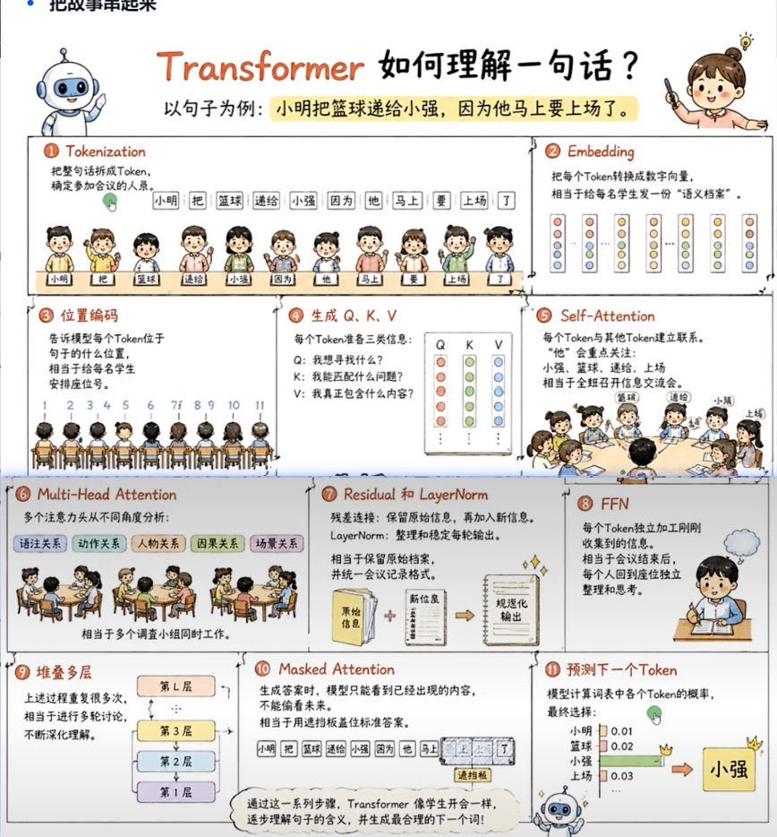
**核心概念总结**
| ******概念** | **作用** |
| --- | --- |
| Token | 输入的基本单位 |
| Embedding | 将 Token 转换为向量 |
| Position Encoding | 提供位置信息 |
| Q | 查询信息 |
| K | 用于计算相关性 |
| V | 实际提供的信息 |
| Self-Attention | Token 与其他 Token 建立关系 |
| Multi-Head Attention | 从多个角度计算 Attention |
| FFN | 对每个 Token 进行特征转换 |
| Residual | 保留原始信息，帮助深层网络训练 |
| LayerNorm | 稳定训练 |
| Mask | 限制 Attention 可以看到的信息 |
| Encoder | 主要用于理解输入 |
| Decoder | 主要用于生成输出 |
一句话理解 Transformer
Transformer 先将文本转换为 Token 向量，然后通过 Self-Attention 计算每个 Token 与其他 Token 的关系，根据注意力权重融合上下文信息，再经过多层 Attention 和 FFN 不断提取更高层次的特征，最终完成理解或生成任务。
### 1.5 大模型的训练与统计数据
知识如何编码到参数中
#### 1.5.1 大模型的知识如何来的
大模型本身**没有真正记忆、不会思考**，所有知识全部来自数据 + 训练，知识存储在神经网络的**参数权重**里面。
**三个阶段（即大模型的三阶段训练范式）**：
预训练（Pre-training）—— 吸收知识（海量阅读）
指令微调（SFT, Supervised Fine-Tuning）—— 激活知识（对齐人类）
人类反馈强化学习（RLHF / DPO）—— 价值观与偏好对齐
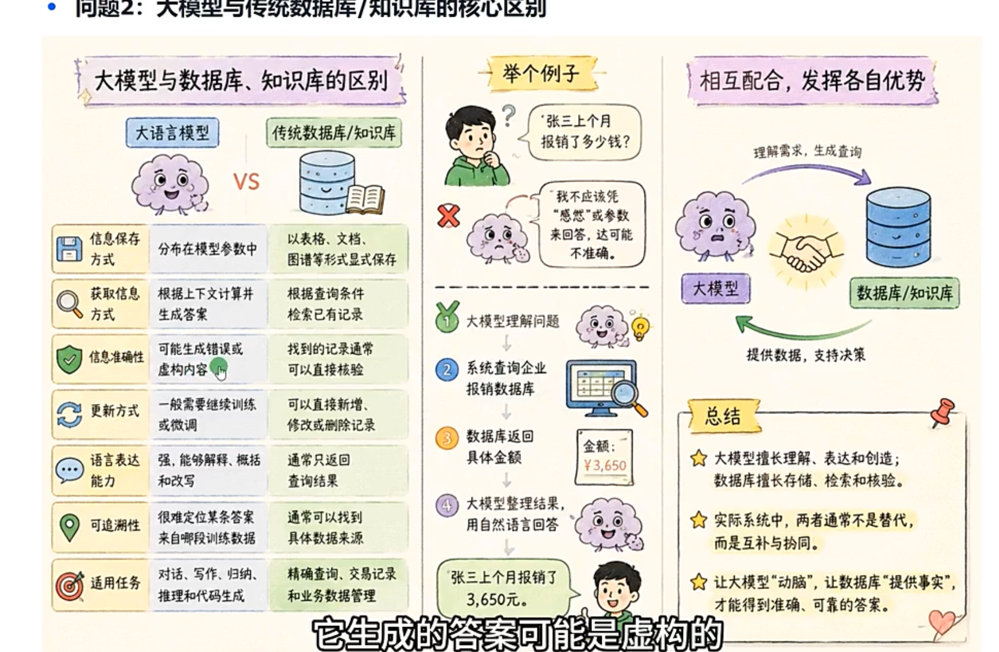
#### 1.5. 2 训练数据从哪里来
 百度百科
人工标注
合成数据
私有领域数据
#### 1.5.3 数据处理五大关键步骤
数据清洗、数据格式化、数据分词、数据混合、去重和判重。
#### 1.5.4 大模型调用数据（如何回答问题）
接收输入、组织上下文、预处理和编码、模型计算、逐个生产词元、后处理和安全检查、返回结果
```bash
[用户输入] ──► 1. 接收输入 (鉴权/限流)
                    │
                    ▼ 2. 组织上下文 (拼接 Prompt + 历史对话 + RAG 知识)
                    │
                    ▼ 3. 预处理和编码 (Tokenizer 分词 + Embedding + RoPE)
                    │
                    ▼ 4. 模型计算 (Prefill 阶段并行计算，构建 KV Cache)
                    │
                    ▼ 5. 逐个生产词元 (Decode 阶段自回归循环，结合 Temperature 采样)
                    │
                    ▼ 6. 后处理和安全检查 (Detokenization 转文本 + 敏感风控过滤)
                    │
                    ▼ 7. 返回结果 (SSE 流式推送 / 完整 JSON 响应) ──► [用户前端]
```
### 1.6 大模型为什么需要GPU
大模型依赖GPU进行训练和推理
#### 1.6.1  CPU/GPU的区别
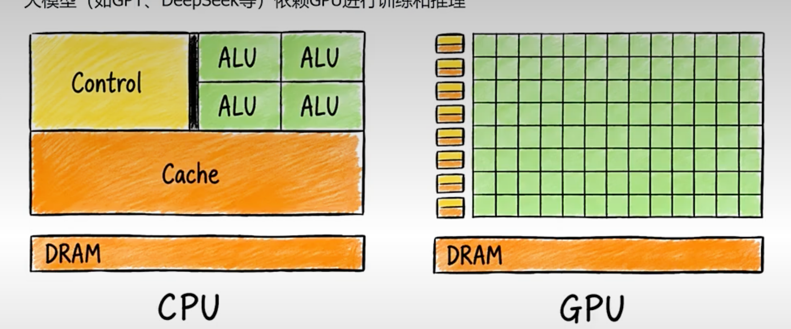
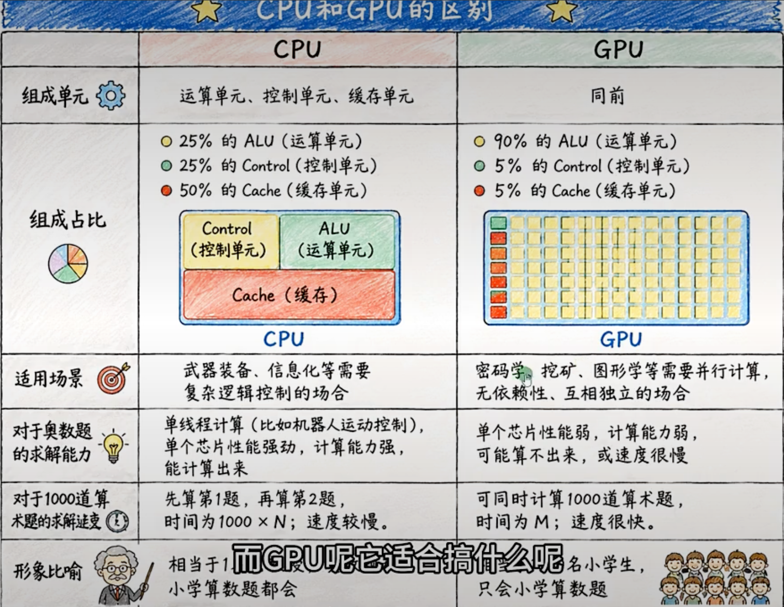
#### 1.6.2 什么深度学习通常使用GPU？
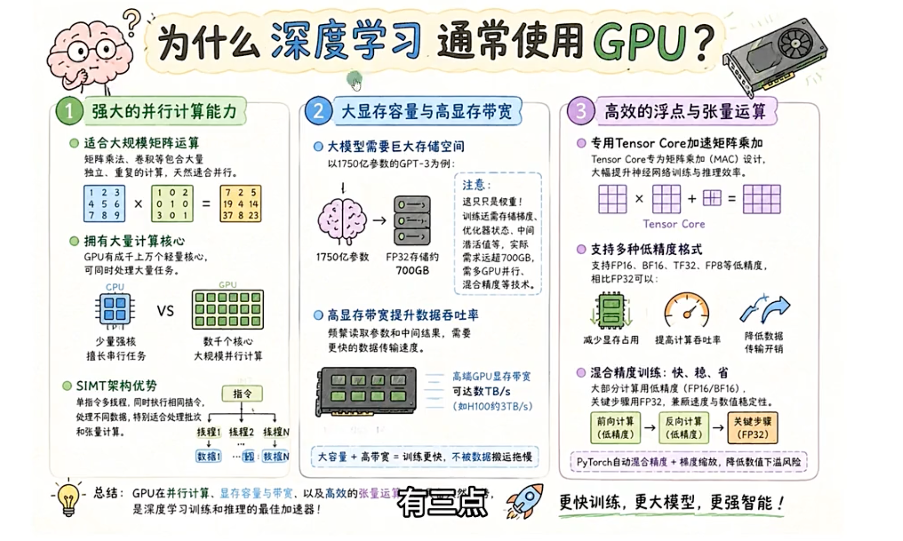
## 2 大模型私有部署
### 2.1 硬件配置估算
#### 2.1.1 硬件核心配置逻辑
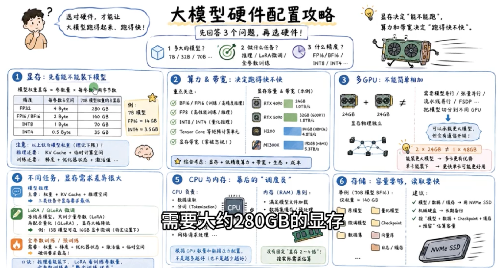
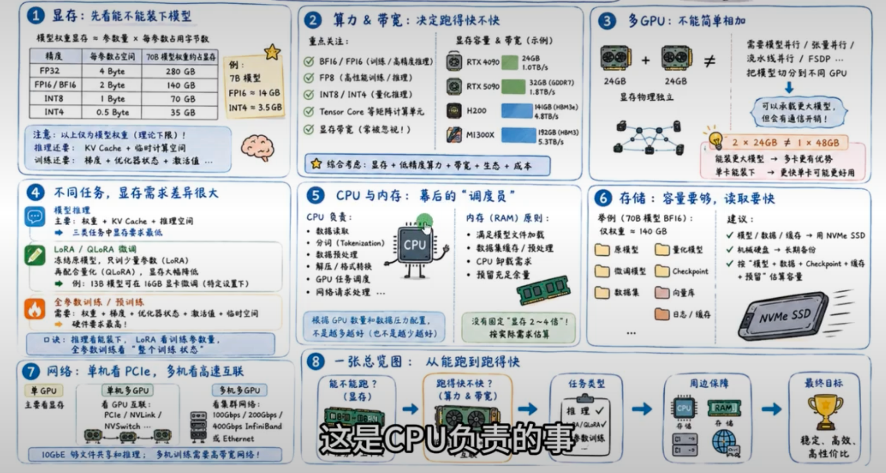
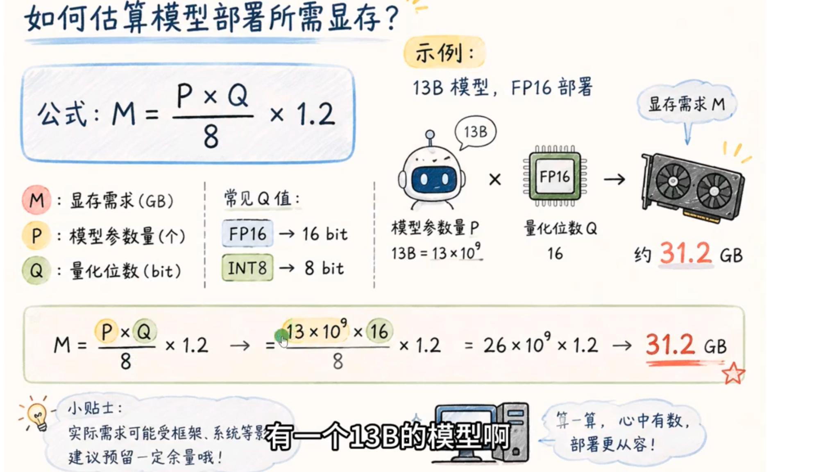
#### 2.1.2 硬件选项策略
1.数据安全与合规优先
2.成本控制优先
3.性能与效率优先
4.自主可控于国产适配优先
5.一个更实用的决策方法
### 2.2 部署思路和方案
开源模型：
hugginface：https://huggingface.co/models

魔搭社区：https://modelscope.cn/models

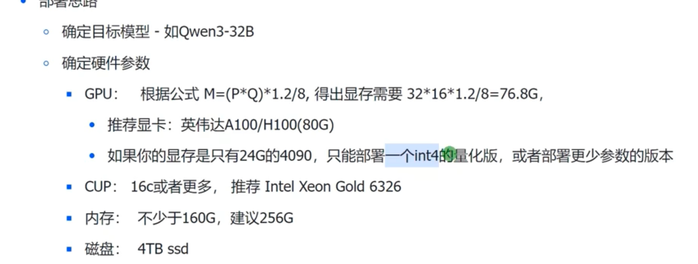
确定模型：确定硬件参数，GPU、CPU、内存、磁盘
### 2.3 使用阿里云PAI部署大模型
<span style="color:#0366d6"><u>https://pai.console.aliyun.com/</u></span>
方式一：模型部署--》模型在线服务--》部署服务--》LLM大语言模型部署
1、授权开通
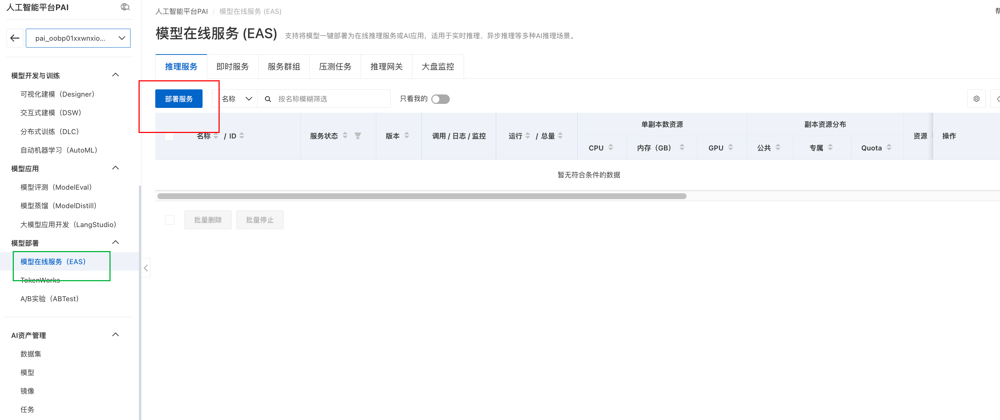
查看调用的信息
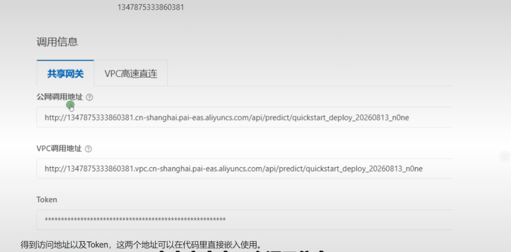
在cherry studio调用服务，添加已有的模型API。
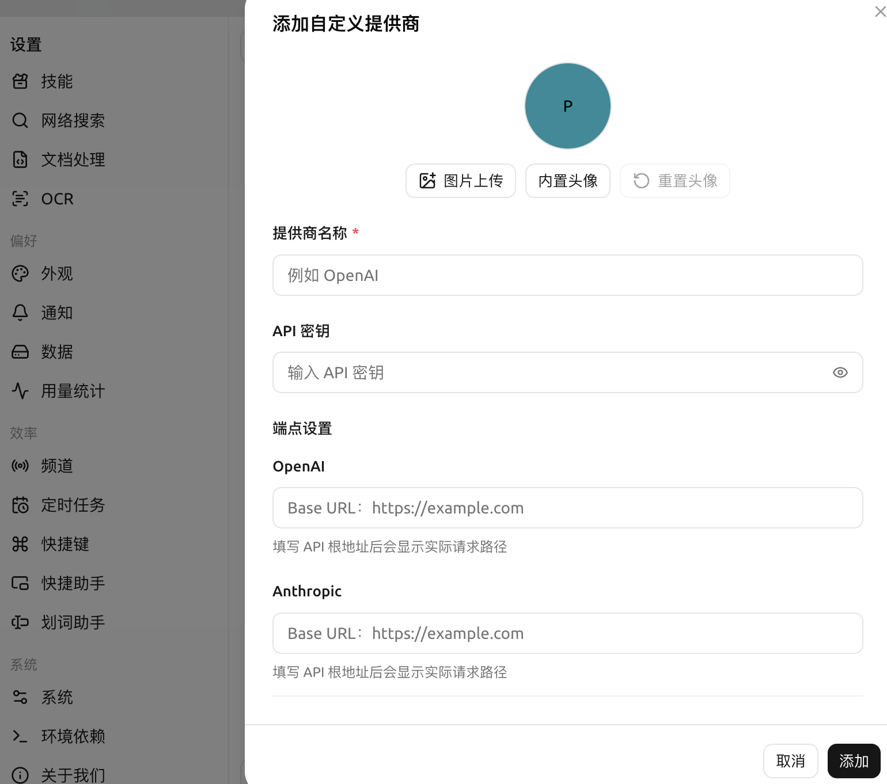
### 2.4 ollama方式部署大模型
https://www.ollama.com
1）AutoDL方式（容器化虚拟机）
<span style="color:#0366d6"><u>https://www.autodl.com</u></span>
容器实例--》租用新的实例
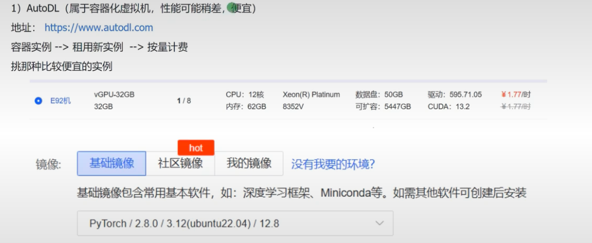
其它云
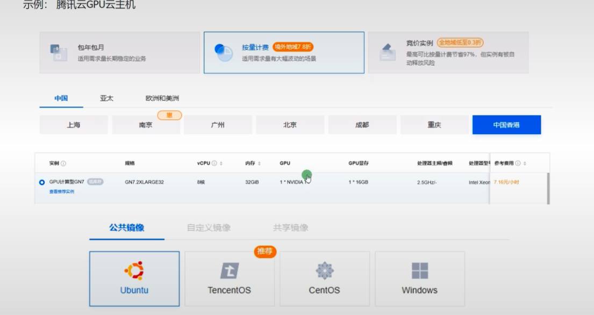
2）阿里云/腾讯云
https://www.aliyun.com/product/ecs
https://cloud.tencent.com/product/gpu
示例： 腾讯云GPU云主机
- 安装ollama（Linux系统）
一键脚本安装：
```
curl -fsSL https://ollama.com/install.sh  | sh
```
这个执行大概率会卡死，因为ollama的包很大，国内网络下载很慢
解决方法是：利用迅雷下载ollama包，然后上传到云主机，ollama包地址：https://github.com/ollama/ollama/releases/latest/download/ollama-linux-amd64.tar.zst
将ollama包上传到linux机器后，按如下步骤安装ollama
1）解压
```
sudo tar --zstd -xf ollama-linux-amd64.tar.zst -C /usr
```
2）配置服务与启动
增加ollama用户
```
sudo useradd ollama  
sudo  mkdir -p /home/ollama 
sudo  usermod -g ollama `whoami`  # root用户不用执行
```
编辑service文件
创建服务文件 /etc/systemd/system/ollama.service ，内容如下：
```
[Unit]
Description=Ollama Service 
After=network-online.target  

[Service]
ExecStart=/usr/bin/ollama serve 
User=ollama 
Group=ollama 
Restart=on-failure 
Environment="OLLAMA_HOST=0.0.0.0:11434"  # 允许外部访问 

[Install]
WantedBy=default.target
```
启用并启动服务
```
sudo systemctl daemon-reload 
sudo systemctl enable ollama 
sudo  systemctl start ollama
```
3）验证安装
检查版本
```
ollama -v
```
- 安装cuda驱动（autodl/腾讯云 默认已经安装）
如果是ubuntu系统：
安装cuda驱动
```
apt list |grep nvidia-driver #先看可用版本
apt install nvidia-driver-570 #安装最新版本
```
如果是RHEL/CentOS:
```
yum install nvidia-driver
```
验证是否安装：
```
nvidia-smi  # 显示 GPU 状态即成功，并查看具体版本
```
- 用ollama部署大模型
模型库列表： https://ollama.com/library
部署千问3.5-8B模型
```
ollama run qwen3.5:0.8b
```
查看本地已经下载的大模型列表：
```
ollama ls 
# 或者 
ollama  list
```
查看本地运行的大模型：
```
ollama ps
```
- 安装Openwebui
1）安装python3.11和对应的pip
```
sudo apt install python3.11 python3-pip
```
如果系统已有python3.10和3.10对应的pip
```
pip3 -V #可以查看到对应python版本
```
此时需要做虚拟环境
```
sudo  apt install python3.11-venv  #安装虚拟环境相关包
sudo python3.11 -m venv myenv #创建虚拟环境  myenv
source myenv/bin/activate   #进入虚拟环境
```
用pip3.11安装openwebui
```
sudo /home/aming/myenv/bin/pip3.11 install open-webui -i https://pypi.tuna.tsinghua.edu.cn/simple
```
启动服务
浏览器访问
可能需要配置安全组策略，放开8080端口
### 2.5 vLLM方式部署
- 租用云主机（有本地硬件环境的同学，可以跳过）
我这里使用AutoDL，步骤略
- 安装vllm
参考文档 https://docs.vllm.ai/en/latest/getting_started/installation/gpu.html
注意，这里默认机器上已经有python3.12环境，如果没有需要先安装这个版本的python
创建虚拟环境
```
python3.12 -m venv /opt/vllm
source /opt/vllm/bin/activate
```
在这个虚拟环境里安装vllm
```
pip3 install "vllm>=0.17.0"  -i https://pypi.tuna.tsinghua.edu.cn/simple ##如果没有pip命令，需要先安装python3以及pip3
```
- 下载大模型
查看vllm所支持的大模型列表：
https://docs.vllm.ai/en/latest/models/supported_models/
在modelscope下载大模型
```
pip3 install modelscope -i https://pypi.tuna.tsinghua.edu.cn/simple #安装modelscope模块
```
下载大模型
```
mkdir -p /models/
modelscope download --model Qwen/Qwen3.5-4B --local_dir /models/Qwen3.5-4B
```
下载后的模型在： /models/Qwen3.5-4B
- vllm运行大模型
安装openai模块
```
pip3 install openai -i https://pypi.tuna.tsinghua.edu.cn/simple
```
运行模型
```
OMP_NUM_THREADS=4  vllm serve /models/Qwen3.5-4B --served-model-name Qwen3-4B --gpu-memory-utilization 0.95 --max-model-len 4096 --api-key sk-123456 --port 6006
```
说明：
--served-model-name Qwen2-7B # 指定模型名字，自定义的，不固定，调接口时使用
--gpu-memory-utilization 0.95 *# 提升显存利用率（默认0.9，最大建议0.95）*
--max-model-len 4096 *# 降低最大序列长度（根据需求调整）*
--api-key # 定义api key
--port 6006 # 自定义端口为6006，因为autodl 6006端口支持直接访问
- vllm其它用法
1）启用混合精度量化
```
vllm serve your_model_path  \
--dtype half \                  
--gpu-memory-utilization 0.9
```
说明：
--dtype half # 使用 FP16 半精度减少显存占用，显存需求降低约50%
2）分布式推理（多 GPU 并行）
```
# 在多 GPU 上分摊显存压力 
vllm serve your_model_path  \
--tensor-parallel-size 2 \ 
--gpu-memory-utilization 0.9
```
说明：
--tensor-parallel-size 2 # 使用2张GPU并行
3）启用模型量化（如 AWQ/GPTQ）
```
# 使用 AWQ 量化进一步压缩模型 
vllm serve your_model_path  \
--quantization awq \  
--gpu-memory-utilization 0.9
```
说明：
--quantization awq # 需模型支持量化格式
3）参数参考表
| 参数 | 典型值范围 | 作用说明 |
| --- | --- | --- |
| --gpu-memory-utilization | 0.8~0.95 | 显存利用率（过高可能导致 OOM） |
| --max-model-len | 2048/4096/8192 | 限制模型处理的最大序列长度 |
| --tensor-parallel-size | 1~8 | GPU 并行数量（需物理 GPU 支持） |
| --dtype | half/auto | 量化类型（显存敏感场景用 half） |
- curl测试
```
curl localhost:6006/v1/models   ##查看模型列表
```
- 调用接口简单示例
```
# 使用正确的 API 端点进行测试 
curl http://localhost:6006/v1/completions \
-H "Authorization: Bearer sk-123456" \
-H "Content-Type: application/json" \
-d '{
    "model": "Qwen3-4B",  
    "prompt": "你好",
    "temperature": 0.7,
    "max_tokens": 50 
}'
```
说明： 如果加载模型时，并未指定模型名字，则这里的model必须要写全，若指定参数 --served-model-name modelname ，那么这里就可以直接写modelname了
- 通过AutoDL自定义服务访问
1）首先要实名认证
2）自定义服务
- 利用cherry studio访问vllm 部署的大模型
打开 cherry studio，点击右上角的小齿轮，点击“+ 添加”
说明：这个API地址就是autodl 6006端口映射的那个地址，但是后面需要加/v1
点击“获取模型列表”，可以列出模型
点击右侧的“+”，添加该模型
设置为模型模型
- 访问模型
点击“首页”，点击“默认助手”，然后对话
```
你好
```
### 2.6 集群模式部署
- 准备机器（这里大家可以用阿里云，GPU选A10或更高级别，不要选T4，跑不动）
<span style="color:#d83931">省钱技巧：可以先在一台机器上下载模型、安装环境，等这些工作做完后，另外一台直接用这台机器的镜像来做系统</span>
- 使用Autodl（可选）
说明：由于Autodl为容器实例，要想使用集群模式要保证两个实例在一台主机上才可以。
- 部署
1）安装驱动、cuda（所有机器都操作）
如果用阿里云或者Autodl，不需要做这一步，驱动已经有了
如果需要安装，请到英伟达官网下载对应版本的驱动文件
参考： https://help.aliyun.com/zh/egs/user-guide/install-a-gpu-driver-on-a-gpu-accelerated-compute-optimized-linux-instance
2）下载模型
安装魔搭(modelscope)模块
```
pip3 install modelscope
```
下载模型
```
mkdir -p /root/autodl-tmp/models/
modelscope download --model Qwen/Qwen3.5-4B --local_dir /root/autodl-tmp/models/Qwen3.5-4B
```
3）安装Ray和vLLM 以及依赖库（所有机器都操作）
- 版本要求：
```
按 2026-08-13 官方最新稳定版本，如果要做 vLLM + Ray 多机 GPU 集群，并部署 Qwen3.5-4B，建议组件推荐版本：vLLM   0.27.1Ray  2.57.0PyTorch   2.13.0Python   3.12CUDA   13.2 Transformers由 vLLM 自动管理，>=5.5.3
```
- 用conda创建纯净的环境
先安装conda （阿里云机器需要，Autodl不需要）
```
wget https://repo.anaconda.com/miniconda/Miniconda3-latest-Linux-x86_64.sh
bash Miniconda3-latest-Linux-x86_64.sh
source ~/.bashrc
# 检查是否安装完成
conda --version
```
创建虚拟环境（python3.12）
```
conda create -n vllm-ray python=3.12 -y
conda init bash 
exit  ## 退出终端，重新登录
conda activate vllm-ray
```
如果报错：
执行
```
conda config --remove channels https://mirrors.tuna.tsinghua.edu.cn/anaconda/pkgs/free/
```
检查python3路径
```
which  python3
```
如果不是 /root/miniconda3/envs/vllm-ray/bin/python3 这个路径，还需要执行下面命令，如果是不用执行
```
conda install -n vllm-ray python=3.12 -y
conda deactivate
conda activate vllm-ray
```
安装uv
```
pip install -U uv
```
然后用uv安装 vllm
```
uv pip install "vllm==0.27.1" --torch-backend=auto ## 让它自动决策安装哪个版本的cuda
```
再安装Ray
```
uv pip install "ray[default,cgraph]==2.57.0"
```
安装完检查
```
python -c "import torch; print(torch.__version__, torch.version.cuda)"
python -c "import vllm; print(vllm.__version__)"
python -c "import ray; print(ray.__version__)"
```
应该出现：
```
2.13.0+cu132 13.2
0.27.1
2.57.0
```
4）启动Ray集群
假设两台机器IP（我的是Autodl容器实例）
```
Node 1: 172.17.0.4
Node 2: 172.17.0.6
```
其中Node 1作为主节点，执行：
```
## 以下这部分只需要在Autodl机器上执行
export VLLM_HOST_IP=172.17.0.4
export GLOO_SOCKET_IFNAME=eth0
export NCCL_SOCKET_IFNAME=eth0
export NCCL_DEBUG=INFO
## 以上需要在Autodl机器上执行
ray stop -f

ray start \
  --head \
  --node-ip-address=172.17.0.4 \
  --port=6379 \
  --dashboard-host=0.0.0.0
```
Node 2 作为从节点，执行：
```
## 以下这部分只需要在Autodl机器上执行
export VLLM_HOST_IP=172.17.0.6
export GLOO_SOCKET_IFNAME=eth0
export NCCL_SOCKET_IFNAME=eth0
export NCCL_DEBUG=INFO
## 以上需要在Autodl机器上执行
ray stop -f

ray start \
  --address=172.17.0.4:6379 \
  --node-ip-address=172.17.0.6
```
查看集群状态：
```
ray status
ray list nodes
```
5）加载大模型（主节点上执行）
```
## 以下这部分只需要在Autodl机器上执行
export VLLM_HOST_IP=172.17.0.4
export GLOO_SOCKET_IFNAME=eth0
export NCCL_SOCKET_IFNAME=eth0
export NCCL_DEBUG=INFO
## 以上需要在Autodl机器上执行

nohup vllm serve /root/autodl-tmp/models/Qwen3.5-4B \
    --served-model-name Qwen3.5-4B \
    --distributed-executor-backend ray \
    --tensor-parallel-size 1 \
    --pipeline-parallel-size 2 \
    --max-model-len 32768 \
    --gpu-memory-utilization 0.90 \
    --host 0.0.0.0 \
    --port 6006  > /tmp/vllm.log 2> /tmp/vllm.log &
```
参数说明：
- --distributed-executor-backend ray ： 分布式 worker 由 **Ray** 管理，告诉 vLLM 使用已经启动好的 Ray Cluster
- --tensor-parallel-size 1 / -tp 1 ： Tensor Parallel 数量， 每个 pipeline stage 使用 1 张 GPU
- --pipeline-parallel-size 2 / -pp 2 ： Pipeline Parallel 数量，把模型按层拆成 2 个 stage，分别运行在两张 GPU / 两个节点上
- --reasoning-parser qwen3 ： 解析 Qwen 的 reasoning/thinking 输出，使用 OpenAI API 时可把 reasoning 内容正确解析出来
6）测试（主节点上）
- 若需要开启远程访问，需要配置安全组策略（阿里云）
## 3 大模型微调
大模型微调（FIne-tuning）是深度学习领域中一项关键技术，通过对预训练模型进行特定任务或领域的进一步训练，优化其性能以适应特定的应用场景。
### 3.1 搞懂大模型微调
#### 3.1.1 为什么需要微调
#### 3.1.2 微调技术分类
按参数更新范围分类
全参数微调（full fine-tunning）
原理
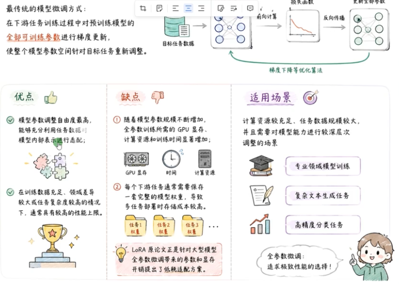
参数高效微调
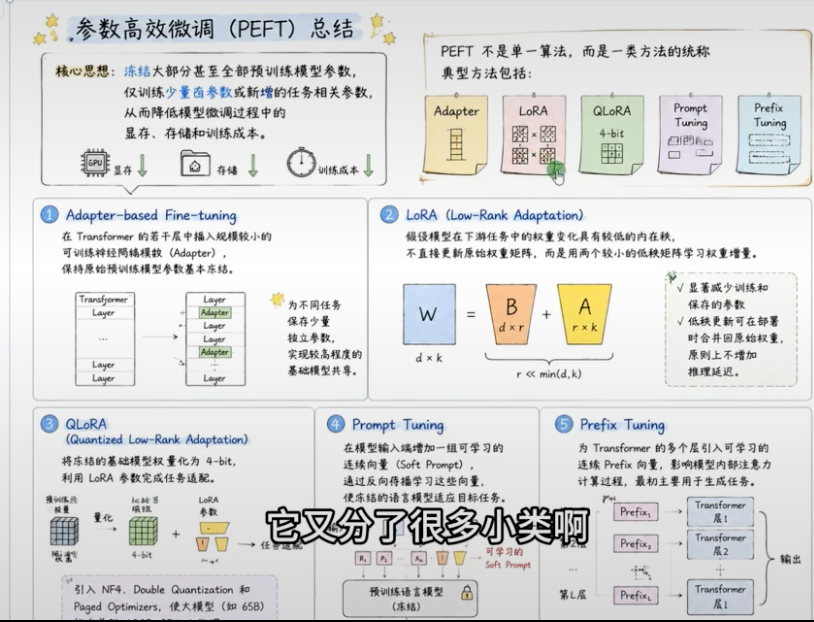
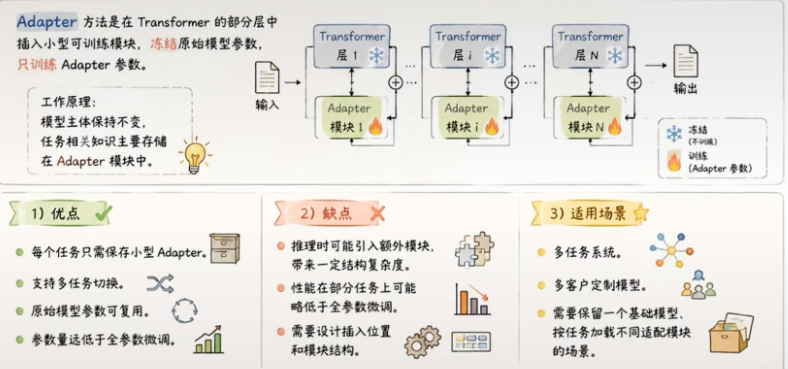
LoRA（low-rank Adaptaion）

QLoRa
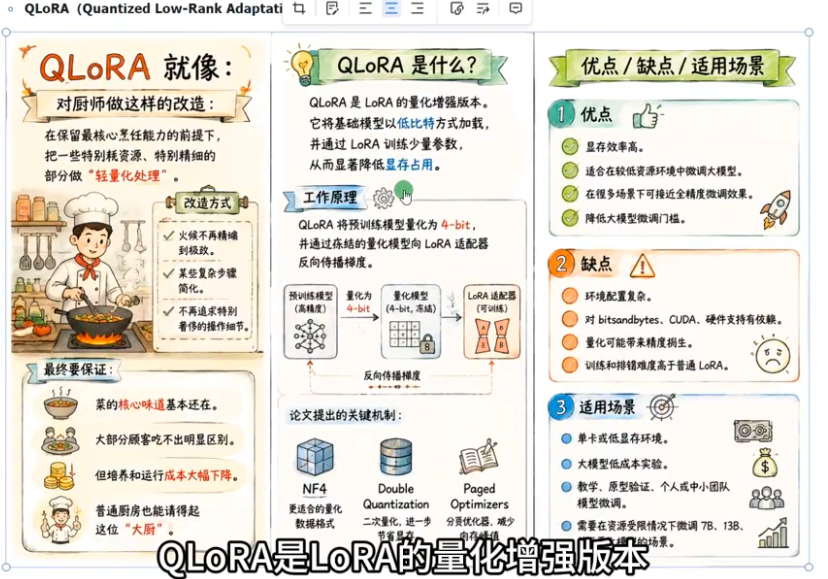
Prompt Tuning

Prefix Tuning
在每个关键环节都给提醒
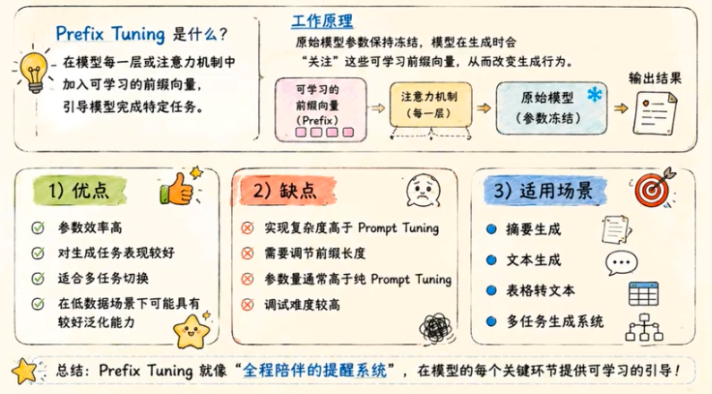
2 按领域和任务适配过程分类
领域/任务自适应继续预训练+ 微调
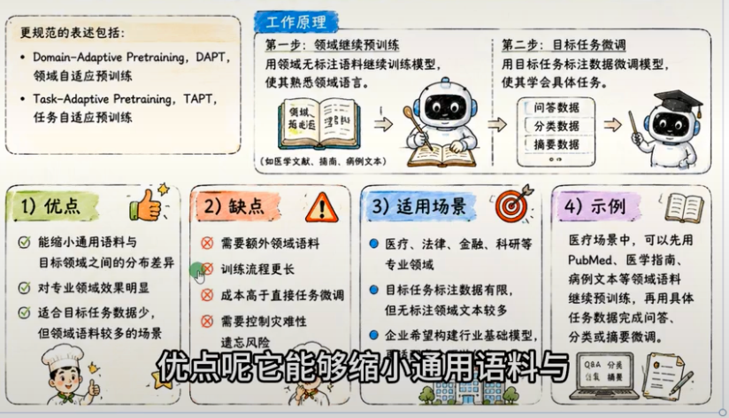
1. 按训练数据和学习目标分类
指令微调instruction fine-tuning
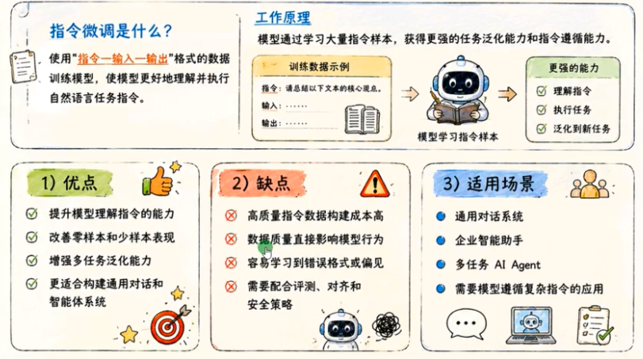
1. 按知识迁移与模型压缩方式分类
知识蒸馏微调
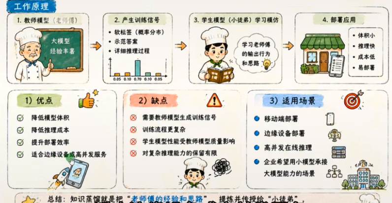
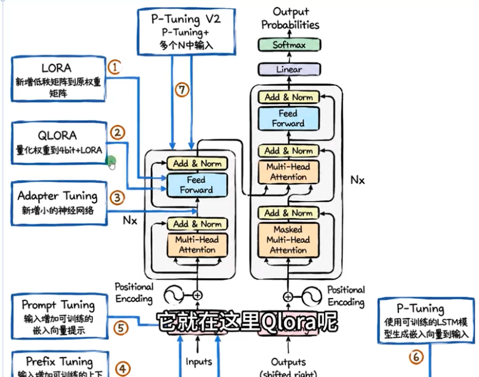
#### 3.1.3 技术选型指南
通过不同任务、数据规模、计算资源和部署环节，对微调方法的要求不同。
- 想要获取最高性能-全参数微调
- 资源有限但希望保持较好效果-- 参数高效微调
- 数据非常少-- 优先开了prompt方法或少样本学习
- 需要部署到手机、边缘设备- 知识蒸馏和模型压缩
1. 根据任务复杂度
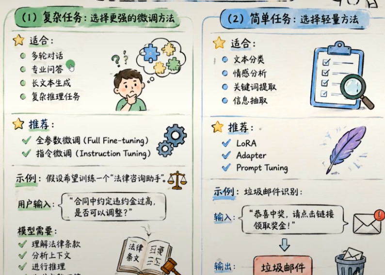
2.根据数据规模
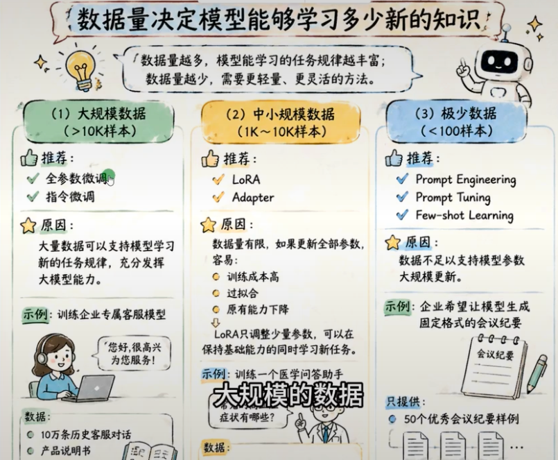
3.根据计算资源
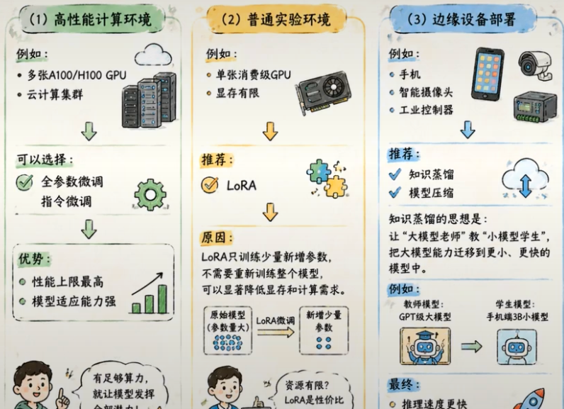
4.根据部署需求
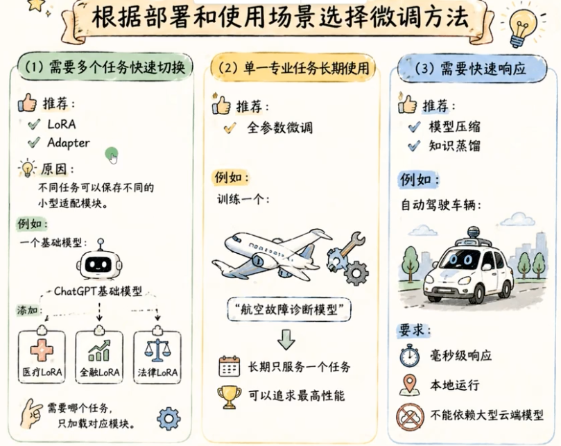
####  3.1.4 微调领域里的重要概念
1. SFT监督微调
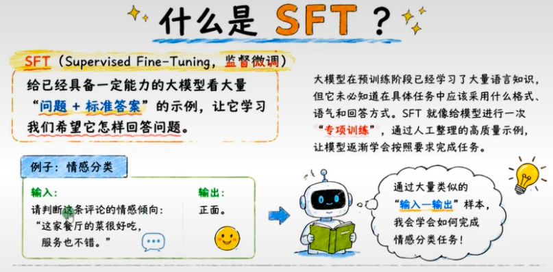
核心：输入---标准输出，更符合特定任务需求的模型
1. DPO direct preference Optimization 直接偏好优化
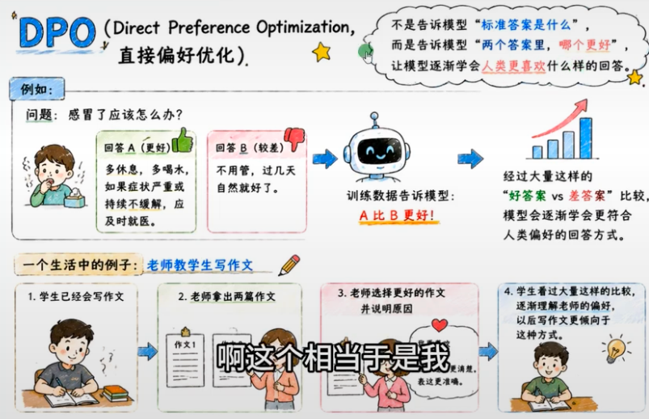
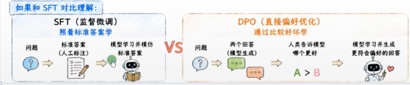
1. ORPO odds 优势比偏好优化
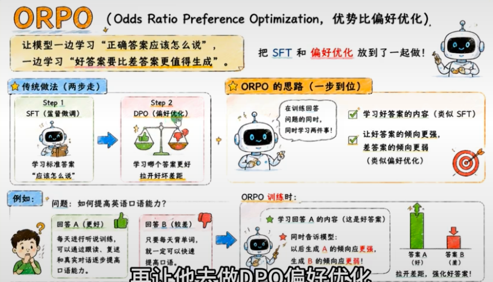