## **2 大模型私有部署**
### 2.1 硬件配置估算
#### 2.1.1 硬件核心配置逻辑


#### 2.1.2 硬件选项策略
1.数据安全与合规优先
2.成本控制优先
3.性能与效率优先
4.自主可控于国产适配优先
5.一个更实用的决策方法
### 2.2 部署思路和方案
开源模型：
hugginface：https://huggingface.co/models

魔搭社区：https://modelscope.cn/models


确定模型：确定硬件参数，GPU、CPU、内存、磁盘
### 2.3 使用阿里云PAI部署大模型
<span style="color:#0366d6"><u>https://pai.console.aliyun.com/</u></span>
方式一：模型部署--》模型在线服务--》部署服务--》LLM大语言模型部署
1、授权开通

查看调用的信息

在cherry studio调用服务，添加已有的模型API。

### 2.4 ollama方式部署大模型
https://www.ollama.com
1）AutoDL方式（容器化虚拟机）
<span style="color:#0366d6"><u>https://www.autodl.com</u></span>
容器实例--》租用新的实例

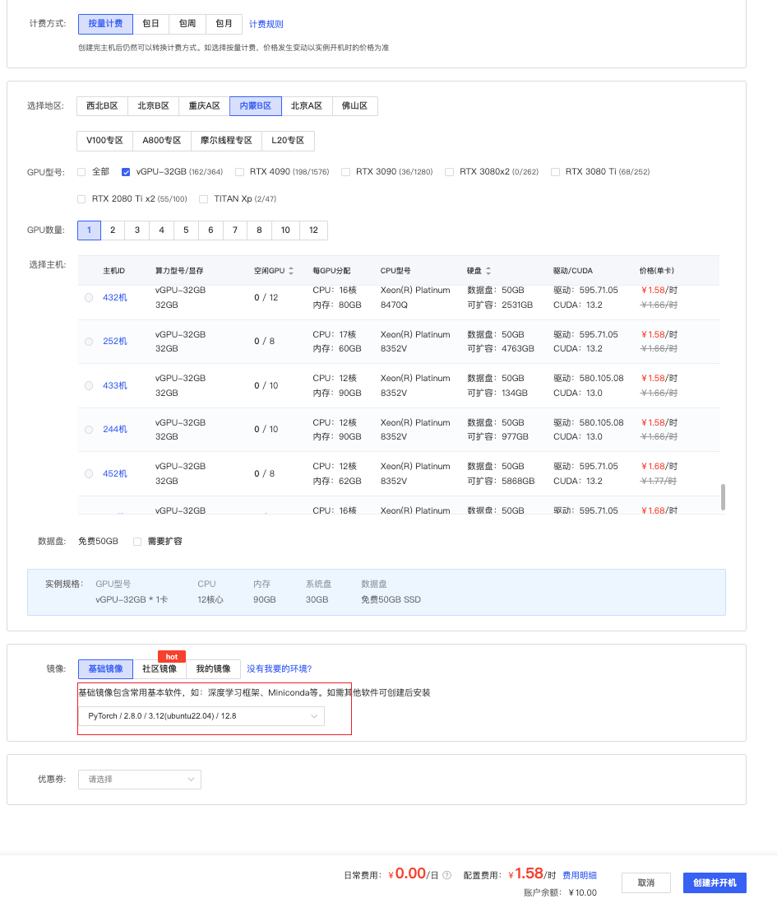
其它云

2）阿里云/腾讯云
https://www.aliyun.com/product/ecs
https://cloud.tencent.com/product/gpu
示例： 腾讯云GPU云主机
- 安装ollama（Linux系统）
连接到机器
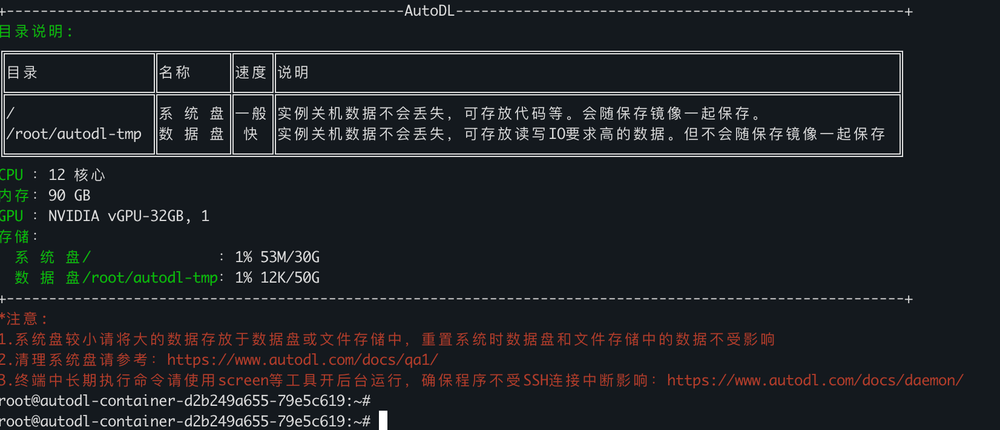
一键脚本安装：
```
curl -fsSL https://ollama.com/install.sh  | sh
curl -fsSL https://ollama.com/install.sh | sh
```
这个执行大概率会卡死，因为ollama的包很大，国内网络下载很慢
解决方法是：利用迅雷下载ollama包，然后上传到云主机，ollama包地址：https://github.com/ollama/ollama/releases/latest/download/ollama-linux-amd64.tar.zst
将ollama包上传到linux机器后，按如下步骤安装ollama
1）解压
```
sudo tar --zstd -xf ollama-linux-amd64.tar.zst -C /usr
```
2）配置服务与启动
增加ollama用户
```
sudo useradd ollama  
sudo  mkdir -p /home/ollama 
sudo  usermod -g ollama `whoami`  # root用户不用执行
```
编辑service文件
创建服务文件 /etc/systemd/system/ollama.service ，内容如下：
```
[Unit]
Description=Ollama Service 
After=network-online.target  

[Service]
ExecStart=/usr/bin/ollama serve 
User=ollama 
Group=ollama 
Restart=on-failure 
Environment="OLLAMA_HOST=0.0.0.0:11434"  # 允许外部访问 

[Install]
WantedBy=default.target
```
启用并启动服务
```
sudo systemctl daemon-reload 
sudo systemctl enable ollama 
sudo  systemctl start ollama
```
3）验证安装
检查版本
```
ollama -v
```
- 安装cuda驱动（autodl/腾讯云 默认已经安装）
如果是ubuntu系统：
安装cuda驱动
```
apt list |grep nvidia-driver #先看可用版本
apt install nvidia-driver-570 #安装最新版本
```
如果是RHEL/CentOS:
```
yum install nvidia-driver
```
验证是否安装：
```
nvidia-smi  # 显示 GPU 状态即成功，并查看具体版本
```
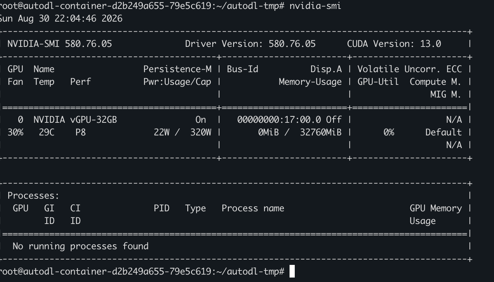
- 用ollama部署大模型
模型库列表： https://ollama.com/library
部署千问3.5-8B模型
```
ollama run qwen3.5:0.8b
```
查看本地已经下载的大模型列表：
```
ollama ls 
# 或者 
ollama  list
```
查看本地运行的大模型：
```
ollama ps
```
- 安装Openwebui
1）安装python3.11和对应的pip
```
sudo apt install python3.11 python3-pip
```
如果系统已有python3.10和3.10对应的pip
```
pip3 -V #可以查看到对应python版本
```
此时需要做虚拟环境
```
sudo  apt install python3.11-venv  #安装虚拟环境相关包
sudo python3.11 -m venv myenv #创建虚拟环境  myenv
source myenv/bin/activate   #进入虚拟环境
```
用pip3.11安装openwebui
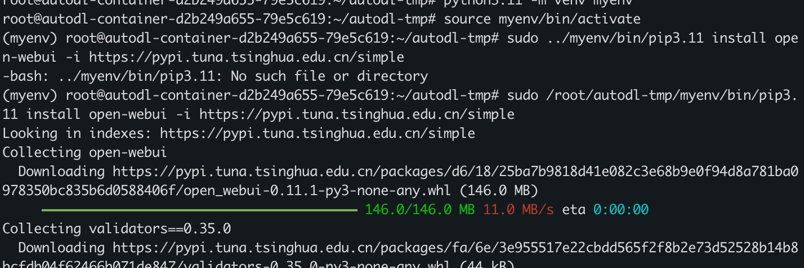
```
sudo /home/aming/myenv/bin/pip3.11 install open-webui -i https://pypi.tuna.tsinghua.edu.cn/simple
```
启动服务
浏览器访问
可能需要配置安全组策略，放开8080端口
### 2.5 vLLM方式部署
- 租用云主机（有本地硬件环境的同学，可以跳过）
我这里使用AutoDL，步骤略
- 安装vllm
参考文档 https://docs.vllm.ai/en/latest/getting_started/installation/gpu.html
注意，这里默认机器上已经有python3.12环境，如果没有需要先安装这个版本的python
创建虚拟环境
```
python3.12 -m venv /opt/vllm
source /opt/vllm/bin/activate
```
在这个虚拟环境里安装vllm
```
pip3 install "vllm>=0.17.0"  -i https://pypi.tuna.tsinghua.edu.cn/simple ##如果没有pip命令，需要先安装python3以及pip3
```
- 下载大模型
查看vllm所支持的大模型列表：
https://docs.vllm.ai/en/latest/models/supported_models/
在modelscope下载大模型
```
pip3 install modelscope -i https://pypi.tuna.tsinghua.edu.cn/simple #安装modelscope模块
```
下载大模型
```
mkdir -p /models/
modelscope download --model Qwen/Qwen3.5-4B --local_dir /models/Qwen3.5-4B
```
下载后的模型在： /models/Qwen3.5-4B
- vllm运行大模型
安装openai模块
```
pip3 install openai -i https://pypi.tuna.tsinghua.edu.cn/simple
```
运行模型
```
OMP_NUM_THREADS=4  vllm serve /models/Qwen3.5-4B --served-model-name Qwen3-4B --gpu-memory-utilization 0.95 --max-model-len 4096 --api-key sk-123456 --port 6006
```
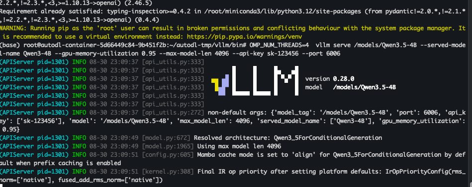
说明：
--served-model-name Qwen2-7B # 指定模型名字，自定义的，不固定，调接口时使用
--gpu-memory-utilization 0.95 *# 提升显存利用率（默认0.9，最大建议0.95）*
--max-model-len 4096 *# 降低最大序列长度（根据需求调整）*
--api-key # 定义api key
--port 6006 # 自定义端口为6006，因为autodl 6006端口支持直接访问
```bash
root@autodl-container-5d66449c84-9b451f2b:~/autodl-tmp/vllm/bin# source activate
(base) root@autodl-container-5d66449c84-9b451f2b:~/autodl-tmp/vllm/bin# nvidia-smi
Sun Aug 30 23:08:53 2026
+-----------------------------------------------------------------------------------------+
| NVIDIA-SMI 580.76.05              Driver Version: 580.76.05      CUDA Version: 13.0     |
+-----------------------------------------+------------------------+----------------------+
| GPU  Name                 Persistence-M | Bus-Id          Disp.A | Volatile Uncorr. ECC |
| Fan  Temp   Perf          Pwr:Usage/Cap |           Memory-Usage | GPU-Util  Compute M. |
|                                         |                        |               MIG M. |
|=========================================+========================+======================|
|   0  NVIDIA vGPU-32GB               On  |   00000000:32:00.0 Off |                  N/A |
| 30%   35C    P8              6W /  320W |       0MiB /  32760MiB |      0%      Default |
|                                         |                        |                  N/A |
+-----------------------------------------+------------------------+----------------------+

+-----------------------------------------------------------------------------------------+
| Processes:                                                                              |
|  GPU   GI   CI              PID   Type   Process name                        GPU Memory |
|        ID   ID                                                               Usage      |
|=========================================================================================|
|  No running processes found                                                             |
+-----------------------------------------------------------------------------------------+
(base) root@autodl-container-5d66449c84-9b451f2b:~/autodl-tmp/vllm/bin# clear
(base) root@autodl-container-5d66449c84-9b451f2b:~/autodl-tmp/vllm/bin# pip3 install openai -i https://pypi.tuna.tsinghua.edu.cn/simple
Looking in indexes: https://pypi.tuna.tsinghua.edu.cn/simple
Requirement already satisfied: openai in /root/miniconda3/lib/python3.12/site-packages (3.6.0)
Requirement already satisfied: anyio<5,>=4.10.0 in /root/miniconda3/lib/python3.12/site-packages (from openai) (4.10.0)
Requirement already satisfied: httpx2<3,>=2.7.0 in /root/miniconda3/lib/python3.12/site-packages (from openai) (2.12.0)
Requirement already satisfied: jiter<1,>=0.16.0 in /root/miniconda3/lib/python3.12/site-packages (from openai) (0.16.0)
Requirement already satisfied: pydantic!=2.0.*,!=2.1.*,!=2.2.*,!=2.3.*,<3,>=1.10.13 in /root/miniconda3/lib/python3.12/site-packages (from openai) (2.13.5)
Requirement already satisfied: sniffio in /root/miniconda3/lib/python3.12/site-packages (from openai) (1.3.1)
Requirement already satisfied: typing-extensions<5,>=4.14 in /root/miniconda3/lib/python3.12/site-packages (from openai) (4.16.0)
Requirement already satisfied: idna>=2.8 in /root/miniconda3/lib/python3.12/site-packages (from anyio<5,>=4.10.0->openai) (3.19)
Requirement already satisfied: httpcore2==2.12.0 in /root/miniconda3/lib/python3.12/site-packages (from httpx2<3,>=2.7.0->openai) (2.12.0)
Requirement already satisfied: truststore>=0.10 in /root/miniconda3/lib/python3.12/site-packages (from httpx2<3,>=2.7.0->openai) (0.10.4)
Requirement already satisfied: h11>=0.16 in /root/miniconda3/lib/python3.12/site-packages (from httpcore2==2.12.0->httpx2<3,>=2.7.0->openai) (0.16.0)
Requirement already satisfied: annotated-types>=0.6.0 in /root/miniconda3/lib/python3.12/site-packages (from pydantic!=2.0.*,!=2.1.*,!=2.2.*,!=2.3.*,<3,>=1.10.13->openai) (0.8.0)
Requirement already satisfied: pydantic-core==2.46.5 in /root/miniconda3/lib/python3.12/site-packages (from pydantic!=2.0.*,!=2.1.*,!=2.2.*,!=2.3.*,<3,>=1.10.13->openai) (2.46.5)
Requirement already satisfied: typing-inspection>=0.4.2 in /root/miniconda3/lib/python3.12/site-packages (from pydantic!=2.0.*,!=2.1.*,!=2.2.*,!=2.3.*,<3,>=1.10.13->openai) (0.4.4)
WARNING: Running pip as the 'root' user can result in broken permissions and conflicting behaviour with the system package manager. It is recommended to use a virtual environment instead: https://pip.pypa.io/warnings/venv
(base) root@autodl-container-5d66449c84-9b451f2b:~/autodl-tmp/vllm/bin# OMP_NUM_THREADS=4  vllm serve /models/Qwen3.5-4B --served-model-name Qwen3-4B --gpu-memory-utilization 0.95 --max-model-len 4096 --api-key sk-123456 --port 6006
(APIServer pid=1301) INFO 08-30 23:09:37 [api_utils.py:333]
(APIServer pid=1301) INFO 08-30 23:09:37 [api_utils.py:333]        █     █     █▄   ▄█
(APIServer pid=1301) INFO 08-30 23:09:37 [api_utils.py:333]  ▄▄ ▄█ █     █     █ ▀▄▀ █  version 0.28.0
(APIServer pid=1301) INFO 08-30 23:09:37 [api_utils.py:333]   █▄█▀ █     █     █     █  model   /models/Qwen3.5-4B
(APIServer pid=1301) INFO 08-30 23:09:37 [api_utils.py:333]    ▀▀  ▀▀▀▀▀ ▀▀▀▀▀ ▀     ▀
(APIServer pid=1301) INFO 08-30 23:09:37 [api_utils.py:333]
(APIServer pid=1301) INFO 08-30 23:09:37 [api_utils.py:272] non-default args: {'model_tag': '/models/Qwen3.5-4B', 'port': 6006, 'api_key': ['sk-123456'], 'model': '/models/Qwen3.5-4B', 'max_model_len': 4096, 'served_model_name': ['Qwen3-4B'], 'gpu_memory_utilization': 0.95}
(APIServer pid=1301) INFO 08-30 23:09:49 [model.py:672] Resolved architecture: Qwen3_5ForConditionalGeneration
(APIServer pid=1301) INFO 08-30 23:09:49 [model.py:1965] Using max model len 4096
(APIServer pid=1301) INFO 08-30 23:09:51 [config.py:605] Mamba cache mode is set to 'align' for Qwen3_5ForConditionalGeneration by default when prefix caching is enabled
(APIServer pid=1301) INFO 08-30 23:09:51 [kernel.py:308] Final IR op priority after setting platform defaults: IrOpPriorityConfig(rms_norm=['native'], fused_add_rms_norm=['native'])
(APIServer pid=1301) [transformers] The `use_fast` parameter is deprecated and will be removed in a future version. Use `backend="torchvision"` instead of `use_fast=True`, or `backend="pil"` instead of `use_fast=False`.
(EngineCore pid=1439) INFO 08-30 23:10:15 [core.py:122] Initializing a V1 LLM engine (v0.28.0) with config: model='/models/Qwen3.5-4B', speculative_config=None, tokenizer='/models/Qwen3.5-4B', skip_tokenizer_init=False, tokenizer_mode=auto, revision=None, tokenizer_revision=None, trust_remote_code=False, dtype=torch.bfloat16, max_seq_len=4096, download_dir=None, load_format=auto, tensor_parallel_size=1, pipeline_parallel_size=1, data_parallel_size=1, decode_context_parallel_size=1, dcp_comm_backend=ag_rs, disable_custom_all_reduce=False, quantization=None, quantization_config=None, enforce_eager=False, enable_return_routed_experts=False, kv_cache_dtype=auto, device_config=cuda, structured_outputs_config=StructuredOutputsConfig(backend='auto', disable_any_whitespace=False, disable_additional_properties=False, reasoning_parser='', reasoning_parser_plugin='', enable_in_reasoning=False), observability_config=ObservabilityConfig(show_hidden_metrics_for_version=None, otlp_traces_endpoint=None, collect_detailed_traces=None, kv_cache_metrics=False, kv_cache_metrics_sample=0.01, cudagraph_metrics=False, enable_layerwise_nvtx_tracing=False, enable_mfu_metrics=False, enable_mm_processor_stats=False, enable_logging_iteration_details=False, jit_monitor_mode='warn', jit_monitor_verbose=False), seed=0, served_model_name=Qwen3-4B, enable_prefix_caching=True, enable_chunked_prefill=True, pooler_config=None, compilation_config={'mode': <CompilationMode.VLLM_COMPILE: 3>, 'debug_dump_path': None, 'cache_dir': '', 'compile_cache_save_format': 'binary', 'backend': 'inductor', 'custom_ops': ['none'], 'ir_enable_torch_wrap': True, 'splitting_ops': ['vllm::unified_attention_with_output', 'vllm::unified_mla_attention_with_output', 'vllm::mamba_mixer2', 'vllm::mamba_mixer', 'vllm::short_conv', 'vllm::linear_attention', 'vllm::qwen_gdn_attention_core', 'vllm::qwen_gdn_attention_core_fused_norm_packed', 'vllm::gdn_attention_core_xpu', 'vllm::olmo_hybrid_gdn_full_forward', 'vllm::sparse_attn_indexer', 'vllm::rocm_aiter_sparse_attn_indexer', 'vllm::deepseek_v4_attention', 'vllm::hpc_rope_norm_forward', 'vllm::unified_kv_cache_update', 'vllm::unified_mla_kv_cache_update'], 'compile_mm_encoder': False, 'cudagraph_mm_encoder': False, 'encoder_cudagraph_token_budgets': [], 'encoder_cudagraph_max_vision_items_per_batch': 0, 'encoder_cudagraph_max_frames_per_batch': None, 'compile_sizes': [], 'compile_ranges_endpoints': [2048], 'inductor_compile_config': {'enable_auto_functionalized_v2': False, 'combo_kernels': True, 'benchmark_combo_kernel': True}, 'inductor_passes': {}, 'cudagraph_mode': <CUDAGraphMode.FULL_AND_PIECEWISE: (2, 1)>, 'cudagraph_num_of_warmups': 1, 'cudagraph_capture_sizes': [1, 2, 4, 8, 16, 24, 32, 40, 48, 56, 64, 72, 80, 88, 96, 104, 112, 120, 128, 136, 144, 152, 160, 168, 176, 184, 192, 200, 208, 216, 224, 232, 240, 248, 256, 272, 288, 304, 320, 336, 352, 368, 384, 400, 416, 432, 448, 464, 480, 496, 512], 'cudagraph_copy_inputs': False, 'cudagraph_specialize_lora': True, 'use_inductor_graph_partition': False, 'pass_config': {'fuse_norm_quant': False, 'fuse_act_quant': False, 'fuse_attn_quant': False, 'enable_sp': False, 'fuse_gemm_comms': False, 'fuse_allreduce_rms': False, 'enable_qk_norm_rope_fusion': False, 'fuse_rope_kvcache_cat_mla': False, 'fuse_act_padding': False, 'fuse_qk_norm_rope_kvcache': False}, 'max_cudagraph_capture_size': 512, 'dynamic_shapes_config': {'type': <DynamicShapesType.BACKED: 'backed'>, 'evaluate_guards': False, 'assume_32_bit_indexing': False}, 'local_cache_dir': None, 'fast_moe_cold_start': False, 'static_all_moe_layers': []}, kernel_config=KernelConfig(ir_op_priority=IrOpPriorityConfig(rms_norm=['native'], fused_add_rms_norm=['native']), enable_flashinfer_autotune=True, enable_cutedsl_warmup=True, enable_jit_warmup=True, enable_bf16x3_router_gemm=False, moe_backend='auto', linear_backend='auto')
(EngineCore pid=1439) INFO 08-30 23:10:18 [parallel_state.py:1638] world_size=1 rank=0 local_rank=0 distributed_init_method=file:///tmp/vllm_dist_38a4a390598f49139669ea6127eb785e backend=nccl
(EngineCore pid=1439) INFO 08-30 23:10:18 [parallel_state.py:1982] rank 0 in world size 1 is assigned as DP rank 0, PP rank 0, PCP rank 0, TP rank 0, EP rank N/A, EPLB rank N/A
(EngineCore pid=1439) INFO 08-30 23:10:19 [topk_topp_sampler.py:62] Using FlashInfer for top-p & top-k sampling.
(EngineCore pid=1439) [transformers] The `use_fast` parameter is deprecated and will be removed in a future version. Use `backend="torchvision"` instead of `use_fast=True`, or `backend="pil"` instead of `use_fast=False`.
(EngineCore pid=1439) INFO 08-30 23:10:28 [gpu_model_runner.py:5419] Starting to load model /models/Qwen3.5-4B...
(EngineCore pid=1439) INFO 08-30 23:10:29 [cuda.py:545] Using backend AttentionBackendEnum.FLASH_ATTN for vit attention
(EngineCore pid=1439) INFO 08-30 23:10:29 [mm_encoder_attention.py:375] Using AttentionBackendEnum.FLASH_ATTN for MMEncoderAttention.
(EngineCore pid=1439) INFO 08-30 23:10:29 [qwen_gdn_linear_attn.py:158] Using Triton/FLA GDN prefill kernel (requested=auto, head_k_dim=128).
(EngineCore pid=1439) INFO 08-30 23:10:29 [qwen_gdn_linear_attn.py:505] GDN decode kernel: cuda
(EngineCore pid=1439) INFO 08-30 23:10:29 [cuda.py:486] Using FLASH_ATTN attention backend out of potential backends: ['FLASH_ATTN', 'FLASHINFER', 'TRITON_ATTN', 'FLEX_ATTENTION'].
(EngineCore pid=1439) INFO 08-30 23:10:29 [flash_attn.py:866] Using FlashAttention version 2
(EngineCore pid=1439) INFO 08-30 23:10:29 [weight_utils.py:858] Filesystem type for checkpoints: OVERLAY. Checkpoint size: 8.68 GiB. Available RAM: 67.80 GiB.
(EngineCore pid=1439) INFO 08-30 23:10:29 [weight_utils.py:881] Auto-prefetch is disabled because the filesystem (OVERLAY) is not a recognized network FS (NFS/Lustre). If you want to force prefetching, start vLLM with --safetensors-load-strategy=prefetch.
Loading safetensors checkpoint shards:   0% Completed | 0/2 [00:00<?, ?it/s]
Loading safetensors checkpoint shards:  50% Completed | 1/2 [00:02<00:02,  2.24s/it]
Loading safetensors checkpoint shards: 100% Completed | 2/2 [00:04<00:00,  2.11s/it]
Loading safetensors checkpoint shards: 100% Completed | 2/2 [00:04<00:00,  2.13s/it]
(EngineCore pid=1439)
(EngineCore pid=1439) INFO 08-30 23:10:34 [default_loader.py:430] Loading weights took 4.46 seconds
(EngineCore pid=1439) INFO 08-30 23:10:35 [gpu_model_runner.py:5515] Model loading took 8.61 GiB memory and 4.836668 seconds
(EngineCore pid=1439) INFO 08-30 23:10:35 [interface.py:911] Setting attention block size to 528 tokens to ensure that attention page size is >= mamba page size.
(EngineCore pid=1439) INFO 08-30 23:10:35 [interface.py:935] Padding mamba page size by 0.76% to ensure that mamba page size and attention page size are exactly equal.
(EngineCore pid=1439) INFO 08-30 23:10:35 [gpu_model_runner.py:6590] Encoder cache will be initialized with a budget of 16384 tokens, and profiled with 1 image items of the maximum feature size.

(EngineCore pid=1439) INFO 08-30 23:10:43 [backends.py:1094] Using cache directory: /root/.cache/vllm/torch_compile_cache/7161cc1714/rank_0_0/backbone for vLLM's torch.compile
(EngineCore pid=1439) INFO 08-30 23:10:43 [backends.py:1155] Dynamo bytecode transform time: 5.25 s
(EngineCore pid=1439) INFO 08-30 23:11:00 [backends.py:393] Compiling a graph for compile range (1, 2048) takes 16.85 s
(EngineCore pid=1439) INFO 08-30 23:11:03 [backends.py:920] collected artifacts: 33 entries, 6 artifacts, 9603389 bytes total
(EngineCore pid=1439) INFO 08-30 23:11:03 [decorators.py:708] saved AOT compiled function to /root/.cache/vllm/torch_compile_cache/torch_aot_compile/0e3c906acae850529eb990296f55e998dfd74f11d97eb59a6914f5d525a41ef7/rank_0_0/model
(EngineCore pid=1439) INFO 08-30 23:11:03 [monitor.py:53] torch.compile took 25.43 s in total
(EngineCore pid=1439) /root/miniconda3/lib/python3.12/site-packages/triton/language/core.py:2284: UserWarning: tl.make_block_ptr is deprecated. Use TensorDescriptor or tl.make_tensor_descriptor instead.
(EngineCore pid=1439)   warn("tl.make_block_ptr is deprecated. Use TensorDescriptor or tl.make_tensor_descriptor instead.")

(EngineCore pid=1439) INFO 08-30 23:12:23 [monitor.py:81] Initial profiling/warmup run took 79.67 s

(EngineCore pid=1439) INFO 08-30 23:13:52 [gpu_model_runner.py:6816] Profiling CUDA graph memory: PIECEWISE=51 (largest=512), FULL=35 (largest=256)
(EngineCore pid=1439) INFO 08-30 23:13:56 [gpu_model_runner.py:6941] Estimated CUDA graph memory: 0.51 GiB total
(EngineCore pid=1439) INFO 08-30 23:13:56 [gpu_worker.py:578] Available KV cache memory: 18.95 GiB
(EngineCore pid=1439) INFO 08-30 23:13:56 [gpu_worker.py:593] CUDA graph memory profiling is enabled (default since v0.21.0). The current --gpu-memory-utilization=0.9500 is equivalent to --gpu-memory-utilization=0.9339 without CUDA graph memory profiling. To maintain the same effective KV cache size as before, increase --gpu-memory-utilization to 0.9661. To disable, set VLLM_MEMORY_PROFILER_ESTIMATE_CUDAGRAPHS=0.
(EngineCore pid=1439) INFO 08-30 23:13:56 [kv_cache_utils.py:1869] GPU KV cache size: 343,771 tokens, Maximum concurrency for 4,096 tokens per request: 83.93x
(EngineCore pid=1439) INFO 08-30 23:13:56 [qwen_triton_warmup.py:270] Warming up Qwen Triton kernels for model_type=qwen3_5_text.
(EngineCore pid=1439) INFO 08-30 23:13:57 [gpu_model_runner.py:7002] Rank 0: Torch profiler disabled for CUDA graph capture
Capturing CUDA graphs (mixed prefill-decode, PIECEWISE): 100%|████████████████████████████████████████| 51/51 [00:02<00:00, 21.72it/s]
Capturing CUDA graphs (decode, FULL): 100%|███████████████████████████████████████████████████████████| 35/35 [00:03<00:00, 10.83it/s]
(EngineCore pid=1439) INFO 08-30 23:14:04 [gpu_model_runner.py:7048] Graph capturing finished in 7 secs, took 0.49 GiB
(EngineCore pid=1439) INFO 08-30 23:14:04 [gpu_worker.py:741] CUDA graph pool memory: 0.49 GiB (actual), 0.51 GiB (estimated), difference: 0.02 GiB (4.4%).
(EngineCore pid=1439) INFO 08-30 23:14:04 [gpu_worker.py:804] Free memory on device (31.23/31.47 GiB) on startup. Desired GPU memory utilization is (0.95, 29.9 GiB). Actual usage is 8.82 GiB for consumed memory (weights + non-torch), 2.13 GiB for peak activation, and 0.49 GiB for CUDAGraph memory. Replace gpu_memory_utilization config with `--kv-cache-memory=19663305012` (18.31 GiB) to fit into requested memory, or `--kv-cache-memory=21095073280` (19.65 GiB) to fully utilize gpu memory. Current kv cache memory in use is 18.95 GiB.
(EngineCore pid=1439) INFO 08-30 23:14:05 [jit_monitor.py:85] Kernel JIT monitor activated; monitored JIT compilations during inference will use mode=warn.
(EngineCore pid=1439) WARNING 08-30 23:14:06 [torch_utils.py:250] OMP_NUM_THREADS=4 is set; leaving Torch threads at 4 for serving. Multi-threaded torch CPU ops during serving can degrade performance through spin-wait contention and cgroup CPU-quota throttling.
(EngineCore pid=1439) INFO 08-30 23:14:06 [core.py:347] init engine (profile, create kv cache, warmup model) took 211.45 s (compilation: 25.43 s)
(EngineCore pid=1439) INFO 08-30 23:14:06 [kernel.py:308] Final IR op priority after setting platform defaults: IrOpPriorityConfig(rms_norm=['native'], fused_add_rms_norm=['native'])
(APIServer pid=1301) INFO 08-30 23:14:07 [api_server.py:653] Supported tasks: ['generate']
(APIServer pid=1301) INFO 08-30 23:14:08 [hf.py:551] Detected the chat template content format to be 'openai'. You can set `--chat-template-content-format` to override this.
(APIServer pid=1301) [transformers] Qwen3VL video processing does not apply the per-frame pixel cap the reference implementation (qwen-vl-utils) applies, so some videos cost far more tokens than they would there. In v5.22 the capped behavior will become the default and `cap_pixels_per_frame` will be removed. Pass `cap_pixels_per_frame=True` to adopt the reference behavior now, or `False` to keep the current behavior and silence this warning.
(APIServer pid=1301) INFO 08-30 23:14:36 [base.py:235] Multi-modal warmup completed in 28.735s
(APIServer pid=1301) INFO 08-30 23:14:39 [base.py:235] Readonly multi-modal warmup completed in 2.507s
(APIServer pid=1301) INFO 08-30 23:14:39 [api_server.py:657] Starting vLLM server on http://0.0.0.0:6006
(APIServer pid=1301) INFO 08-30 23:14:39 [launcher.py:51] Available routes are:
(APIServer pid=1301) INFO 08-30 23:14:39 [launcher.py:60] Route: /openapi.json, Methods: HEAD, GET
(APIServer pid=1301) INFO 08-30 23:14:39 [launcher.py:60] Route: /docs, Methods: HEAD, GET
(APIServer pid=1301) INFO 08-30 23:14:39 [launcher.py:60] Route: /docs/oauth2-redirect, Methods: HEAD, GET
(APIServer pid=1301) INFO 08-30 23:14:39 [launcher.py:60] Route: /redoc, Methods: HEAD, GET
(APIServer pid=1301) INFO 08-30 23:14:39 [launcher.py:60] Route: /load, Methods: GET
(APIServer pid=1301) INFO 08-30 23:14:39 [launcher.py:60] Route: /version, Methods: GET
(APIServer pid=1301) INFO 08-30 23:14:39 [launcher.py:60] Route: /health, Methods: GET
(APIServer pid=1301) INFO 08-30 23:14:39 [launcher.py:60] Route: /metrics, Methods: GET
(APIServer pid=1301) INFO 08-30 23:14:39 [launcher.py:60] Route: /tokenize, Methods: POST
(APIServer pid=1301) INFO 08-30 23:14:39 [launcher.py:60] Route: /detokenize, Methods: POST
(APIServer pid=1301) INFO 08-30 23:14:39 [launcher.py:60] Route: /v1/models, Methods: GET
(APIServer pid=1301) INFO 08-30 23:14:39 [launcher.py:60] Route: /ping, Methods: GET
(APIServer pid=1301) INFO 08-30 23:14:39 [launcher.py:60] Route: /ping, Methods: POST
(APIServer pid=1301) INFO 08-30 23:14:39 [launcher.py:60] Route: /invocations, Methods: POST
(APIServer pid=1301) INFO 08-30 23:14:39 [launcher.py:60] Route: /v1/chat/completions, Methods: POST
(APIServer pid=1301) INFO 08-30 23:14:39 [launcher.py:60] Route: /v1/chat/completions/batch, Methods: POST
(APIServer pid=1301) INFO 08-30 23:14:39 [launcher.py:60] Route: /v1/responses, Methods: POST
(APIServer pid=1301) INFO 08-30 23:14:39 [launcher.py:60] Route: /v1/responses/{response_id}, Methods: GET
(APIServer pid=1301) INFO 08-30 23:14:39 [launcher.py:60] Route: /v1/responses/{response_id}/cancel, Methods: POST
(APIServer pid=1301) INFO 08-30 23:14:39 [launcher.py:60] Route: /v1/completions, Methods: POST
(APIServer pid=1301) INFO 08-30 23:14:39 [launcher.py:60] Route: /v1/messages, Methods: POST
(APIServer pid=1301) INFO 08-30 23:14:39 [launcher.py:60] Route: /v1/messages/count_tokens, Methods: POST
(APIServer pid=1301) INFO 08-30 23:14:39 [launcher.py:60] Route: /generative_scoring, Methods: POST
(APIServer pid=1301) INFO 08-30 23:14:39 [launcher.py:60] Route: /scale_elastic_ep, Methods: POST
(APIServer pid=1301) INFO 08-30 23:14:39 [launcher.py:60] Route: /is_scaling_elastic_ep, Methods: POST
(APIServer pid=1301) INFO 08-30 23:14:39 [launcher.py:60] Route: /v1/chat/completions/render, Methods: POST
(APIServer pid=1301) INFO 08-30 23:14:39 [launcher.py:60] Route: /v1/completions/render, Methods: POST
(APIServer pid=1301) INFO 08-30 23:14:39 [launcher.py:60] Route: /v1/chat/completions/derender, Methods: POST
(APIServer pid=1301) INFO 08-30 23:14:39 [launcher.py:60] Route: /v1/completions/derender, Methods: POST
(APIServer pid=1301) INFO 08-30 23:14:39 [launcher.py:60] Route: /inference/v1/generate, Methods: POST
(APIServer pid=1301) INFO:     Started server process [1301]
(APIServer pid=1301) INFO:     Waiting for application startup.
(APIServer pid=1301) INFO:     Application startup complete.
(APIServer pid=1301) INFO:     127.0.0.1:56052 - "GET /v1/models HTTP/1.1" 401 Unauthorized
(APIServer pid=1301) INFO:     127.0.0.1:56064 - "GET /v1/models HTTP/1.1" 401 Unauthorized
(APIServer pid=1301) INFO:     127.0.0.1:41234 - "GET /v1/models HTTP/1.1" 401 Unauthorized
```
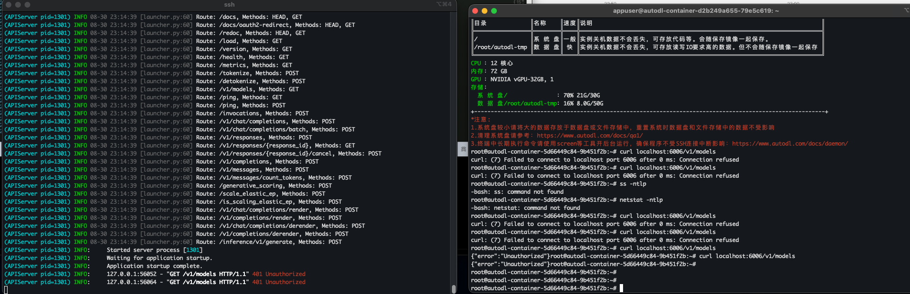
- vllm其它用法
1）启用混合精度量化
```
vllm serve your_model_path  \
--dtype half \                  
--gpu-memory-utilization 0.9
```
说明：
--dtype half # 使用 FP16 半精度减少显存占用，显存需求降低约50%
2）分布式推理（多 GPU 并行）
```
# 在多 GPU 上分摊显存压力 
vllm serve your_model_path  \
--tensor-parallel-size 2 \ 
--gpu-memory-utilization 0.9
```
说明：
--tensor-parallel-size 2 # 使用2张GPU并行
3）启用模型量化（如 AWQ/GPTQ）
```
# 使用 AWQ 量化进一步压缩模型 
vllm serve your_model_path  \
--quantization awq \  
--gpu-memory-utilization 0.9
```
说明：
--quantization awq # 需模型支持量化格式
3）参数参考表
| 参数 | 典型值范围 | 作用说明 |
| --- | --- | --- |
| --gpu-memory-utilization | 0.8~0.95 | 显存利用率（过高可能导致 OOM） |
| --max-model-len | 2048/4096/8192 | 限制模型处理的最大序列长度 |
| --tensor-parallel-size | 1~8 | GPU 并行数量（需物理 GPU 支持） |
| --dtype | half/auto | 量化类型（显存敏感场景用 half） |
- curl测试
```
curl localhost:6006/v1/models   ##查看模型列表
```
- 调用接口简单示例
```
# 使用正确的 API 端点进行测试 
curl http://localhost:6006/v1/completions \
-H "Authorization: Bearer sk-123456" \
-H "Content-Type: application/json" \
-d '{
    "model": "Qwen3-4B",  
    "prompt": "你好",
    "temperature": 0.7,
    "max_tokens": 50 
}'
```
说明： 如果加载模型时，并未指定模型名字，则这里的model必须要写全，若指定参数 --served-model-name modelname ，那么这里就可以直接写modelname了
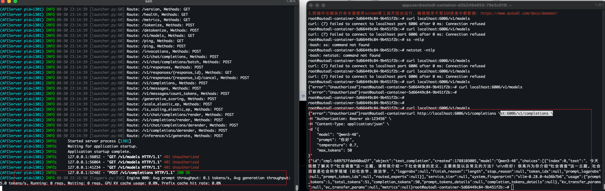
- 通过AutoDL自定义服务访问
1）首先要实名认证
2）自定义服务
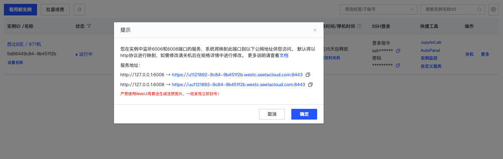
- 利用cherry studio访问vllm 部署的大模型
打开 cherry studio，点击右上角的小齿轮，点击“+ 添加”
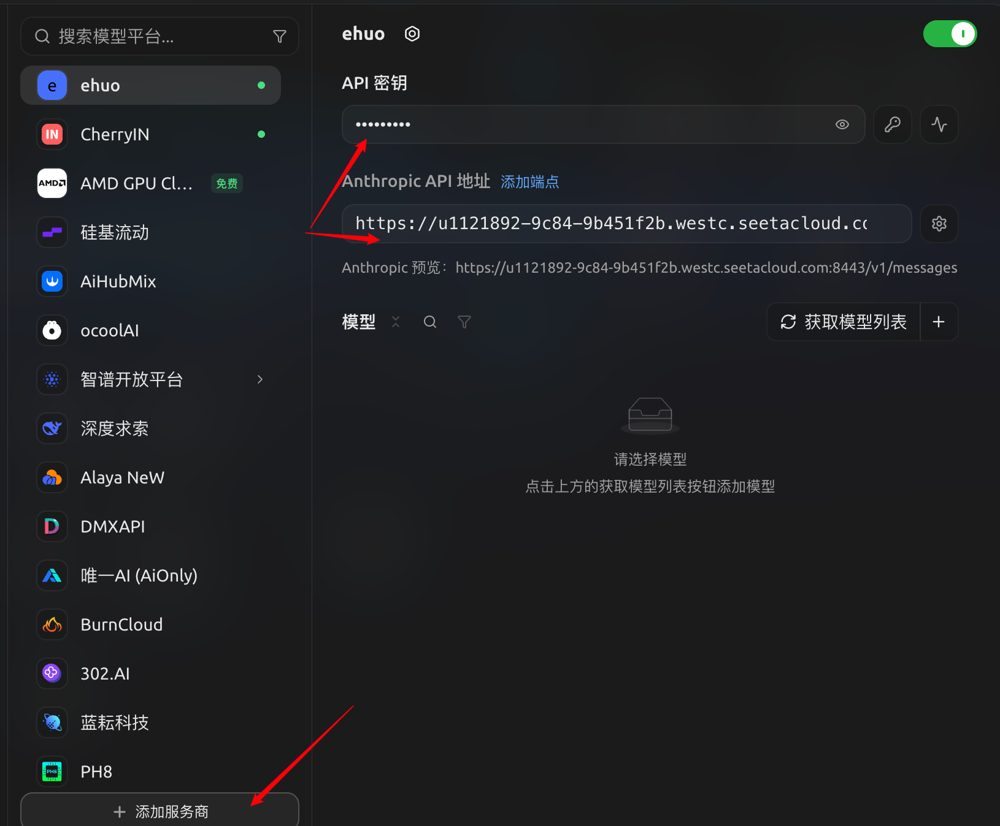
说明：这个API地址就是autodl 6006端口映射的那个地址，但是后面需要加/v1
点击“获取模型列表”，可以列出模型
点击右侧的“+”，添加该模型
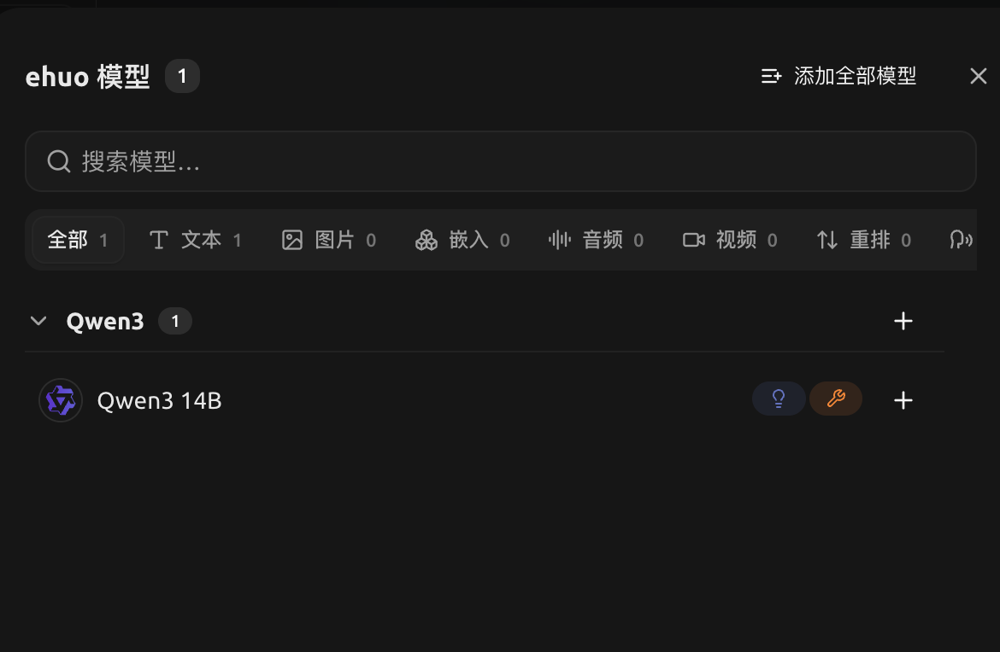
设置为模型模型
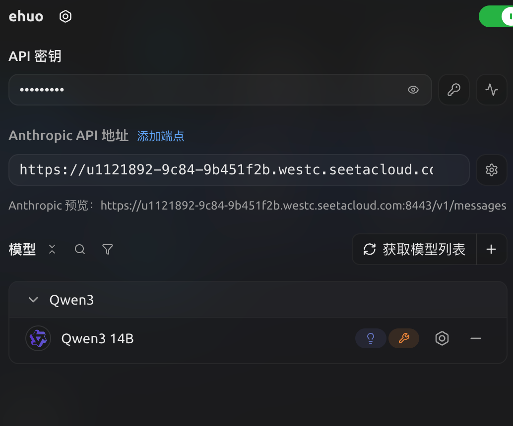
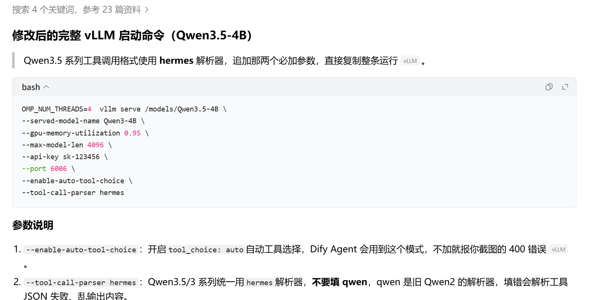
访问模型
点击“首页”，点击“默认助手”，然后对话
```
你好
```
### 2.6 集群模式部署
- 准备机器（这里大家可以用阿里云，GPU选A10或更高级别，不要选T4，跑不动）
<span style="color:#d83931">省钱技巧：可以先在一台机器上下载模型、安装环境，等这些工作做完后，另外一台直接用这台机器的镜像来做系统</span>
- 使用Autodl（可选）
说明：由于Autodl为容器实例，要想使用集群模式要保证两个实例在一台主机上才可以。
- 部署
1）安装驱动、cuda（所有机器都操作）
如果用阿里云或者Autodl，不需要做这一步，驱动已经有了
如果需要安装，请到英伟达官网下载对应版本的驱动文件
参考： https://help.aliyun.com/zh/egs/user-guide/install-a-gpu-driver-on-a-gpu-accelerated-compute-optimized-linux-instance
2）下载模型
安装魔搭(modelscope)模块
```
pip3 install modelscope
```
下载模型
```
mkdir -p /root/autodl-tmp/models/
modelscope download --model Qwen/Qwen3.5-4B --local_dir /root/autodl-tmp/models/Qwen3.5-4B
```
3）安装Ray和vLLM 以及依赖库（所有机器都操作）
- 版本要求：
```
按 2026-08-13 官方最新稳定版本，如果要做 vLLM + Ray 多机 GPU 集群，并部署 Qwen3.5-4B，建议组件推荐版本：vLLM   0.27.1Ray  2.57.0PyTorch   2.13.0Python   3.12CUDA   13.2 Transformers由 vLLM 自动管理，>=5.5.3
```
- -----
- 用conda创建纯净的环境
先安装conda （阿里云机器需要，Autodl不需要）
```
wget https://repo.anaconda.com/miniconda/Miniconda3-latest-Linux-x86_64.sh
bash Miniconda3-latest-Linux-x86_64.sh
source ~/.bashrc
# 检查是否安装完成
conda --version
```
创建虚拟环境（python3.12）
```
conda create -n vllm-ray python=3.12 -y
conda init bash 
exit  ## 退出终端，重新登录
conda activate vllm-ray
```
如果报错：
执行
```
conda config --remove channels https://mirrors.tuna.tsinghua.edu.cn/anaconda/pkgs/free/
```
检查python3路径
```
which  python3
```
如果不是 /root/miniconda3/envs/vllm-ray/bin/python3 这个路径，还需要执行下面命令，如果是不用执行
```
conda install -n vllm-ray python=3.12 -y
conda deactivate
conda activate vllm-ray
```
----上面省略
安装uv
```
pip install -U uv
```
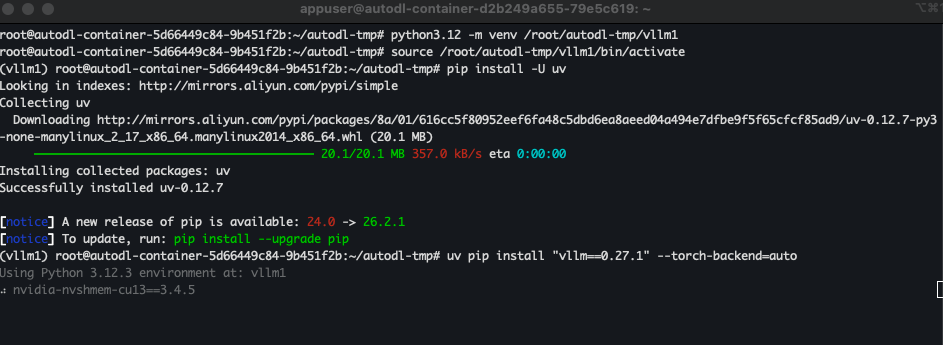
然后用uv安装 vllm
```
uv pip install "vllm==0.27.1" --torch-backend=auto ## 让它自动决策安装哪个版本的cuda
```
再安装Ray
```
uv pip install "ray[default,cgraph]==2.57.0"
```
安装完检查
```
python -c "import torch; print(torch.__version__, torch.version.cuda)"
python -c "import vllm; print(vllm.__version__)"
python -c "import ray; print(ray.__version__)"
```
应该出现：
```
2.13.0+cu132 13.2
0.27.1
2.57.0
```
4）启动Ray集群
假设两台机器IP（我的是Autodl容器实例）
```
Node 1: 172.17.0.4
Node 2: 172.17.0.6
```
其中Node 1作为主节点，执行：
```
## 以下这部分只需要在Autodl机器上执行
export VLLM_HOST_IP=172.17.0.4
export GLOO_SOCKET_IFNAME=eth0
export NCCL_SOCKET_IFNAME=eth0
export NCCL_DEBUG=INFO
## 以上需要在Autodl机器上执行
ray stop -f

ray start \
  --head \
  --node-ip-address=172.17.0.4 \
  --port=6379 \
  --dashboard-host=0.0.0.0
```
Node 2 作为从节点，执行：
```
## 以下这部分只需要在Autodl机器上执行
export VLLM_HOST_IP=172.17.0.6
export GLOO_SOCKET_IFNAME=eth0
export NCCL_SOCKET_IFNAME=eth0
export NCCL_DEBUG=INFO
## 以上需要在Autodl机器上执行
ray stop -f

ray start \
  --address=172.17.0.4:6379 \
  --node-ip-address=172.17.0.6
```
查看集群状态：
```
ray status
ray list nodes
```
5）加载大模型（主节点上执行）
```
## 以下这部分只需要在Autodl机器上执行
export VLLM_HOST_IP=172.17.0.4
export GLOO_SOCKET_IFNAME=eth0
export NCCL_SOCKET_IFNAME=eth0
export NCCL_DEBUG=INFO
## 以上需要在Autodl机器上执行

nohup vllm serve /root/autodl-tmp/models/Qwen3.5-4B \
    --served-model-name Qwen3.5-4B \
    --distributed-executor-backend ray \
    --tensor-parallel-size 1 \
    --pipeline-parallel-size 2 \
    --max-model-len 32768 \
    --gpu-memory-utilization 0.90 \
    --host 0.0.0.0 \
    --port 6006  > /tmp/vllm.log 2> /tmp/vllm.log &
```
参数说明：
- --distributed-executor-backend ray ： 分布式 worker 由 **Ray** 管理，告诉 vLLM 使用已经启动好的 Ray Cluster
- --tensor-parallel-size 1 / -tp 1 ： Tensor Parallel 数量， 每个 pipeline stage 使用 1 张 GPU
- --pipeline-parallel-size 2 / -pp 2 ： Pipeline Parallel 数量，把模型按层拆成 2 个 stage，分别运行在两张 GPU / 两个节点上
- --reasoning-parser qwen3 ： 解析 Qwen 的 reasoning/thinking 输出，使用 OpenAI API 时可把 reasoning 内容正确解析出来
6）测试（主节点上）
- 若需要开启远程访问，需要配置安全组策略（阿里云）