## 4.1 大模型优化目标
**1.降低延迟**提升单个请求响应速度，重点指标：
    - TTFT（Time to First Token，首 token 输出时间）
    - TPS（Token per Second，每秒生成 token 速度）目标：用户更快看到回复，减少等待感。
1. **提高吞吐**在有限硬件资源下，同时承载更多并发请求，单位时间处理更多用户流量。
1. **降低成本**提升 GPU / 显存等资源利用率，压低单次请求（$/request）或每千 token（$/token）的开销。
1. **提升稳定性与可扩展性**能够扛住流量峰值，保障服务 SLA；业务增长时可以平滑扩容，不雪崩。
一句话总结：**更快、更强、更经济、更稳定**。
## 4.2 优化策略-硬件优化
**硬件选择本身就决定了性能的上限**，分为 GPU、CPU 与内存、存储三大部分。
### 1. GPU（最核心）
- 显存：优先**高显存带宽 (>3 TB/s)** + **大容量显存**（如 H200 141GB、B200 192GB），用来存放模型权重与长上下文 KV Cache。
- 计算单元：支持新一代 Tensor Core，支持 FP8、INT8、FP4 等低精度，加速量化计算。
- 多卡互联：多卡集群优先 NVLink（≥900GB/s）；也可选用 InfiniBand/RoCE（≥200G），减少卡间通信瓶颈。
### 2. CPU 与内存
- CPU：选用多核型号（如 AMD EPYC），承担数据预处理、token 分词、任务调度，避免成为业务瓶颈。
- 主机内存：容量建议**≥模型参数量的 2 倍**，用于模型加载与中间缓存。
### 3. 存储
- 推荐 **PCIe 5.0 NVMe SSD**，高速读取模型检查点文件，对大模型冷启动加载速度至关重要。
一句话总结：GPU 决定算力上限，CPU / 内存负责业务调度，高速存储解决模型冷启动瓶颈。
硬件加速特效
核心目标：充分挖掘 GPU 硬件能力，提升推理效率。分为 **CUDA Graph** 和 **低精度计算引擎** 两部分。
### 1. CUDA Graph
- 原理：**固化静态计算图**，提前记录完整 GPU 计算流程，一次性提交给 GPU，减少重复的 kernel 启动、CPU 调度开销。
- 适用场景：短序列（≤2K tokens），收益非常明显。
- 注意：**动态 shape 场景要谨慎使用**，计算图变化时会失效。
- 对比：
    - 不使用 CUDA Graph：每一个 kernel 都需要 CPU 反复调度，开销大。
    - 使用 CUDA Graph：计算流程一次性提交，降低调度开销，提升推理速度。
### 2. 低精度计算引擎（Tensor Core）
- 核心：开启 GPU 的 Tensor Core 专用矩阵计算单元，加速矩阵乘法。开启方式示例：torch.set_float32_matmul_precision('high') 或 TensorRT-LLM FP8 模式。
- 主流量化精度：
    - FP8：训练后量化
    - INT4：仅权重量化
    - INT8：权重 + 激活值量化
- 特点：精度降低，算力更高、显存占用更少，在模型效果损失可控前提下提升吞吐、降低延迟。
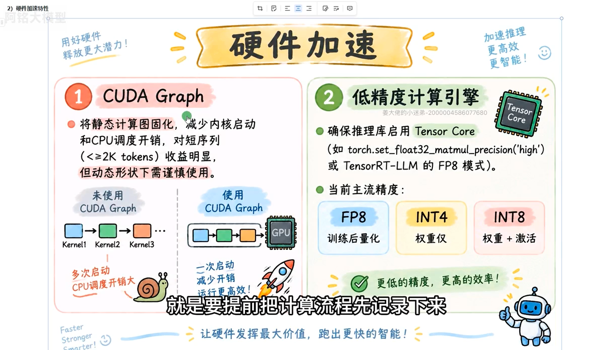
GPU资源共享和隔离
核心目标：对物理 GPU 做资源切分 / 共享，提升 GPU 利用率，兼顾资源隔离，让单卡承载更多任务。
### 1. MIG（Multi-Instance GPU，多实例 GPU）
- 原理：**硬件层面把一张物理 GPU 切分成多个独立的 GPU 实例**，算力、显存硬隔离。
- 适用场景：小模型、低并发场景。
- 特点：实例之间互不干扰，隔离性强；但资源是硬性切分，弹性差。
### 2. vGPU / Time-Slicing（时间片虚拟化）
- 原理：**软件虚拟化，时间片分时调度**，多个任务轮流复用同一张物理 GPU。
- 特点：资源分配灵活；需要关注**调度延迟、显存超限风险**。
### 3. 容器化隔离（NVIDIA MPS / CUDA MPS）
- 原理：基于 MPS 多进程服务，容器内多个进程共享同一个 GPU。
- 特点：提升 GPU 多进程利用率，多个容器进程共用 GPU 算力与显存。
---
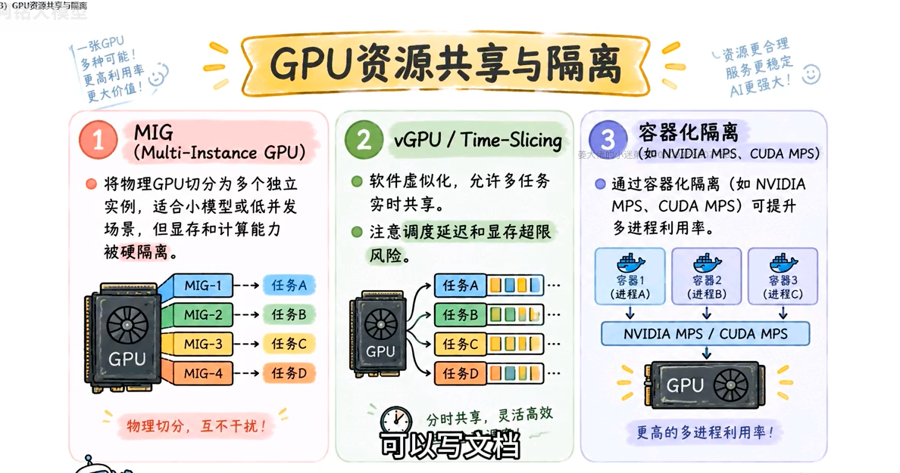
冷启动加速
### 冷启动加速（LLM 服务）
核心目标：缩短大模型服务启动加载耗时，减少用户等待，实现 AI 随时在线。一共 4 种方案：
### 1. 模型预热
服务启动后，**提前加载模型并跑一轮推理**，触发 CUDA 内核初始化。
> 逻辑：先热身，后对外提供服务，避免第一个真实请求触发初始化带来巨大延迟。
### 2. 模型池化（Model Pool）
预先加载多份模型副本放到模型池中，用户请求到来时直接取用，消除请求到达时临时加载模型的等待时间。
> 提前准备，随时响应。
### 3. 高效序列化
使用 **Safetensors**（支持零拷贝加载）替代传统pytorch_model.bin；配合多线程 / 异步 IO 并行读取分片权重，加快文件读取速度。
### 4. 权重分片与内存映射（mmap）
大模型采用mmap内存映射，**按需加载分片权重**，不需要一次性把全部权重载入内存，降低启动瞬间内存峰值，启动更轻量化。
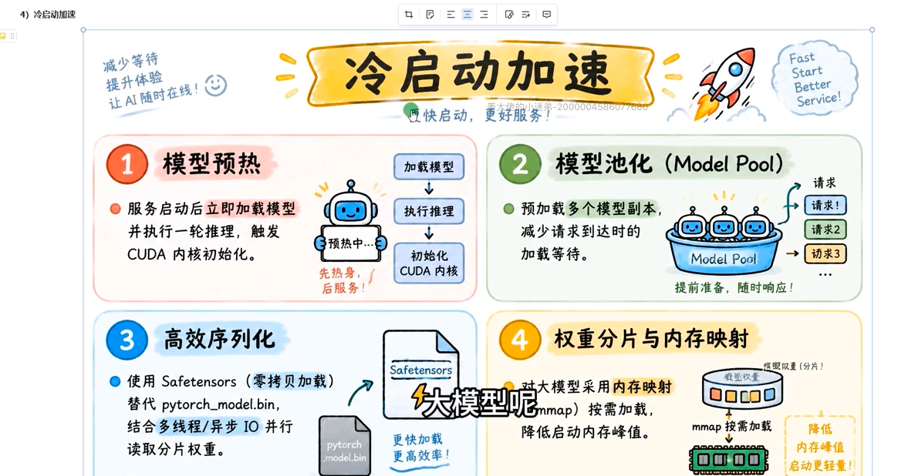
## 4.3 大模型优化策略-推理优化
### 4.3.1 量化
核心目标：**在尽量保留模型能力前提下，降低权重 / 激活精度，减小显存占用、加速推理、降低成本**。
#### 1. 方法
将权重、激活值从 FP16/FP32 高精度，映射到低精度格式：**INT8、INT4、FP8**。
> 用更少比特存储数值，模型体积更小，计算更高效。
#### 2. 效果
- 显存占用下降 **50%~75%**
- 访存带宽需求降低
- 借助 Tensor Core，**计算速度提升 2~4 倍**
#### 3. 主流方案
1. **GPTQ / AWQ（PTQ 训练后权重量化）**：无需微调，精度损失小，支持 4bit 量化
1. **FP8**：权重 + 激活都量化，适配 H100/B200 等新一代 GPU 硬件
1. **QAT 量化感知训练**：训练阶段就模拟量化，精度最优，但训练成本更高
#### 4. 权衡
- 风险：低精度量化有可能造成模型精度下降，小模型会更明显
- 缓解手段：混合精度（部分层不量化）、微调校准
> 核心思路：在精度和推理效率之间找到平衡点。
### 4.3.2 剪支pruning
核心目标：**去除模型冗余权重 / 神经元，精简模型，降低存储与计算开销，保留核心能力**。
#### 1. 方法
移除模型中冗余的权重或者神经元，剔除无效参数，得到精简后的模型。
#### 2. 两种类型
- **结构化剪枝**：直接移除整层、注意力头、通道；可直接减少 FLOPs，部署友好，代表工具：LLM-Pruner。
- **非结构化剪枝**：权重稀疏化，把部分权重置零；需要稀疏计算库支持，代表：SparseGPT。
#### 3. 效果
- 减小模型体积，降低存储占用
- 减少计算量（FLOPs 下降）
- 缺点：会带来精度下降，一般需要重训练 / 微调来恢复模型精度
#### 4. 当前趋势
**剪枝 + 量化联合压缩**：稀疏剪枝 + INT4/INT8 低比特量化，同时实现双重压缩，模型更小、推理更快。
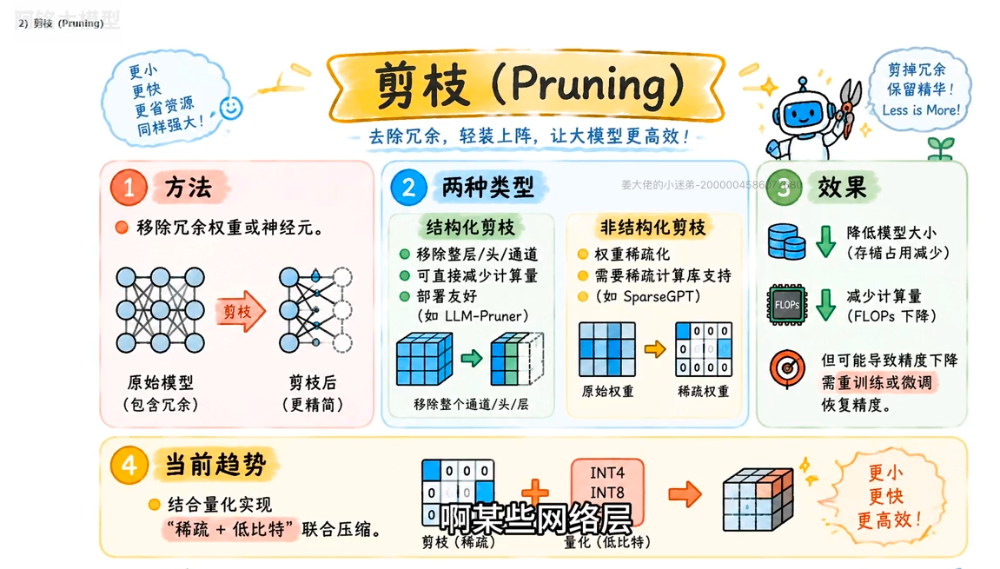
### 4.3.3 知识蒸馏 knowledge distillation
核心目标：**把大教师模型的知识迁移到小学生模型，用更小体积的模型，保留大模型绝大部分能力**。
#### 1. 方法
使用大模型作为**教师模型**，指导小模型（学生模型）学习；传递教师模型输出的 <span style="color:#F33232">**logits **</span>或者<span style="color:#F33232">**中间层特征**</span>，完成知识迁移。
#### 2. 效果
学生模型参数量可减少 50%，依然保留教师模型 90% 以上的能力。
> 模型体积更小，推理成本更低，性能损失很小。
#### 3. 注意事项
1. 对训练数据质量要求高，数据集可以合成；
1. 蒸馏训练过程需要更<span style="color:#F33232">**多计算资源与训练时间**</span>；
1. 多用于**特定任务、垂直领域专用小模型**落地部署。
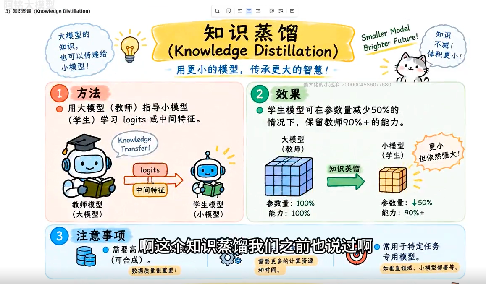
### 4.3.4 注意力机制优化
核心目标：优化 Transformer 注意力计算，**降低显存占用、减少计算开销、支持更长上下文，提升长文本推理速度**。
#### 1. FlashAttention-3（2024 发布）
- 利用 GPU 异步拷贝与片上内存重计算；相比 FlashAttention v2 再次提速 1.5～2 倍
- 支持超长上下文（>128K）
- 目前各大推理引擎均已标配
#### 2. 分组查询注意力 GQA（Grouped-Query Attention）
- 多个 Query 头共享同一组 KV 头，大幅缩减 KV Cache 显存占用，长上下文场景收益明显
- LLaMA2/3、Mistral 等主流模型标配
- 对比 MHA（多头注意力），在性能损失很小的前提下显著降低 KV 缓存开销
#### 3. 滑动窗口注意力 / 稀疏注意力
- 限制注意力的计算范围（代表 Longformer），只计算局部窗口内 token 的注意力，直接降低 FLOPs
- 适合超长文档处理场景，一般需要配套硬件优化
- 只关注局部关键片段，不用对全部 token 做全量注意力计算
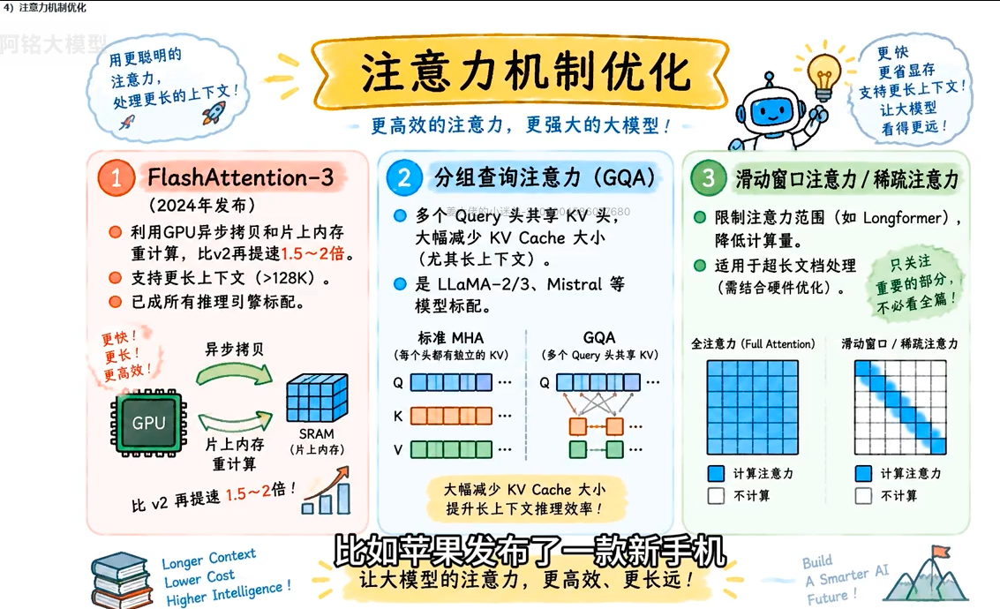
### 4.3.5 连续批处理continuous batching
核心目标：**动态调度请求，消除 GPU 空闲等待，最大化 GPU 利用率，提升服务吞吐**。
#### 1. 核心思想
不再等待批次内全部请求生成完毕才处理下一批；**动态插入新请求**，让 GPU 持续保持满负荷运行，充分利用算力。
#### 2. 工作流程对比
- **传统静态批处理 Static Batching**：必须等同一批次所有请求全部生成完成，才会开启下一批；GPU 存在大量空闲间隙，算力利用率低。
- **连续批处理 Continuous Batching**：旧请求还在生成的同时，随时插入新请求，GPU 几乎无空闲时段。
#### 3. 实现与效果
- 主流推理引擎原生支持：vLLM、TensorRT-LLM、TGI
- 收益：**吞吐提升 2～5 倍**，特别适合请求到达流量不稳定的线上业务场景
****
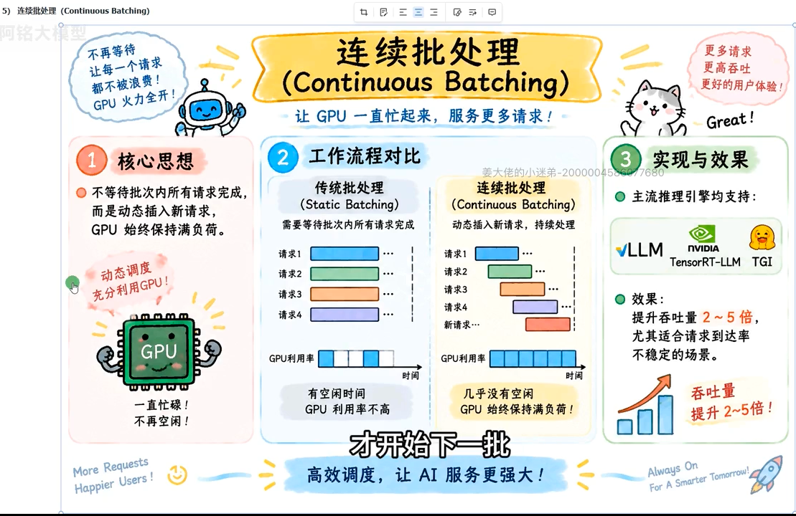
****
### **4.3.6 Paged attention 与KV cache管理**
核心目标：**对 KV Cache 做分页内存管理，消除显存碎片，提升 GPU 内存利用率，支持更大 batch、更长上下文，降低首 token 延迟**。
#### 1. PagedAttention 是什么
把 KV Cache 分页存储在**不连续的 GPU 物理内存**中，类似操作系统虚拟内存分页。
- 传统方案：KV 连续内存分配，容易产生显存碎片，需要提前预留大量内存，浪费显存
- PagedAttention：按需分配、灵活扩展，消除内存碎片，减少内存浪费
#### 2. 优势
- 内存利用率提升接近 100%
- 支持超大 Batch（>256 并发请求）
- 支持超长上下文（>1M）
#### 3. 进阶优化
1. **Chunked Prefill（分块预填充）**：长输入分段处理，降低首 Token 延迟
1. **Prefix Caching（前缀缓存）**：多个请求共用相同前缀的 KV Cache，避免重复计算，进一步加快首 Token 输出
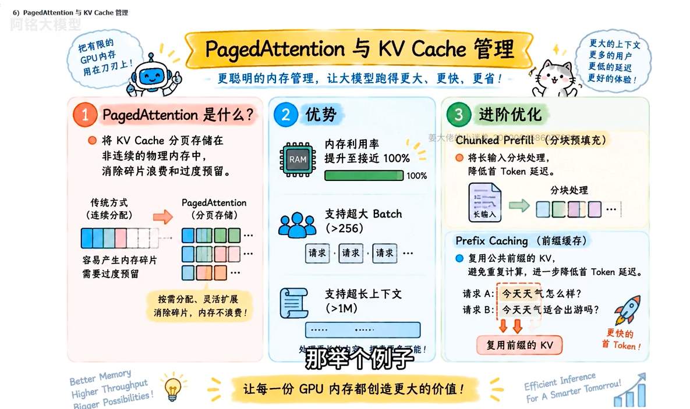
### 4.3.7 推测解码 speculative decoding
核心目标：**小模型预生成候选 Token，大模型并行校验，以 “猜 + 验” 的方式减少大模型前向次数，提升 token 生成速度**。
#### 1. 方法
草稿小模型快速一次性生成多个候选 Token；再由大模型并行验证这批候选，直接接受正确的 Token。一次验证多个 token，减少大模型前向推理次数。
#### 2. 改进方案
- **Medusa**：在大模型头部增加多个并行解码头，**不需要额外独立草稿小模型**，架构更简洁，效率更高。
- **Eagle**：采用动态树搜索策略，探索更多候选 token，提升候选序列的接受率。
#### 3. 效果与注意事项
- 效果：TPOT（每 token 生成耗时）可降低 **2～3 倍**。
- 注意事项：
    1. 原版推测解码需要额外显存存放草稿模型；Medusa 等方案则占用多头解码头开销。
    1. **接受率是性能核心指标**，接受率越高，加速效果越明显。
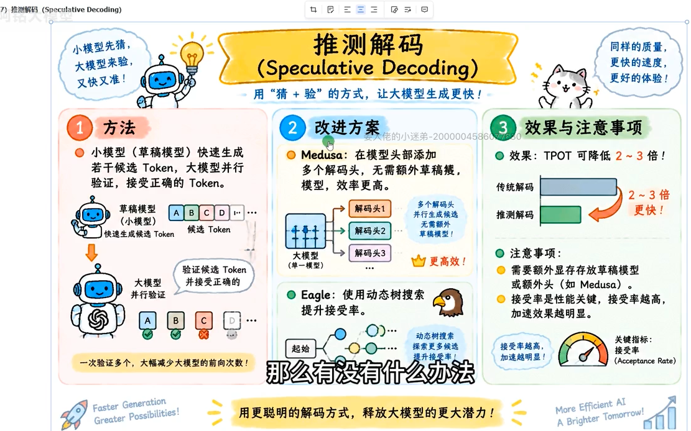
### 4.3.8 解码策略调优
核心目标：**选择合适的 token 生成策略，在生成速度、输出质量、多样性之间做权衡，适配不同业务场景**。
#### 1. 贪心 Greedy
- 规则：每一步直接选概率最高的 Token
- 优点：实现最简单、推理速度最快
- 缺点：输出多样性差，容易出现重复、呆板文本
- 适用：需要确定性结果、简单任务、对创意无要求的场景
#### 2. 采样 Sampling（Top-p / Top-k）
- 规则：基于概率分布随机采样；Top-k 只在概率最高前 k 个 token 里采样，Top-p（核采样）选取累计概率≥p 的候选集合
- 优点：输出灵活、富有创意，多样性好
- 适用：对话、创意写作、需要多样化输出的场景
#### 3. Beam Search 束搜索
- 规则：同时保留多条候选序列（beam），不断扩展并挑选最优序列
- 优点：生成质量稳定
- 缺点：计算量大、速度慢；线上生产环境较少使用，多用于翻译、高质量科研任务
#### 4. 关键参数设置
- max_tokens：控制最大生成长度；数值越大，计算量越高
- temperature：温度系数；值越高随机性越强，值越低越保守、确定性强
- top_p / top_k：控制采样候选范围，平衡输出质量与多样性
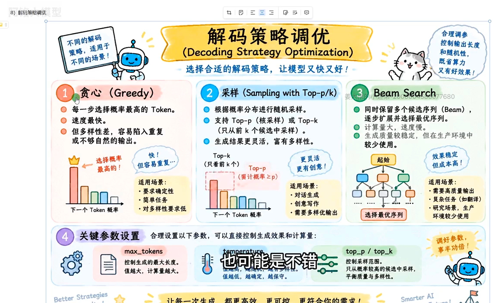
## 4.4 系统架构与服务部署优化
### 4.4.1 分布式推理
核心目标：**单卡显存放不下超大模型或者并发不足时，利用多 GPU / 多节点拆分模型或部署多副本，支持大模型、提升整体吞吐**。
#### 1. 张量并行 Tensor Parallelism（TP）
- 原理：将权重矩阵切分，矩阵乘法分散到多张 GPU 并行计算
- 适用场景：单机多卡（如单机 8 卡）；多用于超大矩阵、线性层、注意力计算加速
- 特点：把单个大矩阵拆分到多张卡共同计算，单机多卡场景简单高效
#### 2. 流水线并行 Pipeline Parallelism（PP）
- 原理：按模型 Layer（层）切分，不同 GPU 负责不同网络层；微批次流水调度
- 适用场景：多节点超大模型（>100B）；常和张量并行组合，构成 3D 并行
- 特点：分层拆分，流水线调度，提升多节点场景 GPU 利用率
#### 3. 数据并行 Data Parallelism（DP）
- 原理：多张 GPU / 多节点各自部署**完整模型副本**；负载均衡器把用户请求分发到不同副本
- 适用场景：大规模在线业务，提升整体服务吞吐
- 特点：多副本独立服务请求，实现横向扩容，逻辑简单
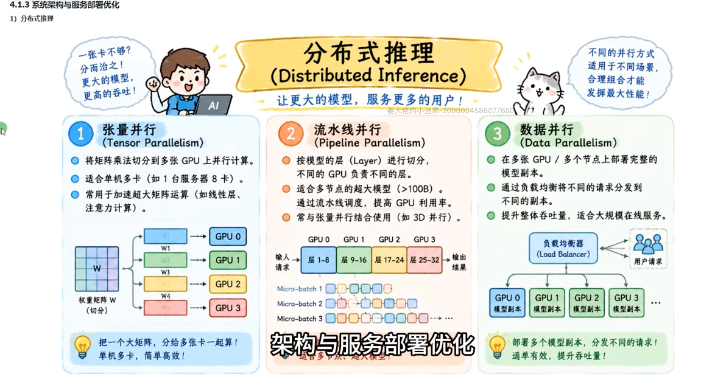
### 4.4.2 高效的请求调度与负载均衡
核心目标：合理分配每一条请求，让 GPU 资源发挥最大价值，降低排队延迟，保障 AI 服务稳定快速响应。包含三大核心模块：
#### <span style="color:#000000">1. 动态批处理大小</span>
<span style="color:#000000">依据 GPU 利用率、请求输入序列长度，</span><span style="color:#000000">**自适应合并请求**</span>
- <span style="color:#000000">GPU 空闲：合并更多请求，增大批次，提升 GPU 算力利用率</span>
- <span style="color:#000000">GPU 繁忙：减小批次，降低单请求推理延迟</span>
- <span style="color:#000000">兼顾序列长度，防止超长请求拖慢整个批次</span>
> <span style="color:#000000">流程：请求队列 → 动态批处理自适应合并 → GPU 推理</span>
#### <span style="color:#000000">2. 优先级队列</span>
<span style="color:#000000">保障高 SLA 业务，解决长尾延迟问题</span>
- <span style="color:#000000">按业务类型、用户等级、SLA 划分请求优先级</span>
- <span style="color:#000000">高优先级请求优先调度、优先分配算力</span>
- <span style="color:#000000">限制低优先级请求抢占资源，避免核心业务等待</span>
> <span style="color:#000000">队列分层：高优先级队列 / 普通优先级队列 / 低优先级队列，由调度器统一调度</span>
#### 3. 负载感知路由策略
<span style="color:#000000">基于节点实时状态智能分发请求</span>
- <span style="color:#000000">监控指标：实例 GPU 利用率、KV Cache 占用、队列长度</span>
- <span style="color:#000000">将新请求路由至负载最低、资源最合适的实例</span>
- <span style="color:#000000">支持多模型、多节点集群智能路由</span>
<span style="color:#000000">**收益**</span><span style="color:#000000">：更快响应、服务更稳定、GPU 资源利用率更高。</span>
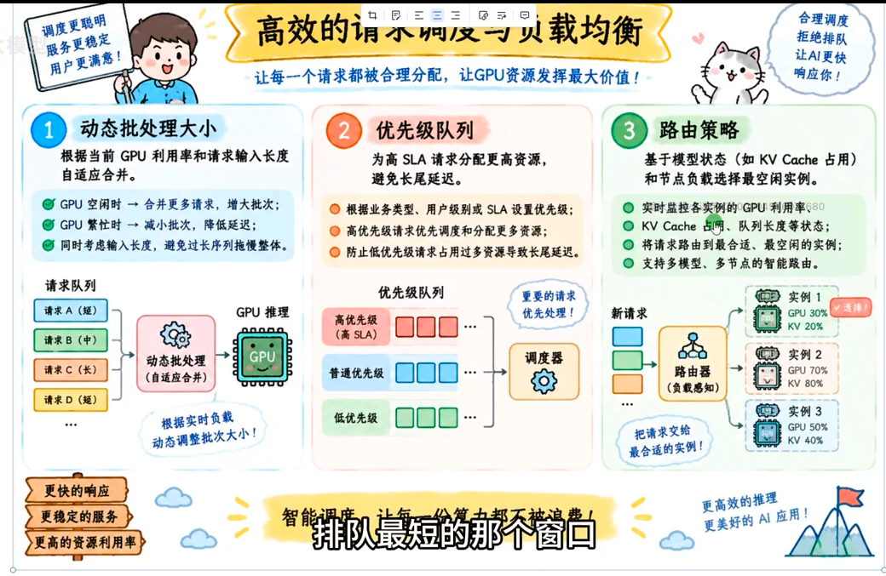
### <span style="color:#000000">4.4.3 API网关与边缘处理</span>
<span style="color:#000000">核心目标：作为大模型服务智能入口，前置处理各类通用逻辑，减轻 GPU 压力，实现更快响应、更高吞吐、更好用户体验。包含三大能力：</span>
#### <span style="color:#000000">1. 流式响应</span>
- <span style="color:#000000">使用</span><span style="color:#000000">text/event-stream</span><span style="color:#000000">协议，</span><span style="color:#000000">**逐 Token 返回生成内容**</span>
- <span style="color:#000000">用户不用等待全部生成完成，边看边输出，大幅提升交互体验</span>
- <span style="color:#000000">流程：模型每生成一个 token → API 网关实时推送给前端用户</span>
#### <span style="color:#000000">2. Tokenization / Detokenization 卸载</span>
<span style="color:#000000">把 CPU 密集型的分词、反分词任务放到 API 网关 / 边缘服务执行</span>
- <span style="color:#000000">Tokenization：用户原始文本 → 在网关转为 Token 序列，再送入 GPU 推理</span>
- <span style="color:#000000">Detokenization：GPU 输出 Token → 在网关还原为自然文本，返回用户</span>
- <span style="color:#000000">收益：释放 GPU 算力，GPU 只专注模型推理，减少 GPU 等待空闲时间</span>
#### <span style="color:#000000">3. 请求合并</span>
<span style="color:#000000">对多条短请求做统一封装，一次性送入 GPU 做前向计算</span>
- <span style="color:#000000">统一多个短请求输入格式，合并成一批次</span>
- <span style="color:#000000">减少 GPU 重复启动开销，提升整体吞吐与 GPU 资源利用率</span>
- <span style="color:#000000">流程：多个独立短请求 → API 网关合并批量 → GPU 一次推理</span>
**整体收益**：更快响应、更高吞吐、更好的 AI 交互体验。
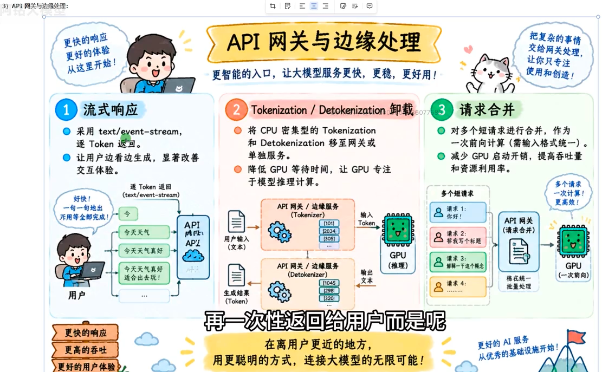
### 4.4.4 缓存策略
核心目标：复用重复计算结果，减少模型推理与向量计算开销，实现 AI 服务更快响应、更低成本、更高效率。包含两类核心缓存方案：
#### <span style="color:#000000">1. 结果缓存</span>
- <span style="color:#000000">针对</span><span style="color:#000000">**确定性、高重复查询**</span><span style="color:#000000">，缓存完整模型输出结果，命中缓存直接返回，不经过模型推理。</span>
- <span style="color:#000000">典型场景：数学计算、固定问答、规则类查询；</span>
- <span style="color:#000000">注意事项：需要考虑数据时效性，动态信息（天气、实时数据）要设置过期、定期更新缓存。</span>
> <span style="color:#000000">流程：用户提问 → 查询缓存 → 命中直接返回结果；未命中则走模型推理，推理结果存入缓存。</span>
#### <span style="color:#000000">2. Embedding 缓存（向量缓存）</span>
<span style="color:#000000">多用于 RAG 知识库检索场景</span>
- <span style="color:#000000">缓存文档向量化后的 Embedding 向量，相同 / 相似文档无需重复执行向量化计算；</span>
- <span style="color:#000000">减少 Embedding 模型重复调用，提升向量检索速度，降低算力成本。</span>
> <span style="color:#000000">流程：文档 → Embedding 向量化 → 向量缓存；后续检索时，直接复用已缓存向量，再做相似度检索，用于 RAG 回答生成。</span>
**核心收益**：更快响应、更低算力成本，把算力留给全新、复杂的请求。
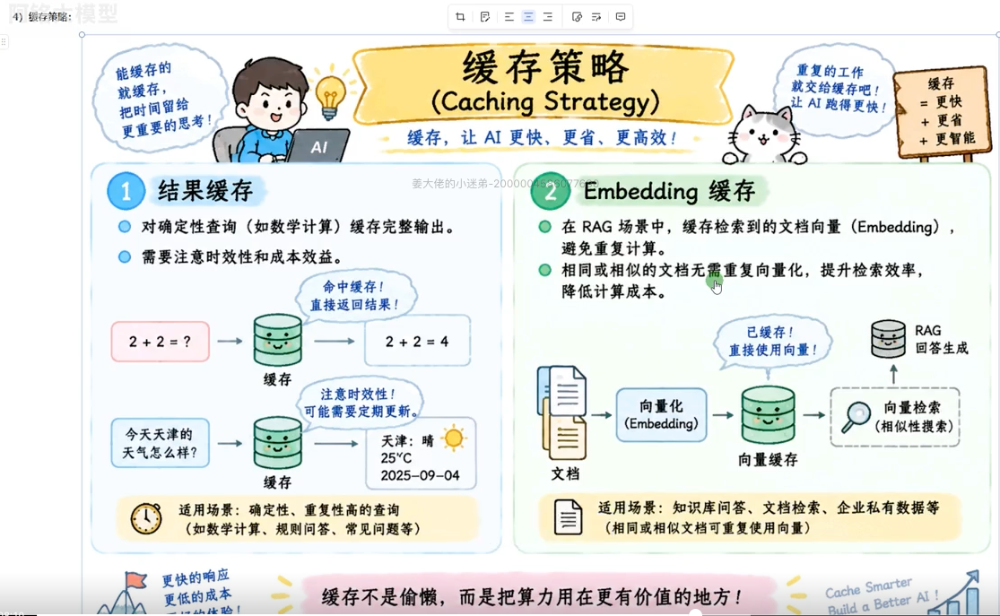
### 4.4.5 可观测性与SLO
核心目标：实现**看得见、找得到、管得住**，通过指标、链路、日志全方位监控大模型服务，设定服务目标 SLO，及时发现故障与性能瓶颈，保障 AI 服务稳定、高效、可持续。包含三大模块：
#### 1<span style="color:#000000">. 核心监控指标</span>
<span style="color:#000000">全面采集服务与硬件状态，快速识别瓶颈</span>
- <span style="color:#000000">TTFT（首 Token 延迟）：用户等待第一个 token 的耗时，影响用户体感</span>
- <span style="color:#000000">TPOT（每 Token 生成时间）：后续 token 生成速度，代表流式输出流畅度</span>
- <span style="color:#000000">吞吐量：req/s 请求数、token/s 生成速率</span>
- <span style="color:#000000">硬件指标：GPU 利用率、显存使用率</span>
- <span style="color:#000000">业务队列：请求队列长度，反映排队压力</span>
#### <span style="color:#000000">2. 可观测工具栈</span>
<span style="color:#000000">多维度数据采集，快速定位根因</span>
- <span style="color:#000000">Prometheus：指标采集、时序数据存储</span>
- <span style="color:#000000">Grafana：可视化大盘，展示指标曲线</span>
- <span style="color:#000000">Jaeger：分布式链路追踪，追踪请求全链路，定位性能瓶颈</span>
- <span style="color:#000000">ELK / Loki：日志收集检索，用于故障排查</span>
#### <span style="color:#000000">3. SLO 定义（服务等级目标）</span>
<span style="color:#000000">设定明确服务目标，配置告警阈值，持续迭代优化</span>
- <span style="color:#000000">SLO 示例：95% 请求 TTFT <500ms；95% 请求 TPOT <50ms</span>
- <span style="color:#000000">告警阈值：指标持续超标触发告警（如 TTFT P95 超时、GPU 高负载、队列堆积）</span>
- <span style="color:#000000">持续优化：搭建监控看板、配置告警、定期复盘优化系统</span>
<span style="color:#000000">**收益**</span><span style="color:#000000">：及时发现问题，保障流畅用户体验，提升服务可靠性。</span>
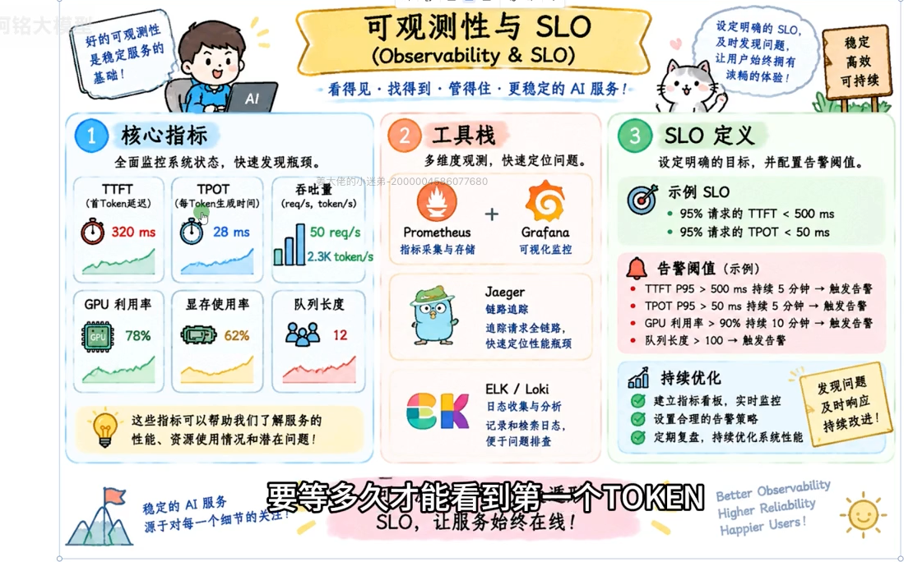
## 4.5 成本优化
### 4.5.1 弹性伸缩
核心目标：算力跟随业务流量动态调整，流量上涨扩容、流量下降缩容，做到资源不浪费、服务不宕机，实现稳定、高效、低成本的大模型在线服务。包含三大核心方案：
#### 1<span style="color:#000000">. 基于预测的伸缩</span>
- <span style="color:#000000">依托历史流量规律（日周期、早晚高峰）预判负载，</span><span style="color:#000000">**提前扩容**</span>
- <span style="color:#000000">适用：流量具备明显周期性场景，例如白天业务高峰、夜间流量低谷</span>
- <span style="color:#000000">逻辑：根据历史曲线，在流量上涨前增加实例；流量回落之后逐步缩减实例，从容应对峰值</span>
#### <span style="color:#000000">2. 基于实时指标伸缩（K8s HPA）</span>
- <span style="color:#000000">依靠 Kubernetes HPA，采集 GPU 利用率、CPU 利用率、请求队列深度等自定义指标自动扩缩容</span>
- <span style="color:#000000">当负载指标超过阈值，自动增加推理实例；负载下降则减少实例</span>
- <span style="color:#000000">特点：实时感知负载波动，快速响应突发流量变化</span>
#### <span style="color:#000000">3. 优雅缩容</span>
<span style="color:#000000">缩容过程保证用户无感知，不中断正在处理的请求</span>
1. <span style="color:#000000">停止该实例接收新请求</span>
1. <span style="color:#000000">等待实例上正在运行的请求全部处理完成</span>
1. <span style="color:#000000">安全下线实例，释放 GPU 资源</span>
> <span style="color:#000000">价值：在线业务平滑过渡，保障高可用</span>
<span style="color:#000000">**整体收益**</span><span style="color:#000000">：流量高峰不宕机，低谷时释放闲置算力，降低硬件成本，资源利用率最大化。</span>
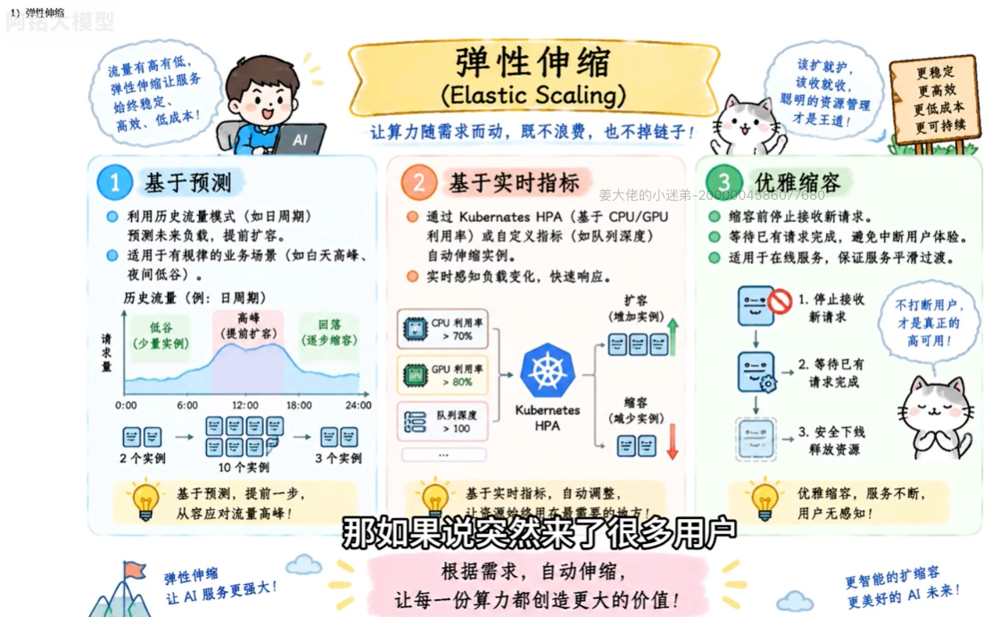
### 4.5.2 使用 Spot 实例 / 抢占式实例
<span style="color:#000000">核心目标：利用云厂商抢占式实例大幅降低算力成本，同时做好中断防护，实现降本增效，支撑更大规模 AI 任务。包含三大模块：</span>
#### <span style="color:#000000">1. 成本优势</span>
<span style="color:#000000">Spot 抢占实例价格远低于常规按需实例，可节省</span><span style="color:#000000">**60%~90%**</span><span style="color:#000000">算力成本。</span>
- <span style="color:#000000">价格对比：按需实例 > 预留实例 > Spot 抢占实例</span>
- <span style="color:#000000">价值：用更少预算，获取更多 GPU 算力，适合大规模算力任务。</span>
#### <span style="color:#000000">2. 风险：实例可能被中断</span>
<span style="color:#000000">云厂商资源紧张时，会回收 Spot 实例资源，一般会提前发送中断通知。</span>
- <span style="color:#000000">实例会被强制下线，不适合承载高 SLA 核心在线业务；</span>
- <span style="color:#000000">一旦回收，正在运行的任务会被打断，必须设计容灾方案。</span>
#### <span style="color:#000000">3. 应对策略</span>
1. <span style="color:#000000">**状态保存**</span><span style="color:#000000">：定期把 KV Cache、模型运行状态持久化到对象存储，防止中断丢失任务进度。</span>
1. <span style="color:#000000">**快速恢复**</span><span style="color:#000000">：准备热备实例 / 容器迁移方案，实例被回收时快速拉起新实例，恢复推理服务。</span>
1. <span style="color:#000000">**任务合理分配**</span><span style="color:#000000">：</span><span style="color:#000000">**非关键任务**</span><span style="color:#000000">（批量推理、离线数据生成）优先跑 Spot 实例；核心高优先级在线请求，使用稳定的按需实例。</span>
<span style="color:#000000">**收益**</span><span style="color:#000000">：更低算力成本、获取更大算力规模，实现降本增效。</span>
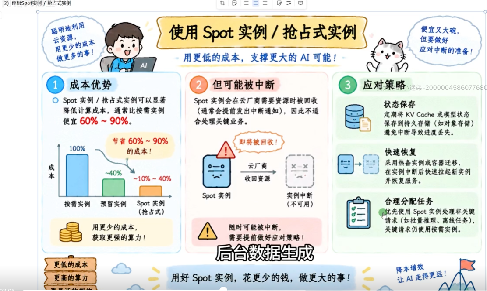
### 4<span style="color:#000000">.5.3 分级存储</span>
<span style="color:#000000">核心目标：把不同热度的数据放到对应存储介质，热数据放高速存储保障访问速度，冷数据放低成本存储节约开销，兼顾</span><span style="color:#000000">**性能与成本**</span><span style="color:#000000">。</span>
#### <span style="color:#000000">1. 热数据（常用模型）</span>
- <span style="color:#000000">存储内容：正在服务的模型权重、活跃 KV Cache、高频访问数据集</span>
- <span style="color:#000000">存储介质：内存 RAM、本地 NVMe SSD</span>
- <span style="color:#000000">特点：低延迟、高吞吐，微秒级访问，保障模型推理流畅快速</span>
#### <span style="color:#000000">2. 冷数据（历史检查点）</span>
- <span style="color:#000000">存储内容：历史模型 Checkpoint、旧版本模型、低频访问历史数据</span>
- <span style="color:#000000">存储介质：对象存储（S3 等）</span>
- <span style="color:#000000">特点：存储单价低、适合长期归档；采用</span><span style="color:#000000">**按需加载**</span><span style="color:#000000">，需要时再拉取到高速存储，不用时归档回冷存储</span>
#### <span style="color:#000000">动态调度逻辑</span>
<span style="color:#000000">按需加载（Load on Demand）：冷数据在需要时从对象存储加载到 NVMe / 内存；不再使用时，重新归档回对象存储。动态平衡性能与存储成本。</span>
<span style="color:#000000">**收益**</span><span style="color:#000000">：更快响应、更低存储成本，在不牺牲在线推理性能</span>的前提下，降低海量模型文件的存储开销。
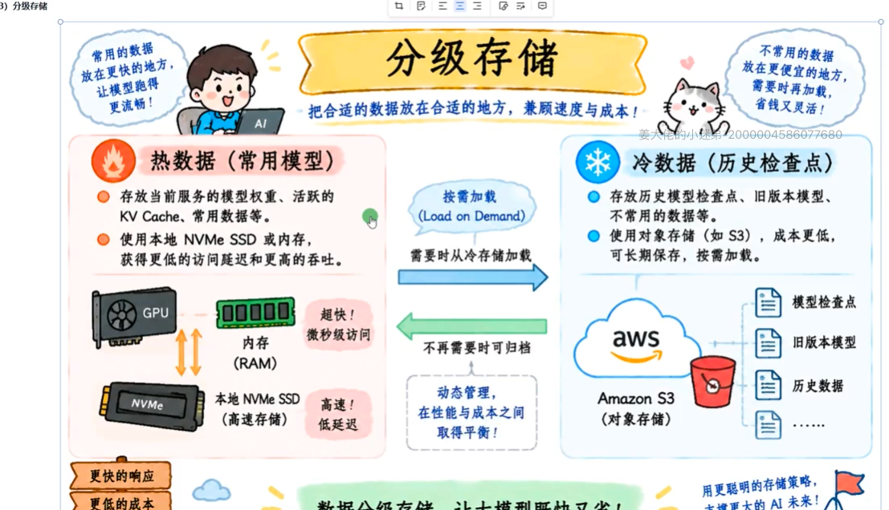
### 4.5.4 模型服务共享
<span style="color:#000000">核心目标：</span><span style="color:#000000">**一套推理集群多租户共享**</span><span style="color:#000000">，不同业务 / 团队共用同一批 GPU 算力，配合隔离与配额机制，实现算力资源最大化利用，降本增效。</span>
#### <span style="color:#000000">1. 多租户 / 多应用</span>
<span style="color:#000000">不同团队、业务作为独立租户，共享同一套推理集群</span>
- <span style="color:#000000">租户 A：产品团队，智能客服对话应用</span>
- <span style="color:#000000">租户 B：数据分析团队，数据分析助手</span>
- <span style="color:#000000">租户 C：研发团队，代码生成应用</span>
- <span style="color:#000000">租户 D：外部客户，行业专属大模型</span>
#### <span style="color:#000000">2. 两大隔离管控手段</span>
1. <span style="color:#000000">**命名空间隔离（K8s Namespace）**</span><span style="color:#000000">使用 Kubernetes Namespace 做租户级环境隔离，每个租户独立 namespace，实现环境、资源、权限隔离。</span>
1. <span style="color:#000000">**资源配额控制**</span><span style="color:#000000">为每个租户配置 CPU、GPU、显存资源上限，防止租户之间抢占资源，控制资源成本，避免单个业务耗尽集群算力。</span>
#### <span style="color:#000000">3. 共享推理集群架构</span>
统一推理平台，负载均衡 + 调度器将请求分发到各租户 Pod；底层共用 GPU 节点资源池，动态分配算力。
> 核心特点：**共享、隔离、可控**，隔离不隔心，资源共享，提升整体算力利用率。
**收益**：资源利用率更高、硬件成本更低，平台可灵活支撑多类 AI 业务。
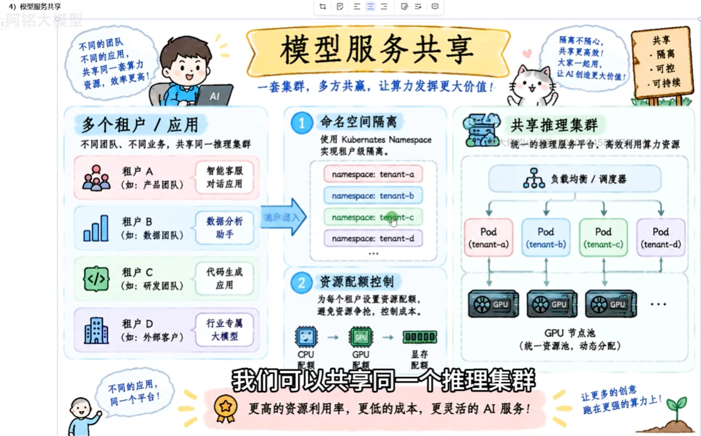
### <span style="color:#000000">4.5.5 精细化配额管理</span>
<span style="color:#000000">核心目标：按用户 / API Key 做资源配额管控，合理分配算力，防止资源滥用，保障多用户场景下服务公平、稳定、可持续。</span>
#### <span style="color:#000000">1. 区分用户 / API Key</span>
<span style="color:#000000">以 API Key 为独立身份，对不同用户类型配置差异化配额策略</span>
- <span style="color:#000000">个人用户：基础配额（免费 / 试用）</span>
- <span style="color:#000000">企业用户：标准配额（生产环境）</span>
- <span style="color:#000000">开发团队：定制配额（支持高并发）</span>
- <span style="color:#000000">内部服务：高级配额（优先级保障）</span>
#### <span style="color:#000000">2. 可配置配额项</span>
- <span style="color:#000000">**并发数**</span><span style="color:#000000">：同一时间允许同时处理的请求数量，例：10</span>
- <span style="color:#000000">**请求速率**</span><span style="color:#000000">：每分钟 / 每小时最大请求数，例：60 req/min</span>
- <span style="color:#000000">**最大上下文长度**</span><span style="color:#000000">：单次请求输入 token 上限，例：32K tokens</span>
- <span style="color:#000000">**最大生成 Token 数**</span><span style="color:#000000">：单次输出 token 上限，例：4K tokens</span>
#### <span style="color:#000000">3. 防滥用与超限处理</span>
<span style="color:#000000">✅ 管控价值</span>
- <span style="color:#000000">防止单用户抢占大量算力、高频刷接口等恶意请求</span>
- <span style="color:#000000">保护核心用户与关键业务，保障整体服务稳定，提升资源利用率</span>
<span style="color:#000000">⚠️ 超出配额时处理逻辑</span>
1. <span style="color:#000000">返回友好错误提示（如 429 Too Many Requests）</span>
1. <span style="color:#000000">记录完整日志，用于审计与问题分析</span>
1. <span style="color:#000000">可配置限流或排队策略，根据业务场景选择</span>
<span style="color:#000000">**收益**</span><span style="color:#000000">：限额不限用，算力资源利用更高效，平台整体服务更稳定。</span>
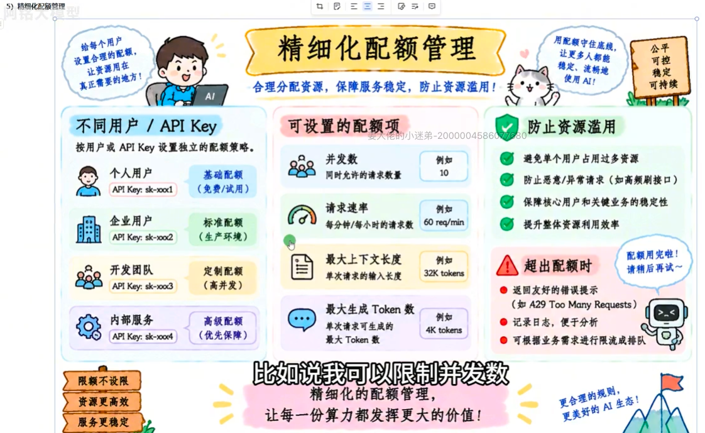
## 4.6 模型量化的两种方法
核心目标：对比两种主流大模型后训练量化方案 GPTQ、AWQ，在模型体积、推理速度、精度之间做取舍，选择适配业务场景的量化方案。
### GPTQ（Post-Training Quantization for GPT）
> 后训练量化算法，使用近似最优量化策略，把 FP16 模型压缩为 INT4/INT8 低位模型
- <span style="color:#000000">✅ 优点：量化速度快、推理性能好、原生支持 HuggingFace 生态，部署友好</span>
- <span style="color:#000000">❌ 缺点：依赖校准数据集；部分任务场景精度损失相对更大</span>
### <span style="color:#000000">AWQ（Activation-aware Weight Quantization）</span>
> <span style="color:#000000">激活感知型权重量化，分析激活值分布，对不同通道做差异化量化，减少精度损失</span>
- <span style="color:#000000">✅ 优点：考虑激活分布，量化后模型精度通常高于 GPTQ</span>
- <span style="color:#000000">❌ 缺点：量化过程耗时更长；量化阶段需要占用更多显存</span>
### <span style="color:#000000">推荐选型</span>
- <span style="color:#000000">⚡ 优先</span><span style="color:#000000">**推理速度、易用性、快速部署**</span><span style="color:#000000"> → 选 GPTQ</span>
- <span style="color:#000000">🎯 优先</span><span style="color:#000000">**模型输出精度**</span><span style="color:#000000">，可接受更长量化时间与更高量化显存开销 → 选 AWQ</span>
**收益**：模型体积更小、推理更快、硬件门槛更低，兼顾精度与部署成本；没有万能量化算法，按需选择。
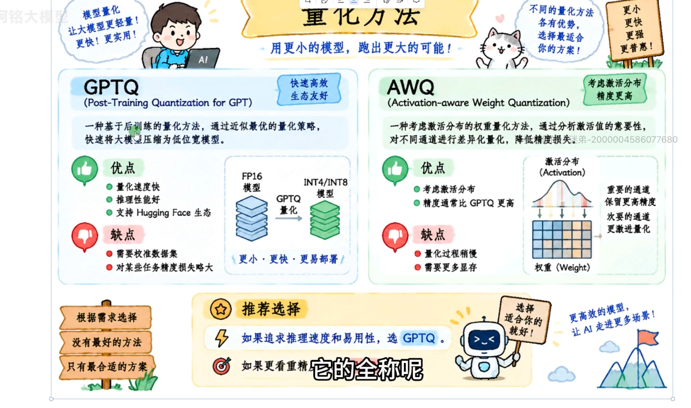
## 4.7 量化实操-AWQ量化
1）目标：基于Qwen3.5-4B-Base做int4量化
2）硬件要求：
- GPU：至少16GB显存。
- 内存：32GB以上（用于加载模型和中间数据）。
- 磁盘：至少20GB可用空间（模型权重+中间文件）。
-  
3）下载Qwen3.5-4B-Base大模型
在modelscope社区下载
安装魔搭(modelscope)模块
```python
pip install modelscope -i https://pypi.tuna.tsinghua.edu.cn/simple
```
<span style="color:#333333">下载模型</span>
```bash
mkdir -p /models/
modelscope download --model Qwen/Qwen3.5-4B-Base --local_dir /models/Qwen3.5-4B-Base
```
4）AWQ量化软件环境（Ubuntu2204、AutoDL)
```bash
4）AWQ量化软件环境（Ubuntu2204、AutoDL）
conda create -n qwen35-awq python=3.11
conda activate qwen35-awq
# 或者
source activate qwen35-awq

# 更新pip
python -m pip install -U pip setuptools wheel

# 安装PyTorch
pip install \
  torch==2.11.0 \
  torchvision==0.26.0 \
  torchaudio==2.11.0 \
  --extra-index-url https://download.pytorch.org/whl/cu128
说明：注意cuda的版本，这个cu128指的是 12.8

# 安装transformer
pip install -U "transformers>=5.0.0"  -i https://pypi.tuna.tsinghua.edu.cn/simple

# 安装其它依赖
pip install -U \
    datasets \
    accelerate \
    sentencepiece \
    safetensors \
    llmcompressor -i https://pypi.tuna.tsinghua.edu.cn/simple
```
<span style="color:#333333">检查环境</span>
```bash
python - <<'PY'
import torch
import transformers
import datasets
import llmcompressor

print("torch:", torch.__version__)
print("torch CUDA:", torch.version.cuda)
print("CUDA available:", torch.cuda.is_available())
print("transformers:", transformers.__version__)
print("datasets:", datasets.__version__)
print("llmcompressor:", llmcompressor.__version__)

if torch.cuda.is_available():
    print("GPU:", torch.cuda.get_device_name(0))
PY
输出类似：
torch: 2.11.0+cu128
torch CUDA: 12.8
CUDA available: True
transformers: 5.14.1
datasets: 5.0.1
llmcompressor: 0.13.0
GPU: NVIDIA GeForce RTX 4080 SUPER
 
```
5）确认基础模型是否能正常加载
```bash
5）确认基础模型是否能正常加载
编辑测试脚本 test_load.py
mkdir ~/awq
cd ~/awq
cat > test_load.py << EOF
import torch

from transformers import (
    AutoProcessor,
    AutoTokenizer,
    Qwen3_5ForConditionalGeneration,
)

MODEL_PATH = "/models/Qwen3.5-4B-Base"

print("Loading tokenizer...")
tokenizer = AutoTokenizer.from_pretrained(MODEL_PATH)

print("Loading processor...")
processor = AutoProcessor.from_pretrained(MODEL_PATH)

print("Loading model...")
model = Qwen3_5ForConditionalGeneration.from_pretrained(
    MODEL_PATH,
    dtype="auto",
)

print(model.__class__)
print(model.config.model_type)
print(model.config.text_config.num_hidden_layers)

num_params = sum(p.numel() for p in model.parameters())

print(f"Total params = {num_params / 1e9:.3f} B")
print("Load OK.")
EOF

 
测试
python test_load.py
```
6）AWQ量化
```bash
6）AWQ量化
下载数据集：
mkdir -p /data/calibration
安装依赖
pip install zstandard -i https://pypi.tuna.tsinghua.edu.cn/simple
pip install -U fsspec datasets -i https://pypi.tuna.tsinghua.edu.cn/simple
 
创建脚本
cat > download_calib.py <<EOF
import json
from pathlib import Path

from datasets import load_dataset

DATASET_ID = "mit-han-lab/pile-val-backup"
DATASET_SPLIT = "validation"

OUTPUT_FILE = "/data/calibration/calib.jsonl"

NUM_SAMPLES = 512
MIN_CHARS = 200
MAX_CHARS = 8000
SEED = 42

print(f"Loading dataset: {DATASET_ID}")

# streaming=True：
# 不需要先把整个 471 MB 数据集完整下载下来
dataset = load_dataset(
    DATASET_ID,
    split=DATASET_SPLIT,
    streaming=True,
)

# streaming dataset 的 shuffle 使用缓冲区
dataset = dataset.shuffle(
    seed=SEED,
    buffer_size=10000,
)

Path(OUTPUT_FILE).parent.mkdir(
    parents=True,
    exist_ok=True
)

count = 0

with open(
    OUTPUT_FILE,
    "w",
    encoding="utf-8"
) as f:

    for example in dataset:

        text = example.get(
            "text",
            ""
        ).strip()

        if len(text) < MIN_CHARS:
            continue

        if len(text) > MAX_CHARS:
            text = text[:MAX_CHARS]

        json.dump(
            {
                "text": text
            },
            f,
            ensure_ascii=False
        )

        f.write("\n")

        count += 1

        if count >= NUM_SAMPLES:
            break

print("=" * 60)
print(f"Downloaded calibration samples: {count}")
print(f"Saved to: {OUTPUT_FILE}")
print("=" * 60)
EOF

执行脚本
export HF_ENDPOINT=https://hf-mirror.com
python download_calib.py
创建量化脚本
cat > quantize_qwen35_awq.py <<EOF
# -*- coding: utf-8 -*-

import os
import json
from pathlib import Path
import torch
from datasets import Dataset
from transformers import (
    AutoProcessor,
    Qwen3_5ForConditionalGeneration,
)

from llmcompressor import oneshot
from llmcompressor.modifiers.quantization import (
    QuantizationModifier,
)

from llmcompressor.utils import load_context

# ============================================================
# PATH
# ============================================================

MODEL_DIR = "/models/Qwen3.5-4B-Base"
CALIB_FILE = "/data/calibration/calib.jsonl"
OUTPUT_DIR = "/models/Qwen3.5-4B-Base-AWQ-W4A16"

NUM_CALIBRATION_SAMPLES = 256
MAX_SEQUENCE_LENGTH = 512
SEED = 42

# ============================================================
# CHECK
# ============================================================

print("="*80)
print("Qwen3.5-4B W4A16 Quantization")
print("="*80)

if not os.path.exists(MODEL_DIR):
    raise FileNotFoundError(MODEL_DIR)

if not os.path.exists(CALIB_FILE):
    raise FileNotFoundError(CALIB_FILE)

if not torch.cuda.is_available():
    raise RuntimeError(
        "CUDA unavailable"
    )

print(
    "GPU:",
    torch.cuda.get_device_name(0)
)

# ============================================================
# Processor
# ============================================================

print("Loading processor...")

processor = AutoProcessor.from_pretrained(
    MODEL_DIR,
    trust_remote_code=True,
)

tokenizer = processor.tokenizer

# ============================================================
# Model
# ============================================================

print("Loading model...")

with load_context(
    Qwen3_5ForConditionalGeneration
):

    model = (
        Qwen3_5ForConditionalGeneration
        .from_pretrained(
            MODEL_DIR,
            dtype="auto",
            device_map="auto",
            trust_remote_code=True,
        )
    )

model.eval()

print(
    "dtype:",
    next(model.parameters()).dtype
)

# ============================================================
# Calibration
# ============================================================

print("Loading calibration data...")

records=[]
with open(
    CALIB_FILE,
    "r",
    encoding="utf-8"
) as f:

    for line in f:
        line=line.strip()
        if not line:
            continue

        obj=json.loads(line)

        text=obj.get(
            "text",
            ""
        ).strip()

        if text:
            records.append(
                {
                    "text":text
                }
            )

records = records[:NUM_CALIBRATION_SAMPLES]
dataset = Dataset.from_list(records)
dataset = dataset.shuffle(
    seed=SEED
)

print(
    "samples:",
    len(dataset)
)

# ============================================================
# Tokenize
# ============================================================

def tokenize(example):
    return tokenizer(
        example["text"],
        truncation=True,
        max_length=MAX_SEQUENCE_LENGTH,
        padding=False,
        add_special_tokens=True,
    )

dataset = dataset.map(
    tokenize,
    remove_columns=[
        "text"
    ],
)

print(dataset)

# ============================================================
# Pure W4A16 Recipe
# ============================================================

recipe = QuantizationModifier(
    targets=[
        "Linear"
    ],
    scheme="W4A16_ASYM",
    ignore=[
        # output
        r"re:.*lm_head$",
        # embedding
        r"re:.*embed_tokens$",
        # vision encoder
        r"re:.*visual.*",
        # Qwen3.5 GatedDeltaNet
        r"re:.*linear_attn.*",
    ],
)

print(
    "Recipe ready"
)

# ============================================================
# Quantize
# ============================================================

torch.cuda.empty_cache()
oneshot(
    model=model,
    dataset=dataset,
    recipe=recipe,
    max_seq_length=MAX_SEQUENCE_LENGTH,
    num_calibration_samples=len(dataset),
)

print(
    "Quantization finished"
)

# ============================================================
# Save
# ============================================================

Path(
    OUTPUT_DIR
).mkdir(
    parents=True,
    exist_ok=True
)

model.save_pretrained(
    OUTPUT_DIR,
    save_compressed=True,
)

processor.save_pretrained(
    OUTPUT_DIR
)

print("="*80)
print("DONE")
print(
    OUTPUT_DIR
)

print("="*80)
EOF

 
启动量化
python quantize_qwen35_awq.py
7）检查量化后的模型是否为INT4
量化结束：
ls -lh /models/Qwen3.5-4B-Base-AWQ-W4A16/
应该能看到：
config.json
generation_config.json
model-*.safetensors
processor_config.json
tokenizer.json
tokenizer_config.json
...
 
然后创建check_quant.py：
cat > check_quant.py <<EOF
import json

MODEL_DIR = "/models/Qwen3.5-4B-Base-AWQ-W4A16"

with open(
    f"{MODEL_DIR}/config.json",
    "r",
    encoding="utf-8"
) as f:

    cfg = json.load(f)

qcfg = cfg.get(
    "quantization_config",
    {}
)

print(
    json.dumps(
        qcfg,
        ensure_ascii=False,
        indent=2
    )
)
EOF

 
执行：
python check_quant.py
 
看是否有：
num_bits = 4
strategy = group
group_size = 128
symmetric = false
 
 
8）测试AWQ量化后的模型
内容：
cat > test_awq.py <<EOF
import torch
from transformers import (
    AutoProcessor,
    Qwen3_5ForConditionalGeneration,
)

MODEL_DIR = (
    "/models/"
    "Qwen3.5-4B-Base-AWQ-W4A16"
)

processor = AutoProcessor.from_pretrained(
    MODEL_DIR,
    trust_remote_code=True,
)

model = (
    Qwen3_5ForConditionalGeneration
    .from_pretrained(
        MODEL_DIR,
        dtype="auto",
        device_map="auto",
        trust_remote_code=True,
    )
)

prompt = """
Artificial intelligence is a field of computer science that
"""

inputs = processor(
    text=prompt,
    return_tensors="pt",
)

device = next(
    model.parameters()
).device

inputs = {
    k: v.to(device)
    for k, v in inputs.items()
}

with torch.no_grad():

    outputs = model.generate(
        **inputs,
        max_new_tokens=100,
        do_sample=False,
    )

result = processor.decode(
    outputs[0],
    skip_special_tokens=True,
)

print(result)
EOF

 
运行：
python test_awq.py
 
说明： 官方对 Base 模型的定位主要是预训练、微调、in-context learning 等，而不是直接聊天，所以测试时重点确认：
模型能正常加载 前向传播正常 generate 正常 不存在 NaN 不存在乱码
不要拿 Base 模型的聊天表现判断量化是否成功。
```
## 4.8 GPTQ量化实操
硬件配置要求和AWQ一致，模型同样用Qwen3.5-4B-Base
目标：将 **Qwen3.5-4B-Base** 原始权重转换为 **GPTQ INT4** 格式，用于低显存部署（Transformers / vLLM / ExLlama 等推理框架）。
**1）下载Qwen3.5-4B-Base大模型**
在modelscope社区下载
安装魔搭(modelscope)模块
```bash
pip install modelscope -i https://pypi.tuna.tsinghua.edu.cn/simple
```
<span style="color:#333333">下载模型</span>
```bash
mkdir -p /models/
modelscope download --model Qwen/Qwen3.5-4B-Base --local_dir /models/Qwen3.5-4B-Base
```
2）软件环境
```
# 创建虚拟环境
conda create -n qwen-gptq python=3.11 -y
conda activate qwen-gptq
或者
source activate qwen-gptq

# 安装PyTorch
pip install torch torchvision torchaudio \
--index-url https://download.pytorch.org/whl/cu128
说明：注意cuda的版本，这个cu128指的是 12.8

# 安装GPTQ
pip install gptqmodel -i https://pypi.tuna.tsinghua.edu.cn/simple

# 安装基础依赖
pip install transformers accelerate datasets optimum  -i https://pypi.tuna.tsinghua.edu.cn/simple
```
<span style="color:#333333">3）下载数据集</span>
```bash
mkdir ~/GPTQ/
cd ~/GPTQ/
cat > download_calib.py <<EOF
from datasets import load_dataset

print("Downloading WikiText-2 raw dataset...")

dataset = load_dataset(
    "Salesforce/wikitext",
    "wikitext-2-raw-v1",
    split="train"
)

print(dataset)

print("\nFirst sample:")
print(dataset[0])

dataset.save_to_disk(
    "./calibration/wikitext2"
)

print("\nDownload finished.")
print("Saved to: /root/GPTQ/calibration/wikitext2")
EOF

执行脚本
export HF_ENDPOINT=https://hf-mirror.com
python download_calib.py
```
4）转换成GPTQ可用的校准数据
```
cat > convert_calib.py <<EOF
from datasets import load_from_disk
import json

dataset = load_from_disk(
    "./calibration/wikitext2"
)

texts=[]

for item in dataset:

    text=item["text"]

    if len(text.strip())>100:

        texts.append(text)

# 取256条
texts=texts[:256]

with open(
    "calibration.json",
    "w",
    encoding="utf-8"
) as f:

    json.dump(
        texts,
        f,
        ensure_ascii=False,
        indent=2
    )

print(
    "samples:",
    len(texts)
)
EOF

执行脚本
python convert_calib.py
最终得到： ./calibration.json 文件，结构类似：
[
 "The gold dollar...",
 "The Sinclair Scientific...",
 "..."
]
放到/models下面
mv ./calibration.json /models
```
<span style="color:#333333">5）编写量化脚本</span>
```bash
cat > quantize_qwen35.py << EOF
import json
import torch

from transformers import AutoTokenizer
from gptqmodel import GPTQModel, QuantizeConfig

# ==============================
# 路径配置
# ==============================
model_path = "/models/Qwen3.5-4B-Base"
output_path = "/models/Qwen3.5-4B-GPTQ-Int4"
calibration_file = "/models/calibration.json"

# ==============================
# Tokenizer
# ==============================
print("Loading tokenizer...")

tokenizer = AutoTokenizer.from_pretrained(
    model_path,
    trust_remote_code=True
)

# ==============================
# GPTQ 配置
# ==============================
quant_config = QuantizeConfig(
    bits=4,
    group_size=128,
    desc_act=False
)

# ==============================
# 加载FP16/BF16模型
# ==============================
print("Loading model...")

model = GPTQModel.load(
    model_path,
    quant_config,
    device="cuda"
)

# ==============================
# 加载 calibration.json
# ==============================
print("Loading calibration dataset...")

with open(
    calibration_file,
    "r",
    encoding="utf-8"
) as f:
    calibration_dataset = json.load(f)

print(
    "Calibration samples:",
    len(calibration_dataset)
)

# ==============================
# 数据过滤
# ==============================
calibration_dataset = [
    text
    for text in calibration_dataset
    if isinstance(text,str)
    and len(text.strip()) > 20
]

# 限制数量
# GPTQ一般256~512条即可
calibration_dataset = calibration_dataset[:256]

print(
    "Used samples:",
    len(calibration_dataset)
)

# ==============================
# 开始GPTQ量化
# ==============================

print("Start quantization...")

model.quantize(
    calibration_dataset,
    batch_size=1
)

# ==============================
# 保存
# ==============================

print("Saving model...")

model.save(
    output_path
)

tokenizer.save_pretrained(
    output_path
)

print("======================")
print("GPTQ Quantization Done")
print(output_path)
print("======================")
EOF

执行脚本
python quantize_qwen35.py
```
6）测试量化后的模型
安装依赖
```bash
pip install auto-gptq -i https://pypi.tuna.tsinghua.edu.cn/simple
 
编辑脚本
cat > test_gptq.py << EOF
import torch
import time
from gptqmodel import GPTQModel

MODEL_PATH="/models/Qwen3.5-4B-GPTQ-Int4"

print("Loading model...")

model = GPTQModel.load(
    MODEL_PATH,
    device="cuda"
)

tokenizer=model.tokenizer

messages=[
    {
        "role":"user",
        "content":"请写一篇2000字关于人工智能发展的综述"
    }
]

prompt = tokenizer.apply_chat_template(
    messages,
    tokenize=False,
    add_generation_prompt=True
)

inputs = tokenizer(
    prompt,
    return_tensors="pt"
).to("cuda")

print("Generating...")

start=time.time()

outputs=model.generate(
    **inputs,
    max_new_tokens=2048,
    temperature=0.7,
    top_p=0.9,
    do_sample=True
)

print(
    "Generation time:",
    time.time()-start
)

generated_ids = outputs[0][
    inputs.input_ids.shape[-1]:
]

answer=tokenizer.decode(
    generated_ids,
    skip_special_tokens=True
)

print("\nResult:")
print(answer)
EOF

 
执行脚本
python test_gptq.py
 
7）对比显存占用
cat > compare_vram.py <<EOF
import gc
import time
import torch

from transformers import AutoModelForImageTextToText, AutoTokenizer
from gptqmodel import GPTQModel

# ============================================================
# 修改这里
# ============================================================

FP_MODEL_PATH = "/models/Qwen3.5-4B-Base"
GPTQ_MODEL_PATH = "/models/Qwen3.5-4B-GPTQ-Int4"

PROMPT = "请简单介绍一下什么是GPTQ量化。"

MAX_NEW_TOKENS = 256

DEVICE = "cuda:0"

# ============================================================
# 工具函数
# ============================================================

def gb(x):
    return x / 1024**3

def print_gpu_memory(prefix=""):
    allocated = torch.cuda.memory_allocated()
    reserved = torch.cuda.memory_reserved()
    max_allocated = torch.cuda.max_memory_allocated()
    max_reserved = torch.cuda.max_memory_reserved()

    print(f"\n[{prefix}]")
    print(f"Allocated      : {gb(allocated):.3f} GB")
    print(f"Reserved       : {gb(reserved):.3f} GB")
    print(f"Max Allocated  : {gb(max_allocated):.3f} GB")
    print(f"Max Reserved   : {gb(max_reserved):.3f} GB")

    return {
        "allocated": gb(allocated),
        "reserved": gb(reserved),
        "max_allocated": gb(max_allocated),
        "max_reserved": gb(max_reserved),
    }

def cleanup():
    gc.collect()

    if torch.cuda.is_available():
        torch.cuda.empty_cache()
        torch.cuda.ipc_collect()
        torch.cuda.reset_peak_memory_stats()

    time.sleep(2)

# ============================================================
# 测试原始 BF16 模型
# ============================================================

def test_fp_model():

    print("\n")
    print("=" * 70)
    print("Testing ORIGINAL BF16 model")
    print("=" * 70)

    cleanup()

    torch.cuda.reset_peak_memory_stats()

    start = time.perf_counter()

    tokenizer = AutoTokenizer.from_pretrained(
        FP_MODEL_PATH,
        trust_remote_code=True,
    )

    model = AutoModelForImageTextToText.from_pretrained(
        FP_MODEL_PATH,
        dtype=torch.bfloat16,
        device_map={"": DEVICE},
        trust_remote_code=True,
    )

    load_time = time.perf_counter() - start

    torch.cuda.synchronize()

    load_memory = print_gpu_memory(
        "BF16 after loading"
    )

    # --------------------------------------------------------
    # 构建输入
    # --------------------------------------------------------

    messages = [
        {
            "role": "user",
            "content": PROMPT
        }
    ]

    text = tokenizer.apply_chat_template(
        messages,
        tokenize=False,
        add_generation_prompt=True
    )

    inputs = tokenizer(
        text,
        return_tensors="pt"
    ).to(DEVICE)

    # 只测 generation 的峰值
    torch.cuda.reset_peak_memory_stats()

    torch.cuda.synchronize()

    start = time.perf_counter()

    with torch.inference_mode():
        outputs = model.generate(
            **inputs,
            max_new_tokens=MAX_NEW_TOKENS,
            do_sample=False,
        )

    torch.cuda.synchronize()

    generation_time = time.perf_counter() - start

    generation_memory = print_gpu_memory(
        "BF16 generation"
    )

    new_tokens = outputs.shape[-1] - inputs.input_ids.shape[-1]

    result = {
        "name": "BF16",
        "load_vram": load_memory["allocated"],
        "load_reserved": load_memory["reserved"],
        "generation_peak": generation_memory["max_allocated"],
        "generation_peak_reserved": generation_memory["max_reserved"],
        "load_time": load_time,
        "generation_time": generation_time,
        "new_tokens": new_tokens,
    }

    del outputs
    del inputs
    del model
    del tokenizer

    cleanup()

    return result

# ============================================================
# 测试 GPTQ INT4
# ============================================================

def test_gptq_model():

    print("\n")
    print("=" * 70)
    print("Testing GPTQ INT4 model")
    print("=" * 70)

    cleanup()

    torch.cuda.reset_peak_memory_stats()

    start = time.perf_counter()

    model = GPTQModel.load(
        GPTQ_MODEL_PATH,
        device=DEVICE,
    )

    tokenizer = model.tokenizer

    load_time = time.perf_counter() - start

    torch.cuda.synchronize()

    load_memory = print_gpu_memory(
        "GPTQ INT4 after loading"
    )

    # --------------------------------------------------------
    # 输入
    # --------------------------------------------------------

    messages = [
        {
            "role": "user",
            "content": PROMPT
        }
    ]

    text = tokenizer.apply_chat_template(
        messages,
        tokenize=False,
        add_generation_prompt=True
    )

    inputs = tokenizer(
        text,
        return_tensors="pt"
    ).to(DEVICE)

    torch.cuda.reset_peak_memory_stats()

    torch.cuda.synchronize()

    start = time.perf_counter()

    with torch.inference_mode():
        outputs = model.generate(
            **inputs,
            max_new_tokens=MAX_NEW_TOKENS,
            do_sample=False,
        )

    torch.cuda.synchronize()

    generation_time = time.perf_counter() - start

    generation_memory = print_gpu_memory(
        "GPTQ INT4 generation"
    )

    new_tokens = outputs.shape[-1] - inputs.input_ids.shape[-1]

    result = {
        "name": "GPTQ INT4",
        "load_vram": load_memory["allocated"],
        "load_reserved": load_memory["reserved"],
        "generation_peak": generation_memory["max_allocated"],
        "generation_peak_reserved": generation_memory["max_reserved"],
        "load_time": load_time,
        "generation_time": generation_time,
        "new_tokens": new_tokens,
    }

    del outputs
    del inputs
    del model
    del tokenizer

    cleanup()

    return result

# ============================================================
# 输出对比
# ============================================================

def show_comparison(fp, gptq):

    print("\n")
    print("=" * 80)
    print("VRAM COMPARISON")
    print("=" * 80)

    print(
        f"{'Model':<15}"
        f"{'Load VRAM':>15}"
        f"{'Peak VRAM':>15}"
        f"{'Load Time':>15}"
        f"{'Gen Time':>15}"
    )

    print("-" * 80)

    print(
        f"{fp['name']:<15}"
        f"{fp['load_vram']:>12.3f} GB"
        f"{fp['generation_peak']:>12.3f} GB"
        f"{fp['load_time']:>12.2f} s"
        f"{fp['generation_time']:>12.2f} s"
    )

    print(
        f"{gptq['name']:<15}"
        f"{gptq['load_vram']:>12.3f} GB"
        f"{gptq['generation_peak']:>12.3f} GB"
        f"{gptq['load_time']:>12.2f} s"
        f"{gptq['generation_time']:>12.2f} s"
    )

    print("-" * 80)

    load_saved = fp["load_vram"] - gptq["load_vram"]
    load_saved_pct = load_saved / fp["load_vram"] * 100

    peak_saved = (
        fp["generation_peak"]
        - gptq["generation_peak"]
    )

    peak_saved_pct = (
        peak_saved
        / fp["generation_peak"]
        * 100
    )

    compression_ratio = (
        fp["load_vram"]
        / gptq["load_vram"]
    )

    print()
    print(
        f"Static VRAM saved : "
        f"{load_saved:.3f} GB "
        f"({load_saved_pct:.1f}%)"
    )

    print(
        f"Peak VRAM saved   : "
        f"{peak_saved:.3f} GB "
        f"({peak_saved_pct:.1f}%)"
    )

    print(
        f"VRAM ratio        : "
        f"{compression_ratio:.2f}x"
    )

    print()
    print(
        f"Generated tokens  : "
        f"BF16={fp['new_tokens']}, "
        f"GPTQ={gptq['new_tokens']}"
    )

    print("=" * 80)

# ============================================================
# main
# ============================================================

if __name__ == "__main__":

    print(
        f"GPU: {torch.cuda.get_device_name(0)}"
    )

    print(
        f"Total GPU VRAM: "
        f"{gb(torch.cuda.get_device_properties(0).total_memory):.2f} GB"
    )

    fp_result = test_fp_model()

    gptq_result = test_gptq_model()

    show_comparison(
        fp_result,
        gptq_result
    )
EOF

 
执行脚本
python compare_vram.py
```
## 4.9 大模型知识蒸馏
核心目标：知识蒸馏是模型压缩技术，把大教师模型学到的隐性知识迁移到小型学生模型，在尽量保留效果前提下减小模型体积、降低推理开销。
### 核心定义 
知识蒸馏（Knowledge Distillation）：将庞大复杂的**教师模型**里蕴含的知识，迁移到更小、更高效的**学生模型**。学生模型可以逼近教师模型的效果，同时参数更少、计算量更低，适合资源受限环境部署。
### 三大核心组件
1. **软标签 Soft Labels**区别于 one-hot 硬标签，软标签是教师模型输出的类别概率分布。不仅给出最优类别，还携带各类别之间相似度信息，给学生模型传递更丰富的隐性知识。例：狐狸图片输出：狐狸 (0.7)、猫 (0.2)、狗 (0.1)，体现类别之间相似关系。
1. **温度参数 Temperature（T）**在 Softmax 中引入 T，用来平滑概率分布。
- T>1：概率分布更加平滑，放大类别间细微差异，提升软标签携带的信息量，帮助学生学习细粒度关系。
1. **蒸馏损失函数 Distillation Loss**联合两种损失一起训练学生模型：
- **硬损失 Hard Loss**：交叉熵，衡量学生预测与真实标签之间的差距；
- **软损失 Soft Loss**：KL 散度，衡量学生输出分布与教师软标签分布之间的差距。
### 知识蒸馏的技术方法分类
核心目标：将知识蒸馏分为三类，分别从**模型输出、中间特征、样本关系**三个维度实现知识迁移，对比各自特点与适用场景。
#### 1. Response-based Distillation 基于响应（逻辑蒸馏）
- 蒸馏对象：教师模型最终输出 logits /softmax 概率（soft targets）
- 原理：调高 softmax 温度 T，平滑概率分布，传递输出层携带的暗知识，学生模仿最终输出
- ✅优点：实现简单、计算高效，通用性强，适合分类任务
- ❌缺点：忽略模型中间层蕴含的表征信息
#### 2. Feature-based Distillation 基于特征蒸馏
- 蒸馏对象：教师模型中间层激活值、特征图、注意力图
- 原理：不只对齐最终输出，同时让学生模型学习教师网络中间层表征，做深层知识指导
- ✅优点：利用丰富中间表征，蒸馏效果更好，适配 NLP、CV 等复杂模型
- ❌缺点：计算开销大，需要做特征维度对齐
#### 3. Relation-based Distillation 基于关系蒸馏
- 蒸馏对象：样本之间、特征之间的结构关系（样本距离、特征相似度等）
- 原理：不学习单个样本输出 / 特征，学习样本、特征之间的相对结构关系
- ✅优点：捕捉语义、空间结构信息，细粒度表征能力强
- ❌缺点：计算复杂度更高
- 适用场景：细粒度分类、依赖样本关联的任务
| 方法类型 | 蒸馏对象 | 优点 | 缺点 | 适用场景 |
| --- | --- | --- | --- | --- |
| 逻辑蒸馏（基于响应蒸馏） | 输出层 logits | 实现简单，计算高效 | 忽略中间层丰富信息 | 输出空间相对简单的分类任务 |
| 特征蒸馏（基于特征蒸馏） | 中间层特征 | 利用丰富表征信息，效果更好 | 计算成本高，需要处理维度匹配 | 视觉任务、复杂表征学习 |
| 关系蒸馏（基于关系蒸馏） | 样本间、特征间关系 | 捕捉结构化知识，迁移性强 | 算法复杂，实现难度大 | 细粒度分类、关系型任务 |
## 4.10 distillkit蒸馏Qwen3.5模型
DistillKit是由 Arcee.AI 开发的开源大型语言模型(LLM)蒸馏工具包，提供易于使用的工具来研究、探索和推广开源LLM蒸馏方法。
它支持的蒸馏方法有：Logit-based Distillation（基于logits的蒸馏）和Hidden States-based Distillation（基于隐藏状态的蒸馏），后者其实是基于特征蒸馏的一种。
**1）信息汇总：**
硬件：AutoDL v32G cuda 12.8
教师模型：Qwen3.5-4B
学生模型：Qwen3.5-0.8B
0）准备工作
本次实验会占用比较大的磁盘空间，需要将/root/miniconda 挪到数据盘
```
mv /root/miniconda3/ /root/autodl-tmp/ ln -s /root/autodl-tmp/miniconda3 /root/miniconda3
```
<span style="color:#333333">1）下载模型</span>
```bash
# 安装modelscope库
pip install modelscope -i https://pypi.tuna.tsinghua.edu.cn/simple
mkdir /root/autodl-tmp/models
# 下载教师模型
modelscope download --model Qwen/Qwen3.5-4B --local_dir /root/autodl-tmp/models/Qwen3.5-4B
# 下载学生模型
modelscope download --model Qwen/Qwen3.5-0.8B --local_dir /root/autodl-tmp/models/Qwen3.5-0.8B
```
<span style="color:#333333">2）克隆distillkit源码</span>
```bash
git clone https://github.com/arcee-ai/DistillKit.git
```
<span style="color:#333333">3）创建第一个虚拟环境，并安装基础依赖</span>
```bash
# 创建python3.12虚拟环境
conda create -n dk_capture python=3.12 -y
# 激活
source activate dk_capture
# 安装uv
python -m pip install -U pip
pip install -U uv -i https://pypi.tuna.tsinghua.edu.cn/simple cd DistillKit
# 安装capture依赖
uv pip install -e ".[capture]" --index https://mirrors.aliyun.com/pypi/simple --torch-backend=auto
验证环境
python - <<'PY'
import torch
import vllm
import pyarrow
import transformers
import datasets
import accelerate
import trl
import distillkit

print("torch:", torch.__version__)
print("torch CUDA:", torch.version.cuda)
print("CUDA available:", torch.cuda.is_available())

if torch.cuda.is_available():
    print("GPU:", torch.cuda.get_device_name(0))

print("vLLM:", vllm.__version__)
print("transformers:", transformers.__version__)
print("datasets:", datasets.__version__)
print("accelerate:", accelerate.__version__)
print("trl:", trl.__version__)

print("\n===== CAPTURE ENV OK =====")
PY

 
结果类似这样的：
torch: 2.13.0+cu132
torch CUDA: 13.2
CUDA available: True
GPU: NVIDIA GeForce RTX 4080 SUPER
vLLM: 0.27.1
transformers: 5.17.0
datasets: 5.0.1
accelerate: 1.11.0
trl: 0.25.1

===== CAPTURE ENV OK =====

 
检查capture命令是否可以正常执行
python -m distillkit.sample_logits_vllm --help
```
4）登录Huggingface
到huggingface获取token
注册 --> 登录 --> 验证邮箱
https://huggingface.co/settings/tokens，从这里新建token
如果你不方便，就用我这个：
```bash
hf_<你的HuggingFace访问令牌>
 
设置镜像（如果不设置则需要翻墙）：
export HF_ENDPOINT=https://hf-mirror.com
 
安装huggingface_hub
pip install huggingface_hub -i https://pypi.tuna.tsinghua.edu.cn/simple
 
登录
hf auth login
 
```
<span style="color:#333333">6）让Qwen3.5-4B生成 Teacher Logits</span>
```bash
创建配置文件
cat > compression.yaml <<EOF
d: 151936
k: 128
exact_k: 16
exact_dtype: bfloat16
polynomial_terms:
  - 0
  - 1
  - 2
  - 3
  - 4
  - sqrt
term_dtype: float32
residual_bins: []
delta_encoding: false
error_diffusion: false
EOF
 
生成logits
unset OMP_NUM_THREADS
python -m distillkit.sample_logits_vllm --model /root/autodl-tmp/models/Qwen3.5-4B --dataset aminglinux/distillkit-train-data --output teacher_logits --compression-config compression.yaml --samples 10000 --dtype auto
 
成功后，会在 /models/teacher_logits下生成很多：data_xxx.parquet
转换数据集格式
mkdir -p /root/autodl-tmp/DistillKit/teacher_dataset
python - <<EOF

from datasets import load_dataset

src="/root/autodl-tmp/DistillKit/teacher_logits"
dst="/root/autodl-tmp/DistillKit/teacher_dataset"

ds = load_dataset(
    "parquet",
    data_files=f"{src}/data_*.parquet",
    split="train"
)

print(ds)

ds.save_to_disk(dst)
print("saved:", dst)

EOF

 
7）开始蒸馏
创建第二个虚拟环境
# 创建python3.12虚拟环境
conda create -n qwen_dk python=3.12 -y
# 激活
source activate qwen_dk
 
安装基础依赖
# 安装uv
python -m pip install -U pip
pip install -U uv -i https://pypi.tuna.tsinghua.edu.cn/simple
# 安装distill依赖
uv pip install -e . --index https://mirrors.aliyun.com/pypi/simple --torch-backend=auto
pip install pillow torchvision -i https://pypi.tuna.tsinghua.edu.cn/simple
# 检查
python -c "import torch, transformers, datasets, accelerate, trl, distillkit; print('TRAIN ENV OK')"
 
修复logits长度错位
python -m distillkit.pack_logits \
--dataset /root/autodl-tmp/DistillKit/teacher_dataset \
--max-len 4096 \
--output /root/autodl-tmp/DistillKit/teacher_dataset_packed
 
创建distill.yaml
cat > distill.yaml <<EOF
project_name: qwen35-4b-to-08b

model: /root/autodl-tmp/models/Qwen3.5-0.8B

use_flash_attention: false

output_path: /root/autodl-tmp/models/qwen35-08b-distill

sequence_length: 4096

dataset:
  train_dataset:
    disk_path: /root/autodl-tmp/DistillKit/teacher_dataset_packed

  prepacked: true

teacher:
  kind: dataset

  logprob_compressor:
    d: 248078
    k: 128
    exact_k: 16
    exact_dtype: bfloat16

    polynomial_terms:
      - 0
      - 1
      - 2
      - 3
      - 4
      - sqrt

    term_dtype: float32
    residual_bins: []

    delta_encoding: false
    error_diffusion: false
    normalize_t: false

loss_functions:

  - function: cross_entropy
    weight: 0.5

  - function: kl
    weight: 0.5
    temperature: 2.0

training_args:
  num_train_epochs: 3

  per_device_train_batch_size: 1

  gradient_accumulation_steps: 16

  learning_rate: 2.0e-5

  bf16: true

  gradient_checkpointing: true

  remove_unused_columns: false
EOF

 
启动训练
distillkit distill.yaml
 
```
<span style="color:#333333">8）评估蒸馏后的模型</span>
```bash
python - <<'PY'
import torch
from transformers import AutoTokenizer, AutoModelForCausalLM

model_path = "/root/autodl-tmp/models/qwen35-08b-distill"

print("1. Loading tokenizer...")
tokenizer = AutoTokenizer.from_pretrained(
    model_path,
    trust_remote_code=True
)

print("2. Loading model...")
model = AutoModelForCausalLM.from_pretrained(
    model_path,
    torch_dtype=torch.bfloat16,
    device_map="auto",
    trust_remote_code=True
)
model.eval()

print("3. Checking parameters...")
num_params = sum(p.numel() for p in model.parameters())
print(f"Parameters: {num_params / 1e9:.3f} B")

has_nan = any(torch.isnan(p).any().item() for p in model.parameters())
has_inf = any(torch.isinf(p).any().item() for p in model.parameters())

print("Has NaN:", has_nan)
print("Has Inf:", has_inf)

print("4. Generation test...")

messages = [
    {"role": "user", "content": "请用三句话解释什么是机器学习。"}
]

text = tokenizer.apply_chat_template(
    messages,
    tokenize=False,
    add_generation_prompt=True
)

inputs = tokenizer(
    text,
    return_tensors="pt"
).to(model.device)

with torch.no_grad():
    outputs = model.generate(
        **inputs,
        max_new_tokens=128,
        do_sample=False
    )

generated = outputs[0][inputs["input_ids"].shape[1]:]

answer = tokenizer.decode(
    generated,
    skip_special_tokens=True
)

print("\n===== MODEL OUTPUT =====")
print(answer)
print("========================")
PY
```