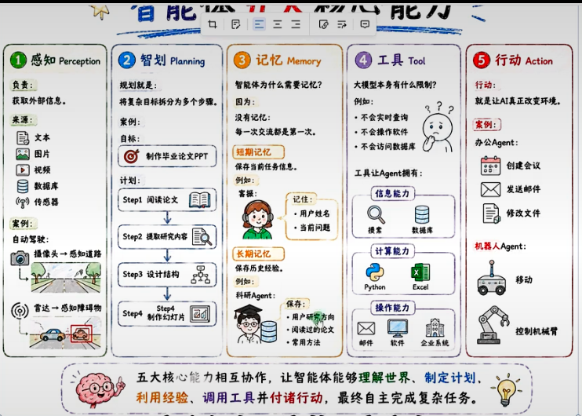
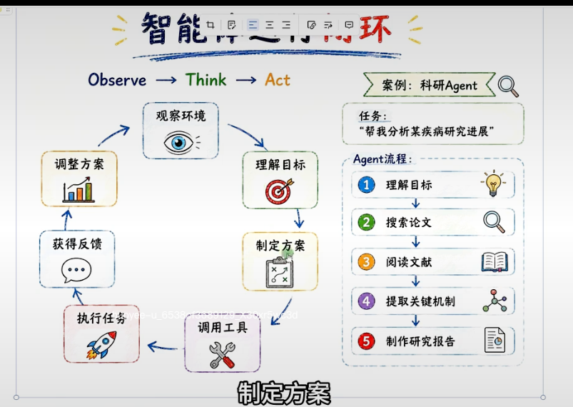

## 5.1 智能体理论基础
梳理 AI 演进三阶段，从规则驱动、数据驱动升级到目标驱动的智能体，理解能力跃迁：执行指令→识别模式→自主完成目标。
### 定义
AI Agent（人工智能智能体）：围绕**目标**，依次完成**感知环境 → 理解任务 → 制定计划 → 调用工具 → 执行动作**，自主完成任务的智能系统。
完整工作链路示例
目标：帮我完成一次市场调研
> 搜索资料 → 阅读报告 → 分析数据 → 制作 PPT → 输出方案
### 现代 AI Agent 核心组成
以**大语言模型 LLM**作为核心底座，叠加三大能力：
1. 规划能力：拆解复杂目标为子任务
1. 记忆能力：保存历史上下文、中间结果
1. 工具调用能力：调用外部工具（搜索、代码、API 等）组合后，可自主完成多步骤复杂任务。
### 5.1.2 Agent 整体架构
核心目标：展示 AI Agent 完整闭环架构，以 LLM 为大脑，由感知、规划、记忆、工具四大模块组成，执行行动并接收环境反馈，形成循环迭代。
#### 架构流程
1. **用户目标**：接收用户原始任务目标
1. **智能体大脑（大模型 LLM）**：核心决策中枢，负责推理、思考
1. 四大核心能力模块
    - **感知**：观察环境，收集外部信息
    - **规划**：任务分解，制定执行计划
    - **记忆**：短期记忆（上下文）、长期记忆（历史知识）
    - **工具**：调用外部工具，扩展能力边界
1. **行动**：执行规划好的动作
1. **环境反馈**：获取执行后的环境结果，回传给大脑，形成闭环循环
#### 智能体五大核心能力
核心目标：拆解 AI Agent 五大核心能力（感知、智划、记忆、工具、行动），分别说明职责、案例，展示多能力协同完成复杂任务。
#### 1. 感知 Perception
- 负责：获取外部信息
- 信息来源：文本、图片、视频、数据库、传感器
- 案例：自动驾驶，摄像头感知道路、雷达感知障碍物
#### 2. 规划 Planning
- 定义：将复杂目标拆分成多个可执行子步骤
- 案例：目标「制作毕业论文 PPT」
    - Step1 阅读论文
    - Step2 提取研究内容
    - Step3 设计 PPT 结构
    - Step4 制作幻灯片
#### 3. 记忆 Memory
- 作用：保存信息，避免每次交互从零开始
    - **短期记忆**：保存当前任务信息（用户姓名、当前问题）
    - **长期记忆**：保存历史经验（用户研究方向、读过的论文、常用方法）
#### 4. 工具 Tool
- 大模型原生局限：无法实时查询、操作软件、访问数据库
- 工具赋予 Agent 三类能力
    - 信息能力：搜索、数据库查询
    - 计算能力：Python、Excel
    - 操作能力：邮件、软件、企业系统
#### 5. 行动 Action
- 定义：AI 真正改变外部环境
- 案例
    - 办公 Agent：创建会议、发送邮件、修改文件
    - 机器人 Agent：移动小车、控制机械臂
> 总结：五大能力相互协作，让智能体理解世界、制定计划、利用经验、调用工具并付诸行动，自主完成复杂任务

### 5.1.3 Agent运行机制
#### 智能体运行闭环（Observe → Think → Act）
核心目标：讲解 Agent 经典 O-T-A 运行闭环：观察 (Observe)→思考 (Think)→行动 (Act)，结合科研 Agent 案例展示完整循环迭代逻辑。
#### 闭环流程
1. **观察环境（Observe）**：感知、收集外部信息
1. **理解目标**：解析用户任务需求
1. **制定方案（Think 思考）**：任务拆解，规划执行步骤
1. **调用工具**：选择合适工具获取信息
1. **执行任务（Act 行动）**：执行动作
1. **获得反馈**：接收环境返回结果
1. **调整方案**：根据反馈优化计划，回到观察环节，循环迭代

### 5.1.4 智能体开发平台
#### 5.1.4.1 云端智能体开发平台
**定位**：面向普通用户和企业，快速创建自己的智能体。**特点**
- 无需部署
- 可视化开发
- 工作流编排
- 知识库
- 插件调用**代表产品**
1. Coze（扣子）
1. 阿里云百炼
1. 百度千帆
1. 腾讯元器
#### 5.1.4.2 开源智能体开发平台
**定位**：面向开发者和企业，实现自主可控的 Agent 系统。**特点**
- 支持私有部署
- 数据可控
- 支持二次开发
- 支持多模型**代表**：低代码 / 可视化开发平台（开源 Agent 框架类）
##### 表产品分类
1. **低代码 / 可视化开发平台**（拖拽式搭建智能体，上手门槛低）
    - Dify
    - FastGPT
    - Flowise
    - Langflow
1. **专业 Agent 开发框架**（代码级开发，灵活定制复杂智能体逻辑）
    - LangChain
    - LangGraph
    - AutoGen
    - CrewAI
    - AgentScope
#### 通用自主智能体工具
核心目标：介绍开箱即用型自主 Agent，定位为成品个人 AI 助手，自带完整能力，可直接使用。
##### 定位
已经具备完整能力，可以直接作为个人 AI 助手使用。
##### 特点
- 主动执行任务
- 操作电脑
- 文件处理
- 多工具调用
- 长期记忆
##### 代表产品
1. WorkBuddy
1. 豆包工作
1. OpenClaw
1. Hermes Agent
## 5.2 快速体验Coze智能体平台
## 5.3 工作流实战
## 5.4 对话流实战